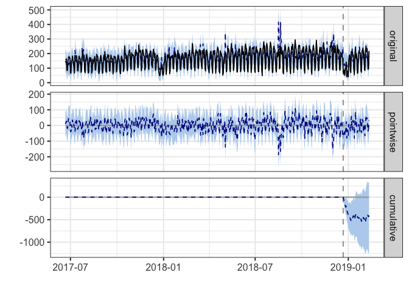

googleAnalyticsModelR
=====================

Creating ready made models to work with `googleAnalyticsR` data

Setup
-----

    install.packages(c("remotes","googleAnalyticsR"))
    remotes::install_github("IronistM/googleAnalyticsModelR")

Useage
------

For end users, they can just load the model then apply it to their data:

    library(googleAnalyticsR)  # assume auto-authentication
    library(googleAnalyticsModelR)

    # fetches data and outputs decomposition
    my_viewid <- 81416156
    decomp_ga <- "inst/models/decomp_ga.gamr"
    d1 <- ga_model(my_viewid, model = decomp_ga)

    #repeat with another viewId
    d2 <- ga_model(123875646, model = decomp_ga)

    # Example CausalImpact
    ga_model(81416156, model = "inst/models/causalImpact_model.gamr", 
             event_date = Sys.Date() - 51, 
             predictors = "Direct", 
             response = "Organic Search")

Creating models
---------------

It needs:

-   A function to collect the data you will need. The first argument
    should be `viewId`
-   A function to work with the data you have fetched. The first
    argument should be the data.frame that is produced by the data
    fetching function.
-   Specification of which R libraries the functions need

The functions need to not use the same arguments, and both include `...`
as the dots are shared between them.

    library(googleAnalyticsR) # assume auto-authentication
    library(googleAnalyticsModelR)

    get_model_data <- function(viewId, 
                               date_range = c(Sys.Date()- 300, Sys.Date()), 
                               ...){
      google_analytics(viewId, 
                       date_range = date_range, 
                       metrics = "sessions", 
                       dimensions = "date", 
                       max = -1)
     }

    decompose_sessions <- function(df, ...){
      web_data_ts <- ts(df$sessions, frequency = 7)
      d <- decompose(web_data_ts)
      list(decom = d, plot = plot(d))
    }
     
    decomp_ga <- ga_model_make(get_model_data,
                               required_columns = c("date", "sessions"),
                               model_f = decompose_sessions,
                               description = "Performs decomposition on session data and creates a plot")
     
    # fetches data and outputs decomposition
    ga_model(81416156, decomp_ga)
     
    # save the model for later
    model_location <- "inst/models/decomp_ga.gamr"
    ga_model_save(decomp_ga, filename = model_location)
     
    # can load model from file
    ga_model(81416156, model_location)
     
    # load model and use again
    model2 <- ga_model_load(model_location)
     
    ga_model(81416156, model2)

More complicated example
------------------------

### Anomaly detection

Using `?ga_anomaly_detection`

    library(googleAnalyticsR)
    library(googleAnalyticsModelR)

    get_anom_data <- function(viewId, 
                              date_range = c(Sys.Date()-600, Sys.Date()),
                              ...){
      google_analytics(viewId, date_range = date_range,
                       metrics = c("sessions","users"),
                       dimensions = "date", 
                       max = -1)
    }

    do_anomaly <- function(df, 
                           value_col = "sessions",
                           max_anoms = 0.1,
                           ...){
      ga_check_anomaly(
        df = df,
        time_col = "date",
        value_col = value_col,
        max_anoms = max_anoms
      )
    }

    req_packs <- c("lubridate", "dplyr", "exploratory", "AnomalyDetection")

    anomaly_model <- ga_model_make(get_anom_data,
                                   required_columns = c("date","sessions","users"),
                                   model_f = do_anomaly,
                                   required_packages = req_packs,
                                   description = "Anomaly detection using Twitter algo on users or sessions")
    # print out model details
    anomaly_model

    ## ==ga_model object==
    ## Description:  Anomaly detection using Twitter algo on users or sessions 
    ## Data args:    viewId date_range 
    ## Input data:   date sessions users 
    ## Model args:   df value_col max_anoms 
    ## Packages:     lubridate dplyr exploratory AnomalyDetection

    # save it to a file for use later
    ga_model_save(anomaly_model, "inst/models/anomaly_model.gamr")

To use, we now have more arguments an end user can specify:

    library(googleAnalyticsR)  # assume auto-authentication
    library(googleAnalyticsModelR)

    # install any needed libraries
    #remotes::install_github("twitter/AnomalyDetection")

    my_viewid <- 81416156
    ga_model(my_viewid, 
             model = "inst/models/anomaly_model.gamr",
             date_range = c(Sys.Date()-601, Sys.Date()-1),
             value_col = "users",
             max_anoms = 0.5)

    ## # A tibble: 601 x 7
    ##    date                users is_positive_ano… positive_anomal…
    ##    <dttm>              <dbl> <lgl>                       <dbl>
    ##  1 2017-06-20 00:00:00   206 FALSE                          NA
    ##  2 2017-06-21 00:00:00   193 FALSE                          NA
    ##  3 2017-06-22 00:00:00   184 FALSE                          NA
    ##  4 2017-06-23 00:00:00   184 FALSE                          NA
    ##  5 2017-06-24 00:00:00    88 FALSE                          NA
    ##  6 2017-06-25 00:00:00    91 FALSE                          NA
    ##  7 2017-06-26 00:00:00   177 FALSE                          NA
    ##  8 2017-06-27 00:00:00   178 FALSE                          NA
    ##  9 2017-06-28 00:00:00   193 FALSE                          NA
    ## 10 2017-06-29 00:00:00   183 FALSE                          NA
    ## # … with 591 more rows, and 3 more variables: is_negative_anomaly <lgl>,
    ## #   negative_anomalies <dbl>, expected_value <dbl>

    #repeat with another viewId
    ga_model(123875646, 
             model = "inst/models/anomaly_model.gamr",
             date_range = c(Sys.Date()-601, Sys.Date()-1),
             value_col = "users",
             max_anoms = 0.5)

    ## # A tibble: 601 x 7
    ##    date                users is_positive_ano… positive_anomal…
    ##    <dttm>              <dbl> <lgl>                       <dbl>
    ##  1 2017-06-20 00:00:00    15 FALSE                          NA
    ##  2 2017-06-21 00:00:00     9 FALSE                          NA
    ##  3 2017-06-22 00:00:00    15 FALSE                          NA
    ##  4 2017-06-23 00:00:00    15 FALSE                          NA
    ##  5 2017-06-24 00:00:00     5 FALSE                          NA
    ##  6 2017-06-25 00:00:00     4 FALSE                          NA
    ##  7 2017-06-26 00:00:00    18 FALSE                          NA
    ##  8 2017-06-27 00:00:00    16 FALSE                          NA
    ##  9 2017-06-28 00:00:00     7 FALSE                          NA
    ## 10 2017-06-29 00:00:00     8 FALSE                          NA
    ## # … with 591 more rows, and 3 more variables: is_negative_anomaly <lgl>,
    ## #   negative_anomalies <dbl>, expected_value <dbl>

### Causal Impact

Example doing CausalImpact as per dartistics.com
<http://www.dartistics.com/timeseries.html>

    library(googleAnalyticsR)
    library(googleAnalyticsModelR)

    get_ci_data <- function(viewId, 
                            date_range = c(Sys.Date()-600, Sys.Date()),
                            ...){
      
      google_analytics(viewId, 
                       date_range = date_range,
                       metrics = "sessions",
                       dimensions = c("date", "channelGrouping"), 
                       max = -1)
    }

    # response_dim is the channel to predict.
    # predictors help with forecast
    do_ci <- function(df, 
                      event_date,
                      response = "Organic Search",
                      predictors = c("Video","Social","Direct"),
                      ...){
      
      message("CausalImpact input data columns: ", paste(names(df), collapse = " "))
      # restrict to one response 
      stopifnot(is.character(response), 
                length(response) == 1,
                assertthat::is.date(event_date),
                is.character(predictors))
      
      pivoted <- df %>% 
        tidyr::spread(channelGrouping, sessions)
      
      stopifnot(response %in% names(pivoted),
                predictors %in% names(pivoted))
      
      ## create a time-series zoo object
      web_data_xts <- xts::xts(pivoted[-1], order.by = as.Date(pivoted$date), frequency = 7)
      
      pre.period <- as.Date(c(min(df$date), event_date))
      post.period <- as.Date(c(event_date + 1, max(df$date)))
      
      predictors <- intersect(predictors, names(web_data_xts))

      ## data in order of response, predictor1, predictor2, etc.
      model_data <- web_data_xts[,c(response,predictors)]
      
      # deal with names
      names(model_data) <- make.names(names(model_data))
      
      impact <- CausalImpact::CausalImpact(model_data,  pre.period, post.period)
      print(plot(impact))
    }

    req_packs <- c("CausalImpact", "xts", "tidyr", "googleAnalyticsR", "assertthat")

    ci_model <- ga_model_make(get_ci_data,
                                   required_columns = c("date","channelGrouping","sessions"),
                                   model_f = do_ci,
                                   required_packages = req_packs,
                                   description = "Causal Impact on channelGrouping data")
    # print out model details
    ci_model

    ## ==ga_model object==
    ## Description:  Causal Impact on channelGrouping data 
    ## Data args:    viewId date_range 
    ## Input data:   date channelGrouping sessions 
    ## Model args:   df event_date response predictors 
    ## Packages:     CausalImpact xts tidyr googleAnalyticsR assertthat

    # save it to a file for use later
    ga_model_save(ci_model, "inst/models/causalImpact_model.gamr")

Creating Shiny modules
======================

The models are also put into Shiny modules that can be used against a
end user's own data.

In that case, you also need to provide the Shiny output and render
functions for the model.

An example reusing the decomposition example above is shown

    library(googleAnalyticsR) # assume auto-authentication
    library(googleAnalyticsModelR)

    get_model_data <- function(viewId, 
                               date_range = c(Sys.Date()- 300, Sys.Date()), 
                               ...){
      google_analytics(viewId, 
                       date_range = date_range, 
                       metrics = "sessions", 
                       dimensions = "date", 
                       max = -1)
     }

    decompose_sessions <- function(df, ...){
      web_data_ts <- ts(df$sessions, frequency = 7)
      d <- decompose(web_data_ts)
      list(decom = d, plot = plot(d))
    }
     
    # to use in Shiny, supply the output and render functions
    myRenderPlot <- function(x){
      # base plot needs to plot here, not in model_f as can't pass plot objects
      shiny::renderPlot(plot(x$decom))
    }
     
    decomp_ga <- ga_model_make(get_model_data,
                               required_columns = c("date", "sessions"),
                               model_f = decompose_sessions,
                               description = "Performs decomposition on session data and creates a plot",
                               outputShiny = shiny::plotOutput,
                               renderShiny = myRenderPlot)

    # save the model for use later
    ga_model_save(decomp_ga, filename = "decomp_ga.gamr")

The Shiny modules are saved in `decomp_model$shiny_module` and contain
the UI and server side elements for Shiny as explained at
<https://shiny.rstudio.com/articles/modules.html>

To use the modules you set them in your ui and server side functions.

In this case the decomposition model is available in `decomp_model`

    # load up the model at runtime
    decomp_model <- ga_model_load("decomp_ga.gamr")

    # within your ui
      ...
      decomp_model$shiny_module$ui("demo1")
      ...

    # within your server - view_id comes from googleAnalyticsR::authDropdown
      ...
      callModule(decomp_model$shiny_module$server, "demo1", view_id = view_id)
      ...

This can then be used in a Shiny app that hooks into `googleAnalyticsR`
multi-user login features:

    library(shiny)
    library(googleAuthR)
    library(googleAnalyticsR)
    library(googleAnalyticsModelR)

    # set your own Google Cloud Project credentials
    googleAuthR::gar_set_client(scopes = "https://www.googleapis.com/auth/analytics.readonly")

    decomp_model <- ga_model_load("decomp_ga.gamr")

    ## ui.R
    ui <- fluidPage(title = "googleAnalyticsR Model Shiny Demo",
                    authDropdownUI("picker"),
                    h1("Decomp Model"),
                    decomp_model$shiny_module$ui("demo1")
    )

    ## server.R
    server <- function(input, output, session){

      # create a non-reactive access_token as we should never get past this if not authenticated
      gar_shiny_auth(session)

      view_id <- callModule(authDropdown, "picker", ga.table = reactive(ga_account_list()))

      callModule(decomp_model$shiny_module$server, "demo1", view_id = view_id)

      output$view_id <- renderText(view_id())

    }

    shinyApp(gar_shiny_ui(ui, login_ui = gar_shiny_login_ui), server)
