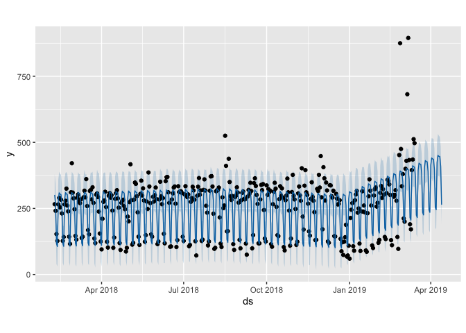

googleAnalyticsModelR
=====================

Creating ready made models to work with `googleAnalyticsR` data

Setup
-----

    install.packages(c("remotes","googleAnalyticsR"))
    remotes::install_github("IronistM/googleAnalyticsModelR")

Useage
------

For end users, they can just load the model then apply it to their data:

    library(googleAnalyticsR)  # assume auto-authentication
    library(googleAnalyticsModelR)

    # fetches data and outputs decomposition
    my_viewid <- 81416156
    decomp_ga <- "inst/models/decomp_ga.gamr"
    d1 <- ga_model(my_viewid, model = decomp_ga)

    #repeat with another viewId
    d2 <- ga_model(123875646, model = decomp_ga)

    # Example CausalImpact
    ci <- ga_model(81416156, model = "inst/models/causalImpact_model.gamr", 
             event_date = Sys.Date() - 51, 
             predictors = "Direct", 
             response = "Organic Search")

Forecasting example with prophet
--------------------------------

The model loading can itself be done in a function, until the final end
user works with data like:

    library(prophet)
    library(dygraphs)
    library(googleAnalyticsR)

    ga_model_prophet(81416156,
                     date_range = c(Sys.Date() - 400, Sys.Date() - 1),
                     forecast_days = 30,
                     metric = "sessions",
                     dim_filter=NULL,
                     interactive_plot = FALSE)

    ## $input
    ##             ds   y
    ## 1   2018-02-07 257
    ## 2   2018-02-08 266
    ## 3   2018-02-09 241
    ## 4   2018-02-10 153
    ## 5   2018-02-11 127
    ## 6   2018-02-12 265
    ## 7   2018-02-13 290
    ## 8   2018-02-14 254
    ## 9   2018-02-15 283
    ## 10  2018-02-16 231
    ## 11  2018-02-17 127
    ## 12  2018-02-18 142
    ## 13  2018-02-19 265
    ## 14  2018-02-20 279
    ## 15  2018-02-21 325
    ## 16  2018-02-22 261
    ## 17  2018-02-23 239
    ## 18  2018-02-24 143
    ## 19  2018-02-25 116
    ## 20  2018-02-26 311
    ## 21  2018-02-27 421
    ## 22  2018-02-28 310
    ## 23  2018-03-01 288
    ## 24  2018-03-02 247
    ## 25  2018-03-03 146
    ## 26  2018-03-04 132
    ## 27  2018-03-05 291
    ## 28  2018-03-06 303
    ## 29  2018-03-07 277
    ## 30  2018-03-08 270
    ## 31  2018-03-09 284
    ## 32  2018-03-10 138
    ## 33  2018-03-11 143
    ## 34  2018-03-12 292
    ## 35  2018-03-13 317
    ## 36  2018-03-14 292
    ## 37  2018-03-15 361
    ## 38  2018-03-16 259
    ## 39  2018-03-17 168
    ## 40  2018-03-18 152
    ## 41  2018-03-19 316
    ## 42  2018-03-20 320
    ## 43  2018-03-21 284
    ## 44  2018-03-22 330
    ## 45  2018-03-23 271
    ## 46  2018-03-24 136
    ## 47  2018-03-25 119
    ## 48  2018-03-26 302
    ## 49  2018-03-27 307
    ## 50  2018-03-28 293
    ## 51  2018-03-29 238
    ## 52  2018-03-30 155
    ## 53  2018-03-31 125
    ## 54  2018-04-01  95
    ## 55  2018-04-02 211
    ## 56  2018-04-03 275
    ## 57  2018-04-04 280
    ## 58  2018-04-05 313
    ## 59  2018-04-06 255
    ## 60  2018-04-07 124
    ## 61  2018-04-08 102
    ## 62  2018-04-09 298
    ## 63  2018-04-10 308
    ## 64  2018-04-11 291
    ## 65  2018-04-12 300
    ## 66  2018-04-13 242
    ## 67  2018-04-14 101
    ## 68  2018-04-15 140
    ## 69  2018-04-16 286
    ## 70  2018-04-17 308
    ## 71  2018-04-18 319
    ## 72  2018-04-19 288
    ## 73  2018-04-20 253
    ## 74  2018-04-21 119
    ## 75  2018-04-22  93
    ## 76  2018-04-23 271
    ## 77  2018-04-24 280
    ## 78  2018-04-25 283
    ## 79  2018-04-26 259
    ## 80  2018-04-27 247
    ## 81  2018-04-28  87
    ## 82  2018-04-29 101
    ## 83  2018-04-30 219
    ## 84  2018-05-01 201
    ## 85  2018-05-02 274
    ## 86  2018-05-03 417
    ## 87  2018-05-04 281
    ## 88  2018-05-05 113
    ## 89  2018-05-06 120
    ## 90  2018-05-07 283
    ## 91  2018-05-08 348
    ## 92  2018-05-09 343
    ## 93  2018-05-10 296
    ## 94  2018-05-11 235
    ## 95  2018-05-12 143
    ## 96  2018-05-13 112
    ## 97  2018-05-14 305
    ## 98  2018-05-15 355
    ## 99  2018-05-16 299
    ## 100 2018-05-17 326
    ## 101 2018-05-18 280
    ## 102 2018-05-19 124
    ## 103 2018-05-20 149
    ## 104 2018-05-21 276
    ## 105 2018-05-22 248
    ## 106 2018-05-23 386
    ## 107 2018-05-24 333
    ## 108 2018-05-25 270
    ## 109 2018-05-26 152
    ## 110 2018-05-27 143
    ## 111 2018-05-28 294
    ## 112 2018-05-29 276
    ## 113 2018-05-30 300
    ## 114 2018-05-31 329
    ## 115 2018-06-01 285
    ## 116 2018-06-02 115
    ## 117 2018-06-03 125
    ## 118 2018-06-04 284
    ## 119 2018-06-05 351
    ## 120 2018-06-06 296
    ## 121 2018-06-07 266
    ## 122 2018-06-08 289
    ## 123 2018-06-09 154
    ## 124 2018-06-10 118
    ## 125 2018-06-11 353
    ## 126 2018-06-12 368
    ## 127 2018-06-13 369
    ## 128 2018-06-14 311
    ## 129 2018-06-15 271
    ## 130 2018-06-16 105
    ## 131 2018-06-17 106
    ## 132 2018-06-18 284
    ## 133 2018-06-19 307
    ## 134 2018-06-20 329
    ## 135 2018-06-21 333
    ## 136 2018-06-22 268
    ## 137 2018-06-23 104
    ## 138 2018-06-24 130
    ## 139 2018-06-25 334
    ## 140 2018-06-26 312
    ## 141 2018-06-27 313
    ## 142 2018-06-28 315
    ## 143 2018-06-29 309
    ## 144 2018-06-30 143
    ## 145 2018-07-01 127
    ## 146 2018-07-02 303
    ## 147 2018-07-03 334
    ## 148 2018-07-04 300
    ## 149 2018-07-05 293
    ## 150 2018-07-06 303
    ## 151 2018-07-07 107
    ## 152 2018-07-08 112
    ## 153 2018-07-09 275
    ## 154 2018-07-10 289
    ## 155 2018-07-11 332
    ## 156 2018-07-12 318
    ## 157 2018-07-13 283
    ## 158 2018-07-14 126
    ## 159 2018-07-15  72
    ## 160 2018-07-16 298
    ## 161 2018-07-17 332
    ## 162 2018-07-18 365
    ## 163 2018-07-19 302
    ## 164 2018-07-20 318
    ## 165 2018-07-21 127
    ## 166 2018-07-22 132
    ## 167 2018-07-23 320
    ## 168 2018-07-24 360
    ## 169 2018-07-25 318
    ## 170 2018-07-26 260
    ## 171 2018-07-27 234
    ## 172 2018-07-28 110
    ## 173 2018-07-29 125
    ## 174 2018-07-30 317
    ## 175 2018-07-31 371
    ## 176 2018-08-01 372
    ## 177 2018-08-02 333
    ## 178 2018-08-03 230
    ## 179 2018-08-04  97
    ## 180 2018-08-05 101
    ## 181 2018-08-06 315
    ## 182 2018-08-07 319
    ## 183 2018-08-08 320
    ## 184 2018-08-09 329
    ## 185 2018-08-10 216
    ## 186 2018-08-11 117
    ## 187 2018-08-12 104
    ## 188 2018-08-13 292
    ## 189 2018-08-14 251
    ## 190 2018-08-15 261
    ## 191 2018-08-16 525
    ## 192 2018-08-17 411
    ## 193 2018-08-18 163
    ## 194 2018-08-19 164
    ## 195 2018-08-20 438
    ## 196 2018-08-21 350
    ## 197 2018-08-22 296
    ## 198 2018-08-23 282
    ## 199 2018-08-24 297
    ## 200 2018-08-25 115
    ## 201 2018-08-26  93
    ## 202 2018-08-27 293
    ## 203 2018-08-28 299
    ## 204 2018-08-29 330
    ## 205 2018-08-30 310
    ## 206 2018-08-31 272
    ## 207 2018-09-01 131
    ## 208 2018-09-02  99
    ## 209 2018-09-03 281
    ## 210 2018-09-04 309
    ## 211 2018-09-05 314
    ## 212 2018-09-06 286
    ## 213 2018-09-07 284
    ## 214 2018-09-08 117
    ## 215 2018-09-09  75
    ## 216 2018-09-10 295
    ## 217 2018-09-11 320
    ## 218 2018-09-12 306
    ## 219 2018-09-13 347
    ## 220 2018-09-14 316
    ## 221 2018-09-15  99
    ## 222 2018-09-16 149
    ## 223 2018-09-17 346
    ## 224 2018-09-18 364
    ## 225 2018-09-19 335
    ## 226 2018-09-20 301
    ## 227 2018-09-21 267
    ## 228 2018-09-22 118
    ## 229 2018-09-23 118
    ## 230 2018-09-24 284
    ## 231 2018-09-25 339
    ## 232 2018-09-26 319
    ## 233 2018-09-27 342
    ## 234 2018-09-28 244
    ## 235 2018-09-29 136
    ## 236 2018-09-30 125
    ## 237 2018-10-01 337
    ## 238 2018-10-02 301
    ## 239 2018-10-03 323
    ## 240 2018-10-04 312
    ## 241 2018-10-05 317
    ## 242 2018-10-06 115
    ## 243 2018-10-07 105
    ## 244 2018-10-08 266
    ## 245 2018-10-09 313
    ## 246 2018-10-10 347
    ## 247 2018-10-11 325
    ## 248 2018-10-12 256
    ## 249 2018-10-13 149
    ## 250 2018-10-14 145
    ## 251 2018-10-15 285
    ## 252 2018-10-16 334
    ## 253 2018-10-17 298
    ## 254 2018-10-18 326
    ## 255 2018-10-19 291
    ## 256 2018-10-20 104
    ## 257 2018-10-21  91
    ## 258 2018-10-22 281
    ## 259 2018-10-23 299
    ## 260 2018-10-24 363
    ## 261 2018-10-25 311
    ## 262 2018-10-26 242
    ## 263 2018-10-27 109
    ## 264 2018-10-28 136
    ## 265 2018-10-29 312
    ## 266 2018-10-30 377
    ## 267 2018-10-31 298
    ## 268 2018-11-01 284
    ## 269 2018-11-02 248
    ## 270 2018-11-03 112
    ## 271 2018-11-04 124
    ## 272 2018-11-05 307
    ## 273 2018-11-06 333
    ## 274 2018-11-07 299
    ## 275 2018-11-08 279
    ## 276 2018-11-09 402
    ## 277 2018-11-10 219
    ## 278 2018-11-11 170
    ## 279 2018-11-12 336
    ## 280 2018-11-13 395
    ## 281 2018-11-14 311
    ## 282 2018-11-15 301
    ## 283 2018-11-16 268
    ## 284 2018-11-17 163
    ## 285 2018-11-18 147
    ## 286 2018-11-19 286
    ## 287 2018-11-20 349
    ## 288 2018-11-21 294
    ## 289 2018-11-22 279
    ## 290 2018-11-23 236
    ## 291 2018-11-24 130
    ## 292 2018-11-25 131
    ## 293 2018-11-26 324
    ## 294 2018-11-27 316
    ## 295 2018-11-28 377
    ## 296 2018-11-29 329
    ## 297 2018-11-30 448
    ## 298 2018-12-01 292
    ## 299 2018-12-02 171
    ## 300 2018-12-03 406
    ## 301 2018-12-04 364
    ## 302 2018-12-05 280
    ## 303 2018-12-06 348
    ## 304 2018-12-07 318
    ## 305 2018-12-08 125
    ## 306 2018-12-09 120
    ## 307 2018-12-10 338
    ## 308 2018-12-11 337
    ## 309 2018-12-12 296
    ## 310 2018-12-13 291
    ## 311 2018-12-14 317
    ## 312 2018-12-15 145
    ## 313 2018-12-16 144
    ## 314 2018-12-17 305
    ## 315 2018-12-18 287
    ## 316 2018-12-19 265
    ## 317 2018-12-20 267
    ## 318 2018-12-21 281
    ## 319 2018-12-22 135
    ## 320 2018-12-23  88
    ## 321 2018-12-24 122
    ## 322 2018-12-25  74
    ## 323 2018-12-26 124
    ## 324 2018-12-27 141
    ## 325 2018-12-28 188
    ## 326 2018-12-29  68
    ## 327 2018-12-30  72
    ## 328 2018-12-31 109
    ## 329 2019-01-01  60
    ## 330 2019-01-02 214
    ## 331 2019-01-03 245
    ## 332 2019-01-04 270
    ## 333 2019-01-05 107
    ## 334 2019-01-06  90
    ## 335 2019-01-07 281
    ## 336 2019-01-08 303
    ## 337 2019-01-09 316
    ## 338 2019-01-10 234
    ## 339 2019-01-11 250
    ## 340 2019-01-12 117
    ## 341 2019-01-13  89
    ## 342 2019-01-14 239
    ## 343 2019-01-15 315
    ## 344 2019-01-16 238
    ## 345 2019-01-17 261
    ## 346 2019-01-18 235
    ## 347 2019-01-19  91
    ## 348 2019-01-20  86
    ## 349 2019-01-21 232
    ## 350 2019-01-22 296
    ## 351 2019-01-23 360
    ## 352 2019-01-24 317
    ## 353 2019-01-25 261
    ## 354 2019-01-26 110
    ## 355 2019-01-27 100
    ## 356 2019-01-28 299
    ## 357 2019-01-29 323
    ## 358 2019-01-30 329
    ## 359 2019-01-31 257
    ## 360 2019-02-01 271
    ## 361 2019-02-02 120
    ## 362 2019-02-03 131
    ## 363 2019-02-04 309
    ## 364 2019-02-05 335
    ## 365 2019-02-06 290
    ## 366 2019-02-07 323
    ## 367 2019-02-08 302
    ## 368 2019-02-09 142
    ## 369 2019-02-10 134
    ## 370 2019-02-11 308
    ## 371 2019-02-12 358
    ## 372 2019-02-13 354
    ## 373 2019-02-14 341
    ## 374 2019-02-15 301
    ## 375 2019-02-16 130
    ## 376 2019-02-17 111
    ## 377 2019-02-18 301
    ## 378 2019-02-19 294
    ## 379 2019-02-20 301
    ## 380 2019-02-21 319
    ## 381 2019-02-22 279
    ## 382 2019-02-23 142
    ## 383 2019-02-24  97
    ## 384 2019-02-25 452
    ## 385 2019-02-26 875
    ## 386 2019-02-27 475
    ## 387 2019-02-28 334
    ## 388 2019-03-01 380
    ## 389 2019-03-02 212
    ## 390 2019-03-03 200
    ## 391 2019-03-04 400
    ## 392 2019-03-05 430
    ## 393 2019-03-06 682
    ## 394 2019-03-07 895
    ## 395 2019-03-08 433
    ## 396 2019-03-09 190
    ## 397 2019-03-10 171
    ## 398 2019-03-11 395
    ## 399 2019-03-12 435
    ## 400 2019-03-13 512
    ## 
    ## $output
    ## $output$forecast
    ##             ds    trend additive_terms additive_terms_lower
    ## 1   2018-02-07 238.8477       62.74154             62.74154
    ## 2   2018-02-08 238.9499       59.78447             59.78447
    ## 3   2018-02-09 239.0521       23.58509             23.58509
    ## 4   2018-02-10 239.1544     -123.52492           -123.52492
    ## 5   2018-02-11 239.2566     -134.23074           -134.23074
    ## 6   2018-02-12 239.3589       42.91567             42.91567
    ## 7   2018-02-13 239.4611       68.72889             68.72889
    ## 8   2018-02-14 239.5634       62.74154             62.74154
    ## 9   2018-02-15 239.6656       59.78447             59.78447
    ## 10  2018-02-16 239.7679       23.58509             23.58509
    ## 11  2018-02-17 239.8701     -123.52492           -123.52492
    ## 12  2018-02-18 239.9724     -134.23074           -134.23074
    ## 13  2018-02-19 240.0746       42.91567             42.91567
    ## 14  2018-02-20 240.1769       68.72889             68.72889
    ## 15  2018-02-21 240.2791       62.74154             62.74154
    ## 16  2018-02-22 240.3813       59.78447             59.78447
    ## 17  2018-02-23 240.4836       23.58509             23.58509
    ## 18  2018-02-24 240.5858     -123.52492           -123.52492
    ## 19  2018-02-25 240.6881     -134.23074           -134.23074
    ## 20  2018-02-26 240.7903       42.91567             42.91567
    ## 21  2018-02-27 240.8926       68.72889             68.72889
    ## 22  2018-02-28 240.9948       62.74154             62.74154
    ## 23  2018-03-01 241.0971       59.78447             59.78447
    ## 24  2018-03-02 241.1993       23.58509             23.58509
    ## 25  2018-03-03 241.3016     -123.52492           -123.52492
    ## 26  2018-03-04 241.4038     -134.23074           -134.23074
    ## 27  2018-03-05 241.5061       42.91567             42.91567
    ## 28  2018-03-06 241.6083       68.72889             68.72889
    ## 29  2018-03-07 241.7105       62.74154             62.74154
    ## 30  2018-03-08 241.8128       59.78447             59.78447
    ## 31  2018-03-09 241.9150       23.58509             23.58509
    ## 32  2018-03-10 242.0173     -123.52492           -123.52492
    ## 33  2018-03-11 242.1195     -134.23074           -134.23074
    ## 34  2018-03-12 242.2218       42.91567             42.91567
    ## 35  2018-03-13 242.3240       68.72889             68.72889
    ## 36  2018-03-14 242.4263       62.74154             62.74154
    ## 37  2018-03-15 242.5285       59.78447             59.78447
    ## 38  2018-03-16 242.6308       23.58509             23.58509
    ## 39  2018-03-17 242.7330     -123.52492           -123.52492
    ## 40  2018-03-18 242.8353     -134.23074           -134.23074
    ## 41  2018-03-19 242.9375       42.91567             42.91567
    ## 42  2018-03-20 243.0397       68.72889             68.72889
    ## 43  2018-03-21 243.1420       62.74154             62.74154
    ## 44  2018-03-22 243.2442       59.78447             59.78447
    ## 45  2018-03-23 243.3465       23.58509             23.58509
    ## 46  2018-03-24 243.4487     -123.52492           -123.52492
    ## 47  2018-03-25 243.5510     -134.23074           -134.23074
    ## 48  2018-03-26 243.6532       42.91567             42.91567
    ## 49  2018-03-27 243.7555       68.72889             68.72889
    ## 50  2018-03-28 243.8577       62.74154             62.74154
    ## 51  2018-03-29 243.9600       59.78447             59.78447
    ## 52  2018-03-30 244.0622       23.58509             23.58509
    ## 53  2018-03-31 244.1644     -123.52492           -123.52492
    ## 54  2018-04-01 244.2667     -134.23074           -134.23074
    ## 55  2018-04-02 244.3689       42.91567             42.91567
    ## 56  2018-04-03 244.4712       68.72889             68.72889
    ## 57  2018-04-04 244.5734       62.74154             62.74154
    ## 58  2018-04-05 244.6757       59.78447             59.78447
    ## 59  2018-04-06 244.7779       23.58509             23.58509
    ## 60  2018-04-07 244.8802     -123.52492           -123.52492
    ## 61  2018-04-08 244.9824     -134.23074           -134.23074
    ## 62  2018-04-09 245.0847       42.91567             42.91567
    ## 63  2018-04-10 245.1869       68.72889             68.72889
    ## 64  2018-04-11 245.2892       62.74154             62.74154
    ## 65  2018-04-12 245.3914       59.78447             59.78447
    ## 66  2018-04-13 245.4936       23.58509             23.58509
    ## 67  2018-04-14 245.5959     -123.52492           -123.52492
    ## 68  2018-04-15 245.6981     -134.23074           -134.23074
    ## 69  2018-04-16 245.8004       42.91567             42.91567
    ## 70  2018-04-17 245.9026       68.72889             68.72889
    ## 71  2018-04-18 246.0049       62.74154             62.74154
    ## 72  2018-04-19 246.1071       59.78447             59.78447
    ## 73  2018-04-20 246.2094       23.58509             23.58509
    ## 74  2018-04-21 246.3116     -123.52492           -123.52492
    ## 75  2018-04-22 246.4139     -134.23074           -134.23074
    ## 76  2018-04-23 246.5161       42.91567             42.91567
    ## 77  2018-04-24 246.6184       68.72889             68.72889
    ## 78  2018-04-25 246.7206       62.74154             62.74154
    ## 79  2018-04-26 246.8228       59.78447             59.78447
    ## 80  2018-04-27 246.9251       23.58509             23.58509
    ## 81  2018-04-28 247.0273     -123.52492           -123.52492
    ## 82  2018-04-29 247.1296     -134.23074           -134.23074
    ## 83  2018-04-30 247.2318       42.91567             42.91567
    ## 84  2018-05-01 247.3341       68.72889             68.72889
    ## 85  2018-05-02 247.4363       62.74154             62.74154
    ## 86  2018-05-03 247.5386       59.78447             59.78447
    ## 87  2018-05-04 247.6408       23.58509             23.58509
    ## 88  2018-05-05 247.7431     -123.52492           -123.52492
    ## 89  2018-05-06 247.8453     -134.23074           -134.23074
    ## 90  2018-05-07 247.9476       42.91567             42.91567
    ## 91  2018-05-08 248.0498       68.72889             68.72889
    ## 92  2018-05-09 248.1520       62.74154             62.74154
    ## 93  2018-05-10 248.2543       59.78447             59.78447
    ## 94  2018-05-11 248.3565       23.58509             23.58509
    ## 95  2018-05-12 248.4588     -123.52492           -123.52492
    ## 96  2018-05-13 248.5610     -134.23074           -134.23074
    ## 97  2018-05-14 248.6633       42.91567             42.91567
    ## 98  2018-05-15 248.7655       68.72889             68.72889
    ## 99  2018-05-16 248.8678       62.74154             62.74154
    ## 100 2018-05-17 248.9700       59.78447             59.78447
    ## 101 2018-05-18 249.0723       23.58509             23.58509
    ## 102 2018-05-19 249.1745     -123.52492           -123.52492
    ## 103 2018-05-20 249.2768     -134.23074           -134.23074
    ## 104 2018-05-21 249.3790       42.91567             42.91567
    ## 105 2018-05-22 249.4812       68.72889             68.72889
    ## 106 2018-05-23 249.5835       62.74154             62.74154
    ## 107 2018-05-24 249.6857       59.78447             59.78447
    ## 108 2018-05-25 249.7880       23.58509             23.58509
    ## 109 2018-05-26 249.8902     -123.52492           -123.52492
    ## 110 2018-05-27 249.9925     -134.23074           -134.23074
    ## 111 2018-05-28 250.0947       42.91567             42.91567
    ## 112 2018-05-29 250.1970       68.72889             68.72889
    ## 113 2018-05-30 250.2992       62.74154             62.74154
    ## 114 2018-05-31 250.4015       59.78447             59.78447
    ## 115 2018-06-01 250.5037       23.58509             23.58509
    ## 116 2018-06-02 250.6060     -123.52492           -123.52492
    ## 117 2018-06-03 250.7082     -134.23074           -134.23074
    ## 118 2018-06-04 250.8104       42.91567             42.91567
    ## 119 2018-06-05 250.9127       68.72889             68.72889
    ## 120 2018-06-06 251.0149       62.74154             62.74154
    ## 121 2018-06-07 251.1171       59.78447             59.78447
    ## 122 2018-06-08 251.2194       23.58509             23.58509
    ## 123 2018-06-09 251.3216     -123.52492           -123.52492
    ## 124 2018-06-10 251.4238     -134.23074           -134.23074
    ## 125 2018-06-11 251.5261       42.91567             42.91567
    ## 126 2018-06-12 251.6283       68.72889             68.72889
    ## 127 2018-06-13 251.7306       62.74154             62.74154
    ## 128 2018-06-14 251.8328       59.78447             59.78447
    ## 129 2018-06-15 251.9350       23.58509             23.58509
    ## 130 2018-06-16 252.0373     -123.52492           -123.52492
    ## 131 2018-06-17 252.1395     -134.23074           -134.23074
    ## 132 2018-06-18 252.2417       42.91567             42.91567
    ## 133 2018-06-19 252.3440       68.72889             68.72889
    ## 134 2018-06-20 252.4462       62.74154             62.74154
    ## 135 2018-06-21 252.5484       59.78447             59.78447
    ## 136 2018-06-22 252.6507       23.58509             23.58509
    ## 137 2018-06-23 252.7529     -123.52492           -123.52492
    ## 138 2018-06-24 252.8552     -134.23074           -134.23074
    ## 139 2018-06-25 252.9574       42.91567             42.91567
    ## 140 2018-06-26 253.0596       68.72889             68.72889
    ## 141 2018-06-27 253.1619       62.74154             62.74154
    ## 142 2018-06-28 253.2641       59.78447             59.78447
    ## 143 2018-06-29 253.3663       23.58509             23.58509
    ## 144 2018-06-30 253.4685     -123.52492           -123.52492
    ## 145 2018-07-01 253.5708     -134.23074           -134.23074
    ## 146 2018-07-02 253.6730       42.91567             42.91567
    ## 147 2018-07-03 253.7752       68.72889             68.72889
    ## 148 2018-07-04 253.8774       62.74154             62.74154
    ## 149 2018-07-05 253.9796       59.78447             59.78447
    ## 150 2018-07-06 254.0819       23.58509             23.58509
    ## 151 2018-07-07 254.1841     -123.52492           -123.52492
    ## 152 2018-07-08 254.2863     -134.23074           -134.23074
    ## 153 2018-07-09 254.3885       42.91567             42.91567
    ## 154 2018-07-10 254.4908       68.72889             68.72889
    ## 155 2018-07-11 254.5930       62.74154             62.74154
    ## 156 2018-07-12 254.6952       59.78447             59.78447
    ## 157 2018-07-13 254.7974       23.58509             23.58509
    ## 158 2018-07-14 254.8997     -123.52492           -123.52492
    ## 159 2018-07-15 255.0019     -134.23074           -134.23074
    ## 160 2018-07-16 255.1041       42.91567             42.91567
    ## 161 2018-07-17 255.2063       68.72889             68.72889
    ## 162 2018-07-18 255.3086       62.74154             62.74154
    ## 163 2018-07-19 255.4108       59.78447             59.78447
    ## 164 2018-07-20 255.5130       23.58509             23.58509
    ## 165 2018-07-21 255.6152     -123.52492           -123.52492
    ## 166 2018-07-22 255.7174     -134.23074           -134.23074
    ## 167 2018-07-23 255.8197       42.91567             42.91567
    ## 168 2018-07-24 255.8842       68.72889             68.72889
    ## 169 2018-07-25 255.9487       62.74154             62.74154
    ## 170 2018-07-26 256.0132       59.78447             59.78447
    ## 171 2018-07-27 256.0777       23.58509             23.58509
    ## 172 2018-07-28 256.1422     -123.52492           -123.52492
    ## 173 2018-07-29 256.2067     -134.23074           -134.23074
    ## 174 2018-07-30 256.2712       42.91567             42.91567
    ## 175 2018-07-31 256.3357       68.72889             68.72889
    ## 176 2018-08-01 256.4002       62.74154             62.74154
    ## 177 2018-08-02 256.4647       59.78447             59.78447
    ## 178 2018-08-03 256.5292       23.58509             23.58509
    ## 179 2018-08-04 256.5937     -123.52492           -123.52492
    ## 180 2018-08-05 256.6582     -134.23074           -134.23074
    ## 181 2018-08-06 256.6526       42.91567             42.91567
    ## 182 2018-08-07 256.6471       68.72889             68.72889
    ## 183 2018-08-08 256.6415       62.74154             62.74154
    ## 184 2018-08-09 256.6360       59.78447             59.78447
    ## 185 2018-08-10 256.6304       23.58509             23.58509
    ## 186 2018-08-11 256.6249     -123.52492           -123.52492
    ## 187 2018-08-12 256.6193     -134.23074           -134.23074
    ## 188 2018-08-13 256.6138       42.91567             42.91567
    ## 189 2018-08-14 256.6082       68.72889             68.72889
    ## 190 2018-08-15 256.6027       62.74154             62.74154
    ## 191 2018-08-16 256.5971       59.78447             59.78447
    ## 192 2018-08-17 256.5916       23.58509             23.58509
    ## 193 2018-08-18 256.4692     -123.52492           -123.52492
    ## 194 2018-08-19 256.3469     -134.23074           -134.23074
    ## 195 2018-08-20 256.2245       42.91567             42.91567
    ## 196 2018-08-21 256.1022       68.72889             68.72889
    ## 197 2018-08-22 255.9798       62.74154             62.74154
    ## 198 2018-08-23 255.8575       59.78447             59.78447
    ## 199 2018-08-24 255.7351       23.58509             23.58509
    ## 200 2018-08-25 255.6128     -123.52492           -123.52492
    ## 201 2018-08-26 255.4904     -134.23074           -134.23074
    ## 202 2018-08-27 255.3681       42.91567             42.91567
    ## 203 2018-08-28 255.2457       68.72889             68.72889
    ## 204 2018-08-29 255.1234       62.74154             62.74154
    ## 205 2018-08-30 255.0010       59.78447             59.78447
    ## 206 2018-08-31 254.8643       23.58509             23.58509
    ## 207 2018-09-01 254.7276     -123.52492           -123.52492
    ## 208 2018-09-02 254.5908     -134.23074           -134.23074
    ## 209 2018-09-03 254.4541       42.91567             42.91567
    ## 210 2018-09-04 254.3174       68.72889             68.72889
    ## 211 2018-09-05 254.1806       62.74154             62.74154
    ## 212 2018-09-06 254.0439       59.78447             59.78447
    ## 213 2018-09-07 253.9072       23.58509             23.58509
    ## 214 2018-09-08 253.7704     -123.52492           -123.52492
    ## 215 2018-09-09 253.6337     -134.23074           -134.23074
    ## 216 2018-09-10 253.4969       42.91567             42.91567
    ## 217 2018-09-11 253.3602       68.72889             68.72889
    ## 218 2018-09-12 253.2235       62.74154             62.74154
    ## 219 2018-09-13 253.0527       59.78447             59.78447
    ## 220 2018-09-14 252.8819       23.58509             23.58509
    ## 221 2018-09-15 252.7112     -123.52492           -123.52492
    ## 222 2018-09-16 252.5404     -134.23074           -134.23074
    ## 223 2018-09-17 252.3697       42.91567             42.91567
    ## 224 2018-09-18 252.1989       68.72889             68.72889
    ## 225 2018-09-19 252.0281       62.74154             62.74154
    ## 226 2018-09-20 251.8574       59.78447             59.78447
    ## 227 2018-09-21 251.6866       23.58509             23.58509
    ## 228 2018-09-22 251.5158     -123.52492           -123.52492
    ## 229 2018-09-23 251.3451     -134.23074           -134.23074
    ## 230 2018-09-24 251.1743       42.91567             42.91567
    ## 231 2018-09-25 251.0036       68.72889             68.72889
    ## 232 2018-09-26 250.8267       62.74154             62.74154
    ## 233 2018-09-27 250.6498       59.78447             59.78447
    ## 234 2018-09-28 250.4729       23.58509             23.58509
    ## 235 2018-09-29 250.2960     -123.52492           -123.52492
    ## 236 2018-09-30 250.1191     -134.23074           -134.23074
    ## 237 2018-10-01 249.9422       42.91567             42.91567
    ## 238 2018-10-02 249.7653       68.72889             68.72889
    ## 239 2018-10-03 249.5884       62.74154             62.74154
    ## 240 2018-10-04 249.4115       59.78447             59.78447
    ## 241 2018-10-05 249.2346       23.58509             23.58509
    ## 242 2018-10-06 249.0577     -123.52492           -123.52492
    ## 243 2018-10-07 248.8808     -134.23074           -134.23074
    ## 244 2018-10-08 248.6975       42.91567             42.91567
    ## 245 2018-10-09 248.5141       68.72889             68.72889
    ## 246 2018-10-10 248.3308       62.74154             62.74154
    ## 247 2018-10-11 248.1475       59.78447             59.78447
    ## 248 2018-10-12 247.9641       23.58509             23.58509
    ## 249 2018-10-13 247.7808     -123.52492           -123.52492
    ## 250 2018-10-14 247.5974     -134.23074           -134.23074
    ## 251 2018-10-15 247.4141       42.91567             42.91567
    ## 252 2018-10-16 247.2307       68.72889             68.72889
    ## 253 2018-10-17 247.0474       62.74154             62.74154
    ## 254 2018-10-18 246.8641       59.78447             59.78447
    ## 255 2018-10-19 246.6807       23.58509             23.58509
    ## 256 2018-10-20 246.4974     -123.52492           -123.52492
    ## 257 2018-10-21 246.3011     -134.23074           -134.23074
    ## 258 2018-10-22 246.1047       42.91567             42.91567
    ## 259 2018-10-23 245.9084       68.72889             68.72889
    ## 260 2018-10-24 245.7121       62.74154             62.74154
    ## 261 2018-10-25 245.5157       59.78447             59.78447
    ## 262 2018-10-26 245.3194       23.58509             23.58509
    ## 263 2018-10-27 245.1231     -123.52492           -123.52492
    ## 264 2018-10-28 244.9267     -134.23074           -134.23074
    ## 265 2018-10-29 244.7304       42.91567             42.91567
    ## 266 2018-10-30 244.5341       68.72889             68.72889
    ## 267 2018-10-31 244.3377       62.74154             62.74154
    ## 268 2018-11-01 244.1414       59.78447             59.78447
    ## 269 2018-11-02 243.9451       23.58509             23.58509
    ## 270 2018-11-03 243.7482     -123.52492           -123.52492
    ## 271 2018-11-04 243.5514     -134.23074           -134.23074
    ## 272 2018-11-05 243.3545       42.91567             42.91567
    ## 273 2018-11-06 243.1576       68.72889             68.72889
    ## 274 2018-11-07 242.9608       62.74154             62.74154
    ## 275 2018-11-08 242.7639       59.78447             59.78447
    ## 276 2018-11-09 242.5670       23.58509             23.58509
    ## 277 2018-11-10 242.3702     -123.52492           -123.52492
    ## 278 2018-11-11 242.1733     -134.23074           -134.23074
    ## 279 2018-11-12 241.9765       42.91567             42.91567
    ## 280 2018-11-13 241.7796       68.72889             68.72889
    ## 281 2018-11-14 241.5827       62.74154             62.74154
    ## 282 2018-11-15 241.3859       59.78447             59.78447
    ## 283 2018-11-16 241.1890       23.58509             23.58509
    ## 284 2018-11-17 240.9921     -123.52492           -123.52492
    ## 285 2018-11-18 240.7953     -134.23074           -134.23074
    ## 286 2018-11-19 240.5984       42.91567             42.91567
    ## 287 2018-11-20 240.4015       68.72889             68.72889
    ## 288 2018-11-21 240.2047       62.74154             62.74154
    ## 289 2018-11-22 240.0078       59.78447             59.78447
    ## 290 2018-11-23 239.8109       23.58509             23.58509
    ## 291 2018-11-24 239.6141     -123.52492           -123.52492
    ## 292 2018-11-25 239.4172     -134.23074           -134.23074
    ## 293 2018-11-26 239.2203       42.91567             42.91567
    ## 294 2018-11-27 239.0235       68.72889             68.72889
    ## 295 2018-11-28 238.8266       62.74154             62.74154
    ## 296 2018-11-29 238.6297       59.78447             59.78447
    ## 297 2018-11-30 238.4329       23.58509             23.58509
    ## 298 2018-12-01 238.2360     -123.52492           -123.52492
    ## 299 2018-12-02 238.0391     -134.23074           -134.23074
    ## 300 2018-12-03 237.8423       42.91567             42.91567
    ## 301 2018-12-04 237.6454       68.72889             68.72889
    ## 302 2018-12-05 237.4485       62.74154             62.74154
    ## 303 2018-12-06 237.2517       59.78447             59.78447
    ## 304 2018-12-07 237.0548       23.58509             23.58509
    ## 305 2018-12-08 236.8579     -123.52492           -123.52492
    ## 306 2018-12-09 236.6611     -134.23074           -134.23074
    ## 307 2018-12-10 236.4642       42.91567             42.91567
    ## 308 2018-12-11 236.2673       68.72889             68.72889
    ## 309 2018-12-12 236.0705       62.74154             62.74154
    ## 310 2018-12-13 235.8736       59.78447             59.78447
    ## 311 2018-12-14 235.6767       23.58509             23.58509
    ## 312 2018-12-15 235.4799     -123.52492           -123.52492
    ## 313 2018-12-16 235.2830     -134.23074           -134.23074
    ## 314 2018-12-17 235.0861       42.91567             42.91567
    ## 315 2018-12-18 234.8893       68.72889             68.72889
    ## 316 2018-12-19 234.6924       62.74154             62.74154
    ## 317 2018-12-20 234.4955       59.78447             59.78447
    ## 318 2018-12-21 234.2987       23.58509             23.58509
    ## 319 2018-12-22 234.1018     -123.52492           -123.52492
    ## 320 2018-12-23 233.9049     -134.23074           -134.23074
    ## 321 2018-12-24 235.2351       42.91567             42.91567
    ## 322 2018-12-25 236.5653       68.72889             68.72889
    ## 323 2018-12-26 237.8954       62.74154             62.74154
    ## 324 2018-12-27 239.2256       59.78447             59.78447
    ## 325 2018-12-28 240.5558       23.58509             23.58509
    ## 326 2018-12-29 241.8859     -123.52492           -123.52492
    ## 327 2018-12-30 243.2161     -134.23074           -134.23074
    ## 328 2018-12-31 244.5463       42.91567             42.91567
    ## 329 2019-01-01 245.8765       68.72889             68.72889
    ## 330 2019-01-02 247.2066       62.74154             62.74154
    ## 331 2019-01-03 248.5368       59.78447             59.78447
    ## 332 2019-01-04 249.8670       23.58509             23.58509
    ## 333 2019-01-05 251.1971     -123.52492           -123.52492
    ## 334 2019-01-06 252.5273     -134.23074           -134.23074
    ## 335 2019-01-07 253.8575       42.91567             42.91567
    ## 336 2019-01-08 255.1876       68.72889             68.72889
    ## 337 2019-01-09 256.5178       62.74154             62.74154
    ## 338 2019-01-10 257.8480       59.78447             59.78447
    ## 339 2019-01-11 259.1781       23.58509             23.58509
    ## 340 2019-01-12 260.5083     -123.52492           -123.52492
    ## 341 2019-01-13 261.8385     -134.23074           -134.23074
    ## 342 2019-01-14 263.1686       42.91567             42.91567
    ## 343 2019-01-15 264.4988       68.72889             68.72889
    ## 344 2019-01-16 265.8290       62.74154             62.74154
    ## 345 2019-01-17 267.1591       59.78447             59.78447
    ## 346 2019-01-18 268.4893       23.58509             23.58509
    ## 347 2019-01-19 269.8195     -123.52492           -123.52492
    ## 348 2019-01-20 271.1497     -134.23074           -134.23074
    ## 349 2019-01-21 272.4798       42.91567             42.91567
    ## 350 2019-01-22 273.8100       68.72889             68.72889
    ## 351 2019-01-23 275.1402       62.74154             62.74154
    ## 352 2019-01-24 276.4703       59.78447             59.78447
    ## 353 2019-01-25 277.8005       23.58509             23.58509
    ## 354 2019-01-26 279.1307     -123.52492           -123.52492
    ## 355 2019-01-27 280.4608     -134.23074           -134.23074
    ## 356 2019-01-28 281.7910       42.91567             42.91567
    ## 357 2019-01-29 283.1212       68.72889             68.72889
    ## 358 2019-01-30 284.4513       62.74154             62.74154
    ## 359 2019-01-31 285.7815       59.78447             59.78447
    ## 360 2019-02-01 287.1117       23.58509             23.58509
    ## 361 2019-02-02 288.4418     -123.52492           -123.52492
    ## 362 2019-02-03 289.7720     -134.23074           -134.23074
    ## 363 2019-02-04 291.1022       42.91567             42.91567
    ## 364 2019-02-05 292.4323       68.72889             68.72889
    ## 365 2019-02-06 293.7625       62.74154             62.74154
    ## 366 2019-02-07 295.0927       59.78447             59.78447
    ## 367 2019-02-08 296.4229       23.58509             23.58509
    ## 368 2019-02-09 297.7530     -123.52492           -123.52492
    ## 369 2019-02-10 299.0832     -134.23074           -134.23074
    ## 370 2019-02-11 300.4134       42.91567             42.91567
    ## 371 2019-02-12 301.7435       68.72889             68.72889
    ## 372 2019-02-13 303.0737       62.74154             62.74154
    ## 373 2019-02-14 304.4039       59.78447             59.78447
    ## 374 2019-02-15 305.7340       23.58509             23.58509
    ## 375 2019-02-16 307.0642     -123.52492           -123.52492
    ## 376 2019-02-17 308.3944     -134.23074           -134.23074
    ## 377 2019-02-18 309.7245       42.91567             42.91567
    ## 378 2019-02-19 311.0547       68.72889             68.72889
    ## 379 2019-02-20 312.3849       62.74154             62.74154
    ## 380 2019-02-21 313.7150       59.78447             59.78447
    ## 381 2019-02-22 315.0452       23.58509             23.58509
    ## 382 2019-02-23 316.3754     -123.52492           -123.52492
    ## 383 2019-02-24 317.7055     -134.23074           -134.23074
    ## 384 2019-02-25 319.0357       42.91567             42.91567
    ## 385 2019-02-26 320.3659       68.72889             68.72889
    ## 386 2019-02-27 321.6961       62.74154             62.74154
    ## 387 2019-02-28 323.0262       59.78447             59.78447
    ## 388 2019-03-01 324.3564       23.58509             23.58509
    ## 389 2019-03-02 325.6866     -123.52492           -123.52492
    ## 390 2019-03-03 327.0167     -134.23074           -134.23074
    ## 391 2019-03-04 328.3469       42.91567             42.91567
    ## 392 2019-03-05 329.6771       68.72889             68.72889
    ## 393 2019-03-06 331.0072       62.74154             62.74154
    ## 394 2019-03-07 332.3374       59.78447             59.78447
    ## 395 2019-03-08 333.6676       23.58509             23.58509
    ## 396 2019-03-09 334.9977     -123.52492           -123.52492
    ## 397 2019-03-10 336.3279     -134.23074           -134.23074
    ## 398 2019-03-11 337.6581       42.91567             42.91567
    ## 399 2019-03-12 338.9882       68.72889             68.72889
    ## 400 2019-03-13 340.3184       62.74154             62.74154
    ## 401 2019-03-14 341.6486       59.78447             59.78447
    ## 402 2019-03-15 342.9787       23.58509             23.58509
    ## 403 2019-03-16 344.3089     -123.52492           -123.52492
    ## 404 2019-03-17 345.6391     -134.23074           -134.23074
    ## 405 2019-03-18 346.9693       42.91567             42.91567
    ## 406 2019-03-19 348.2994       68.72889             68.72889
    ## 407 2019-03-20 349.6296       62.74154             62.74154
    ## 408 2019-03-21 350.9598       59.78447             59.78447
    ## 409 2019-03-22 352.2899       23.58509             23.58509
    ## 410 2019-03-23 353.6201     -123.52492           -123.52492
    ## 411 2019-03-24 354.9503     -134.23074           -134.23074
    ## 412 2019-03-25 356.2804       42.91567             42.91567
    ## 413 2019-03-26 357.6106       68.72889             68.72889
    ## 414 2019-03-27 358.9408       62.74154             62.74154
    ## 415 2019-03-28 360.2709       59.78447             59.78447
    ## 416 2019-03-29 361.6011       23.58509             23.58509
    ## 417 2019-03-30 362.9313     -123.52492           -123.52492
    ## 418 2019-03-31 364.2614     -134.23074           -134.23074
    ## 419 2019-04-01 365.5916       42.91567             42.91567
    ## 420 2019-04-02 366.9218       68.72889             68.72889
    ## 421 2019-04-03 368.2519       62.74154             62.74154
    ## 422 2019-04-04 369.5821       59.78447             59.78447
    ## 423 2019-04-05 370.9123       23.58509             23.58509
    ## 424 2019-04-06 372.2425     -123.52492           -123.52492
    ## 425 2019-04-07 373.5726     -134.23074           -134.23074
    ## 426 2019-04-08 374.9028       42.91567             42.91567
    ## 427 2019-04-09 376.2330       68.72889             68.72889
    ## 428 2019-04-10 377.5631       62.74154             62.74154
    ## 429 2019-04-11 378.8933       59.78447             59.78447
    ## 430 2019-04-12 380.2235       23.58509             23.58509
    ##     additive_terms_upper     weekly weekly_lower weekly_upper
    ## 1               62.74154   62.74154     62.74154     62.74154
    ## 2               59.78447   59.78447     59.78447     59.78447
    ## 3               23.58509   23.58509     23.58509     23.58509
    ## 4             -123.52492 -123.52492   -123.52492   -123.52492
    ## 5             -134.23074 -134.23074   -134.23074   -134.23074
    ## 6               42.91567   42.91567     42.91567     42.91567
    ## 7               68.72889   68.72889     68.72889     68.72889
    ## 8               62.74154   62.74154     62.74154     62.74154
    ## 9               59.78447   59.78447     59.78447     59.78447
    ## 10              23.58509   23.58509     23.58509     23.58509
    ## 11            -123.52492 -123.52492   -123.52492   -123.52492
    ## 12            -134.23074 -134.23074   -134.23074   -134.23074
    ## 13              42.91567   42.91567     42.91567     42.91567
    ## 14              68.72889   68.72889     68.72889     68.72889
    ## 15              62.74154   62.74154     62.74154     62.74154
    ## 16              59.78447   59.78447     59.78447     59.78447
    ## 17              23.58509   23.58509     23.58509     23.58509
    ## 18            -123.52492 -123.52492   -123.52492   -123.52492
    ## 19            -134.23074 -134.23074   -134.23074   -134.23074
    ## 20              42.91567   42.91567     42.91567     42.91567
    ## 21              68.72889   68.72889     68.72889     68.72889
    ## 22              62.74154   62.74154     62.74154     62.74154
    ## 23              59.78447   59.78447     59.78447     59.78447
    ## 24              23.58509   23.58509     23.58509     23.58509
    ## 25            -123.52492 -123.52492   -123.52492   -123.52492
    ## 26            -134.23074 -134.23074   -134.23074   -134.23074
    ## 27              42.91567   42.91567     42.91567     42.91567
    ## 28              68.72889   68.72889     68.72889     68.72889
    ## 29              62.74154   62.74154     62.74154     62.74154
    ## 30              59.78447   59.78447     59.78447     59.78447
    ## 31              23.58509   23.58509     23.58509     23.58509
    ## 32            -123.52492 -123.52492   -123.52492   -123.52492
    ## 33            -134.23074 -134.23074   -134.23074   -134.23074
    ## 34              42.91567   42.91567     42.91567     42.91567
    ## 35              68.72889   68.72889     68.72889     68.72889
    ## 36              62.74154   62.74154     62.74154     62.74154
    ## 37              59.78447   59.78447     59.78447     59.78447
    ## 38              23.58509   23.58509     23.58509     23.58509
    ## 39            -123.52492 -123.52492   -123.52492   -123.52492
    ## 40            -134.23074 -134.23074   -134.23074   -134.23074
    ## 41              42.91567   42.91567     42.91567     42.91567
    ## 42              68.72889   68.72889     68.72889     68.72889
    ## 43              62.74154   62.74154     62.74154     62.74154
    ## 44              59.78447   59.78447     59.78447     59.78447
    ## 45              23.58509   23.58509     23.58509     23.58509
    ## 46            -123.52492 -123.52492   -123.52492   -123.52492
    ## 47            -134.23074 -134.23074   -134.23074   -134.23074
    ## 48              42.91567   42.91567     42.91567     42.91567
    ## 49              68.72889   68.72889     68.72889     68.72889
    ## 50              62.74154   62.74154     62.74154     62.74154
    ## 51              59.78447   59.78447     59.78447     59.78447
    ## 52              23.58509   23.58509     23.58509     23.58509
    ## 53            -123.52492 -123.52492   -123.52492   -123.52492
    ## 54            -134.23074 -134.23074   -134.23074   -134.23074
    ## 55              42.91567   42.91567     42.91567     42.91567
    ## 56              68.72889   68.72889     68.72889     68.72889
    ## 57              62.74154   62.74154     62.74154     62.74154
    ## 58              59.78447   59.78447     59.78447     59.78447
    ## 59              23.58509   23.58509     23.58509     23.58509
    ## 60            -123.52492 -123.52492   -123.52492   -123.52492
    ## 61            -134.23074 -134.23074   -134.23074   -134.23074
    ## 62              42.91567   42.91567     42.91567     42.91567
    ## 63              68.72889   68.72889     68.72889     68.72889
    ## 64              62.74154   62.74154     62.74154     62.74154
    ## 65              59.78447   59.78447     59.78447     59.78447
    ## 66              23.58509   23.58509     23.58509     23.58509
    ## 67            -123.52492 -123.52492   -123.52492   -123.52492
    ## 68            -134.23074 -134.23074   -134.23074   -134.23074
    ## 69              42.91567   42.91567     42.91567     42.91567
    ## 70              68.72889   68.72889     68.72889     68.72889
    ## 71              62.74154   62.74154     62.74154     62.74154
    ## 72              59.78447   59.78447     59.78447     59.78447
    ## 73              23.58509   23.58509     23.58509     23.58509
    ## 74            -123.52492 -123.52492   -123.52492   -123.52492
    ## 75            -134.23074 -134.23074   -134.23074   -134.23074
    ## 76              42.91567   42.91567     42.91567     42.91567
    ## 77              68.72889   68.72889     68.72889     68.72889
    ## 78              62.74154   62.74154     62.74154     62.74154
    ## 79              59.78447   59.78447     59.78447     59.78447
    ## 80              23.58509   23.58509     23.58509     23.58509
    ## 81            -123.52492 -123.52492   -123.52492   -123.52492
    ## 82            -134.23074 -134.23074   -134.23074   -134.23074
    ## 83              42.91567   42.91567     42.91567     42.91567
    ## 84              68.72889   68.72889     68.72889     68.72889
    ## 85              62.74154   62.74154     62.74154     62.74154
    ## 86              59.78447   59.78447     59.78447     59.78447
    ## 87              23.58509   23.58509     23.58509     23.58509
    ## 88            -123.52492 -123.52492   -123.52492   -123.52492
    ## 89            -134.23074 -134.23074   -134.23074   -134.23074
    ## 90              42.91567   42.91567     42.91567     42.91567
    ## 91              68.72889   68.72889     68.72889     68.72889
    ## 92              62.74154   62.74154     62.74154     62.74154
    ## 93              59.78447   59.78447     59.78447     59.78447
    ## 94              23.58509   23.58509     23.58509     23.58509
    ## 95            -123.52492 -123.52492   -123.52492   -123.52492
    ## 96            -134.23074 -134.23074   -134.23074   -134.23074
    ## 97              42.91567   42.91567     42.91567     42.91567
    ## 98              68.72889   68.72889     68.72889     68.72889
    ## 99              62.74154   62.74154     62.74154     62.74154
    ## 100             59.78447   59.78447     59.78447     59.78447
    ## 101             23.58509   23.58509     23.58509     23.58509
    ## 102           -123.52492 -123.52492   -123.52492   -123.52492
    ## 103           -134.23074 -134.23074   -134.23074   -134.23074
    ## 104             42.91567   42.91567     42.91567     42.91567
    ## 105             68.72889   68.72889     68.72889     68.72889
    ## 106             62.74154   62.74154     62.74154     62.74154
    ## 107             59.78447   59.78447     59.78447     59.78447
    ## 108             23.58509   23.58509     23.58509     23.58509
    ## 109           -123.52492 -123.52492   -123.52492   -123.52492
    ## 110           -134.23074 -134.23074   -134.23074   -134.23074
    ## 111             42.91567   42.91567     42.91567     42.91567
    ## 112             68.72889   68.72889     68.72889     68.72889
    ## 113             62.74154   62.74154     62.74154     62.74154
    ## 114             59.78447   59.78447     59.78447     59.78447
    ## 115             23.58509   23.58509     23.58509     23.58509
    ## 116           -123.52492 -123.52492   -123.52492   -123.52492
    ## 117           -134.23074 -134.23074   -134.23074   -134.23074
    ## 118             42.91567   42.91567     42.91567     42.91567
    ## 119             68.72889   68.72889     68.72889     68.72889
    ## 120             62.74154   62.74154     62.74154     62.74154
    ## 121             59.78447   59.78447     59.78447     59.78447
    ## 122             23.58509   23.58509     23.58509     23.58509
    ## 123           -123.52492 -123.52492   -123.52492   -123.52492
    ## 124           -134.23074 -134.23074   -134.23074   -134.23074
    ## 125             42.91567   42.91567     42.91567     42.91567
    ## 126             68.72889   68.72889     68.72889     68.72889
    ## 127             62.74154   62.74154     62.74154     62.74154
    ## 128             59.78447   59.78447     59.78447     59.78447
    ## 129             23.58509   23.58509     23.58509     23.58509
    ## 130           -123.52492 -123.52492   -123.52492   -123.52492
    ## 131           -134.23074 -134.23074   -134.23074   -134.23074
    ## 132             42.91567   42.91567     42.91567     42.91567
    ## 133             68.72889   68.72889     68.72889     68.72889
    ## 134             62.74154   62.74154     62.74154     62.74154
    ## 135             59.78447   59.78447     59.78447     59.78447
    ## 136             23.58509   23.58509     23.58509     23.58509
    ## 137           -123.52492 -123.52492   -123.52492   -123.52492
    ## 138           -134.23074 -134.23074   -134.23074   -134.23074
    ## 139             42.91567   42.91567     42.91567     42.91567
    ## 140             68.72889   68.72889     68.72889     68.72889
    ## 141             62.74154   62.74154     62.74154     62.74154
    ## 142             59.78447   59.78447     59.78447     59.78447
    ## 143             23.58509   23.58509     23.58509     23.58509
    ## 144           -123.52492 -123.52492   -123.52492   -123.52492
    ## 145           -134.23074 -134.23074   -134.23074   -134.23074
    ## 146             42.91567   42.91567     42.91567     42.91567
    ## 147             68.72889   68.72889     68.72889     68.72889
    ## 148             62.74154   62.74154     62.74154     62.74154
    ## 149             59.78447   59.78447     59.78447     59.78447
    ## 150             23.58509   23.58509     23.58509     23.58509
    ## 151           -123.52492 -123.52492   -123.52492   -123.52492
    ## 152           -134.23074 -134.23074   -134.23074   -134.23074
    ## 153             42.91567   42.91567     42.91567     42.91567
    ## 154             68.72889   68.72889     68.72889     68.72889
    ## 155             62.74154   62.74154     62.74154     62.74154
    ## 156             59.78447   59.78447     59.78447     59.78447
    ## 157             23.58509   23.58509     23.58509     23.58509
    ## 158           -123.52492 -123.52492   -123.52492   -123.52492
    ## 159           -134.23074 -134.23074   -134.23074   -134.23074
    ## 160             42.91567   42.91567     42.91567     42.91567
    ## 161             68.72889   68.72889     68.72889     68.72889
    ## 162             62.74154   62.74154     62.74154     62.74154
    ## 163             59.78447   59.78447     59.78447     59.78447
    ## 164             23.58509   23.58509     23.58509     23.58509
    ## 165           -123.52492 -123.52492   -123.52492   -123.52492
    ## 166           -134.23074 -134.23074   -134.23074   -134.23074
    ## 167             42.91567   42.91567     42.91567     42.91567
    ## 168             68.72889   68.72889     68.72889     68.72889
    ## 169             62.74154   62.74154     62.74154     62.74154
    ## 170             59.78447   59.78447     59.78447     59.78447
    ## 171             23.58509   23.58509     23.58509     23.58509
    ## 172           -123.52492 -123.52492   -123.52492   -123.52492
    ## 173           -134.23074 -134.23074   -134.23074   -134.23074
    ## 174             42.91567   42.91567     42.91567     42.91567
    ## 175             68.72889   68.72889     68.72889     68.72889
    ## 176             62.74154   62.74154     62.74154     62.74154
    ## 177             59.78447   59.78447     59.78447     59.78447
    ## 178             23.58509   23.58509     23.58509     23.58509
    ## 179           -123.52492 -123.52492   -123.52492   -123.52492
    ## 180           -134.23074 -134.23074   -134.23074   -134.23074
    ## 181             42.91567   42.91567     42.91567     42.91567
    ## 182             68.72889   68.72889     68.72889     68.72889
    ## 183             62.74154   62.74154     62.74154     62.74154
    ## 184             59.78447   59.78447     59.78447     59.78447
    ## 185             23.58509   23.58509     23.58509     23.58509
    ## 186           -123.52492 -123.52492   -123.52492   -123.52492
    ## 187           -134.23074 -134.23074   -134.23074   -134.23074
    ## 188             42.91567   42.91567     42.91567     42.91567
    ## 189             68.72889   68.72889     68.72889     68.72889
    ## 190             62.74154   62.74154     62.74154     62.74154
    ## 191             59.78447   59.78447     59.78447     59.78447
    ## 192             23.58509   23.58509     23.58509     23.58509
    ## 193           -123.52492 -123.52492   -123.52492   -123.52492
    ## 194           -134.23074 -134.23074   -134.23074   -134.23074
    ## 195             42.91567   42.91567     42.91567     42.91567
    ## 196             68.72889   68.72889     68.72889     68.72889
    ## 197             62.74154   62.74154     62.74154     62.74154
    ## 198             59.78447   59.78447     59.78447     59.78447
    ## 199             23.58509   23.58509     23.58509     23.58509
    ## 200           -123.52492 -123.52492   -123.52492   -123.52492
    ## 201           -134.23074 -134.23074   -134.23074   -134.23074
    ## 202             42.91567   42.91567     42.91567     42.91567
    ## 203             68.72889   68.72889     68.72889     68.72889
    ## 204             62.74154   62.74154     62.74154     62.74154
    ## 205             59.78447   59.78447     59.78447     59.78447
    ## 206             23.58509   23.58509     23.58509     23.58509
    ## 207           -123.52492 -123.52492   -123.52492   -123.52492
    ## 208           -134.23074 -134.23074   -134.23074   -134.23074
    ## 209             42.91567   42.91567     42.91567     42.91567
    ## 210             68.72889   68.72889     68.72889     68.72889
    ## 211             62.74154   62.74154     62.74154     62.74154
    ## 212             59.78447   59.78447     59.78447     59.78447
    ## 213             23.58509   23.58509     23.58509     23.58509
    ## 214           -123.52492 -123.52492   -123.52492   -123.52492
    ## 215           -134.23074 -134.23074   -134.23074   -134.23074
    ## 216             42.91567   42.91567     42.91567     42.91567
    ## 217             68.72889   68.72889     68.72889     68.72889
    ## 218             62.74154   62.74154     62.74154     62.74154
    ## 219             59.78447   59.78447     59.78447     59.78447
    ## 220             23.58509   23.58509     23.58509     23.58509
    ## 221           -123.52492 -123.52492   -123.52492   -123.52492
    ## 222           -134.23074 -134.23074   -134.23074   -134.23074
    ## 223             42.91567   42.91567     42.91567     42.91567
    ## 224             68.72889   68.72889     68.72889     68.72889
    ## 225             62.74154   62.74154     62.74154     62.74154
    ## 226             59.78447   59.78447     59.78447     59.78447
    ## 227             23.58509   23.58509     23.58509     23.58509
    ## 228           -123.52492 -123.52492   -123.52492   -123.52492
    ## 229           -134.23074 -134.23074   -134.23074   -134.23074
    ## 230             42.91567   42.91567     42.91567     42.91567
    ## 231             68.72889   68.72889     68.72889     68.72889
    ## 232             62.74154   62.74154     62.74154     62.74154
    ## 233             59.78447   59.78447     59.78447     59.78447
    ## 234             23.58509   23.58509     23.58509     23.58509
    ## 235           -123.52492 -123.52492   -123.52492   -123.52492
    ## 236           -134.23074 -134.23074   -134.23074   -134.23074
    ## 237             42.91567   42.91567     42.91567     42.91567
    ## 238             68.72889   68.72889     68.72889     68.72889
    ## 239             62.74154   62.74154     62.74154     62.74154
    ## 240             59.78447   59.78447     59.78447     59.78447
    ## 241             23.58509   23.58509     23.58509     23.58509
    ## 242           -123.52492 -123.52492   -123.52492   -123.52492
    ## 243           -134.23074 -134.23074   -134.23074   -134.23074
    ## 244             42.91567   42.91567     42.91567     42.91567
    ## 245             68.72889   68.72889     68.72889     68.72889
    ## 246             62.74154   62.74154     62.74154     62.74154
    ## 247             59.78447   59.78447     59.78447     59.78447
    ## 248             23.58509   23.58509     23.58509     23.58509
    ## 249           -123.52492 -123.52492   -123.52492   -123.52492
    ## 250           -134.23074 -134.23074   -134.23074   -134.23074
    ## 251             42.91567   42.91567     42.91567     42.91567
    ## 252             68.72889   68.72889     68.72889     68.72889
    ## 253             62.74154   62.74154     62.74154     62.74154
    ## 254             59.78447   59.78447     59.78447     59.78447
    ## 255             23.58509   23.58509     23.58509     23.58509
    ## 256           -123.52492 -123.52492   -123.52492   -123.52492
    ## 257           -134.23074 -134.23074   -134.23074   -134.23074
    ## 258             42.91567   42.91567     42.91567     42.91567
    ## 259             68.72889   68.72889     68.72889     68.72889
    ## 260             62.74154   62.74154     62.74154     62.74154
    ## 261             59.78447   59.78447     59.78447     59.78447
    ## 262             23.58509   23.58509     23.58509     23.58509
    ## 263           -123.52492 -123.52492   -123.52492   -123.52492
    ## 264           -134.23074 -134.23074   -134.23074   -134.23074
    ## 265             42.91567   42.91567     42.91567     42.91567
    ## 266             68.72889   68.72889     68.72889     68.72889
    ## 267             62.74154   62.74154     62.74154     62.74154
    ## 268             59.78447   59.78447     59.78447     59.78447
    ## 269             23.58509   23.58509     23.58509     23.58509
    ## 270           -123.52492 -123.52492   -123.52492   -123.52492
    ## 271           -134.23074 -134.23074   -134.23074   -134.23074
    ## 272             42.91567   42.91567     42.91567     42.91567
    ## 273             68.72889   68.72889     68.72889     68.72889
    ## 274             62.74154   62.74154     62.74154     62.74154
    ## 275             59.78447   59.78447     59.78447     59.78447
    ## 276             23.58509   23.58509     23.58509     23.58509
    ## 277           -123.52492 -123.52492   -123.52492   -123.52492
    ## 278           -134.23074 -134.23074   -134.23074   -134.23074
    ## 279             42.91567   42.91567     42.91567     42.91567
    ## 280             68.72889   68.72889     68.72889     68.72889
    ## 281             62.74154   62.74154     62.74154     62.74154
    ## 282             59.78447   59.78447     59.78447     59.78447
    ## 283             23.58509   23.58509     23.58509     23.58509
    ## 284           -123.52492 -123.52492   -123.52492   -123.52492
    ## 285           -134.23074 -134.23074   -134.23074   -134.23074
    ## 286             42.91567   42.91567     42.91567     42.91567
    ## 287             68.72889   68.72889     68.72889     68.72889
    ## 288             62.74154   62.74154     62.74154     62.74154
    ## 289             59.78447   59.78447     59.78447     59.78447
    ## 290             23.58509   23.58509     23.58509     23.58509
    ## 291           -123.52492 -123.52492   -123.52492   -123.52492
    ## 292           -134.23074 -134.23074   -134.23074   -134.23074
    ## 293             42.91567   42.91567     42.91567     42.91567
    ## 294             68.72889   68.72889     68.72889     68.72889
    ## 295             62.74154   62.74154     62.74154     62.74154
    ## 296             59.78447   59.78447     59.78447     59.78447
    ## 297             23.58509   23.58509     23.58509     23.58509
    ## 298           -123.52492 -123.52492   -123.52492   -123.52492
    ## 299           -134.23074 -134.23074   -134.23074   -134.23074
    ## 300             42.91567   42.91567     42.91567     42.91567
    ## 301             68.72889   68.72889     68.72889     68.72889
    ## 302             62.74154   62.74154     62.74154     62.74154
    ## 303             59.78447   59.78447     59.78447     59.78447
    ## 304             23.58509   23.58509     23.58509     23.58509
    ## 305           -123.52492 -123.52492   -123.52492   -123.52492
    ## 306           -134.23074 -134.23074   -134.23074   -134.23074
    ## 307             42.91567   42.91567     42.91567     42.91567
    ## 308             68.72889   68.72889     68.72889     68.72889
    ## 309             62.74154   62.74154     62.74154     62.74154
    ## 310             59.78447   59.78447     59.78447     59.78447
    ## 311             23.58509   23.58509     23.58509     23.58509
    ## 312           -123.52492 -123.52492   -123.52492   -123.52492
    ## 313           -134.23074 -134.23074   -134.23074   -134.23074
    ## 314             42.91567   42.91567     42.91567     42.91567
    ## 315             68.72889   68.72889     68.72889     68.72889
    ## 316             62.74154   62.74154     62.74154     62.74154
    ## 317             59.78447   59.78447     59.78447     59.78447
    ## 318             23.58509   23.58509     23.58509     23.58509
    ## 319           -123.52492 -123.52492   -123.52492   -123.52492
    ## 320           -134.23074 -134.23074   -134.23074   -134.23074
    ## 321             42.91567   42.91567     42.91567     42.91567
    ## 322             68.72889   68.72889     68.72889     68.72889
    ## 323             62.74154   62.74154     62.74154     62.74154
    ## 324             59.78447   59.78447     59.78447     59.78447
    ## 325             23.58509   23.58509     23.58509     23.58509
    ## 326           -123.52492 -123.52492   -123.52492   -123.52492
    ## 327           -134.23074 -134.23074   -134.23074   -134.23074
    ## 328             42.91567   42.91567     42.91567     42.91567
    ## 329             68.72889   68.72889     68.72889     68.72889
    ## 330             62.74154   62.74154     62.74154     62.74154
    ## 331             59.78447   59.78447     59.78447     59.78447
    ## 332             23.58509   23.58509     23.58509     23.58509
    ## 333           -123.52492 -123.52492   -123.52492   -123.52492
    ## 334           -134.23074 -134.23074   -134.23074   -134.23074
    ## 335             42.91567   42.91567     42.91567     42.91567
    ## 336             68.72889   68.72889     68.72889     68.72889
    ## 337             62.74154   62.74154     62.74154     62.74154
    ## 338             59.78447   59.78447     59.78447     59.78447
    ## 339             23.58509   23.58509     23.58509     23.58509
    ## 340           -123.52492 -123.52492   -123.52492   -123.52492
    ## 341           -134.23074 -134.23074   -134.23074   -134.23074
    ## 342             42.91567   42.91567     42.91567     42.91567
    ## 343             68.72889   68.72889     68.72889     68.72889
    ## 344             62.74154   62.74154     62.74154     62.74154
    ## 345             59.78447   59.78447     59.78447     59.78447
    ## 346             23.58509   23.58509     23.58509     23.58509
    ## 347           -123.52492 -123.52492   -123.52492   -123.52492
    ## 348           -134.23074 -134.23074   -134.23074   -134.23074
    ## 349             42.91567   42.91567     42.91567     42.91567
    ## 350             68.72889   68.72889     68.72889     68.72889
    ## 351             62.74154   62.74154     62.74154     62.74154
    ## 352             59.78447   59.78447     59.78447     59.78447
    ## 353             23.58509   23.58509     23.58509     23.58509
    ## 354           -123.52492 -123.52492   -123.52492   -123.52492
    ## 355           -134.23074 -134.23074   -134.23074   -134.23074
    ## 356             42.91567   42.91567     42.91567     42.91567
    ## 357             68.72889   68.72889     68.72889     68.72889
    ## 358             62.74154   62.74154     62.74154     62.74154
    ## 359             59.78447   59.78447     59.78447     59.78447
    ## 360             23.58509   23.58509     23.58509     23.58509
    ## 361           -123.52492 -123.52492   -123.52492   -123.52492
    ## 362           -134.23074 -134.23074   -134.23074   -134.23074
    ## 363             42.91567   42.91567     42.91567     42.91567
    ## 364             68.72889   68.72889     68.72889     68.72889
    ## 365             62.74154   62.74154     62.74154     62.74154
    ## 366             59.78447   59.78447     59.78447     59.78447
    ## 367             23.58509   23.58509     23.58509     23.58509
    ## 368           -123.52492 -123.52492   -123.52492   -123.52492
    ## 369           -134.23074 -134.23074   -134.23074   -134.23074
    ## 370             42.91567   42.91567     42.91567     42.91567
    ## 371             68.72889   68.72889     68.72889     68.72889
    ## 372             62.74154   62.74154     62.74154     62.74154
    ## 373             59.78447   59.78447     59.78447     59.78447
    ## 374             23.58509   23.58509     23.58509     23.58509
    ## 375           -123.52492 -123.52492   -123.52492   -123.52492
    ## 376           -134.23074 -134.23074   -134.23074   -134.23074
    ## 377             42.91567   42.91567     42.91567     42.91567
    ## 378             68.72889   68.72889     68.72889     68.72889
    ## 379             62.74154   62.74154     62.74154     62.74154
    ## 380             59.78447   59.78447     59.78447     59.78447
    ## 381             23.58509   23.58509     23.58509     23.58509
    ## 382           -123.52492 -123.52492   -123.52492   -123.52492
    ## 383           -134.23074 -134.23074   -134.23074   -134.23074
    ## 384             42.91567   42.91567     42.91567     42.91567
    ## 385             68.72889   68.72889     68.72889     68.72889
    ## 386             62.74154   62.74154     62.74154     62.74154
    ## 387             59.78447   59.78447     59.78447     59.78447
    ## 388             23.58509   23.58509     23.58509     23.58509
    ## 389           -123.52492 -123.52492   -123.52492   -123.52492
    ## 390           -134.23074 -134.23074   -134.23074   -134.23074
    ## 391             42.91567   42.91567     42.91567     42.91567
    ## 392             68.72889   68.72889     68.72889     68.72889
    ## 393             62.74154   62.74154     62.74154     62.74154
    ## 394             59.78447   59.78447     59.78447     59.78447
    ## 395             23.58509   23.58509     23.58509     23.58509
    ## 396           -123.52492 -123.52492   -123.52492   -123.52492
    ## 397           -134.23074 -134.23074   -134.23074   -134.23074
    ## 398             42.91567   42.91567     42.91567     42.91567
    ## 399             68.72889   68.72889     68.72889     68.72889
    ## 400             62.74154   62.74154     62.74154     62.74154
    ## 401             59.78447   59.78447     59.78447     59.78447
    ## 402             23.58509   23.58509     23.58509     23.58509
    ## 403           -123.52492 -123.52492   -123.52492   -123.52492
    ## 404           -134.23074 -134.23074   -134.23074   -134.23074
    ## 405             42.91567   42.91567     42.91567     42.91567
    ## 406             68.72889   68.72889     68.72889     68.72889
    ## 407             62.74154   62.74154     62.74154     62.74154
    ## 408             59.78447   59.78447     59.78447     59.78447
    ## 409             23.58509   23.58509     23.58509     23.58509
    ## 410           -123.52492 -123.52492   -123.52492   -123.52492
    ## 411           -134.23074 -134.23074   -134.23074   -134.23074
    ## 412             42.91567   42.91567     42.91567     42.91567
    ## 413             68.72889   68.72889     68.72889     68.72889
    ## 414             62.74154   62.74154     62.74154     62.74154
    ## 415             59.78447   59.78447     59.78447     59.78447
    ## 416             23.58509   23.58509     23.58509     23.58509
    ## 417           -123.52492 -123.52492   -123.52492   -123.52492
    ## 418           -134.23074 -134.23074   -134.23074   -134.23074
    ## 419             42.91567   42.91567     42.91567     42.91567
    ## 420             68.72889   68.72889     68.72889     68.72889
    ## 421             62.74154   62.74154     62.74154     62.74154
    ## 422             59.78447   59.78447     59.78447     59.78447
    ## 423             23.58509   23.58509     23.58509     23.58509
    ## 424           -123.52492 -123.52492   -123.52492   -123.52492
    ## 425           -134.23074 -134.23074   -134.23074   -134.23074
    ## 426             42.91567   42.91567     42.91567     42.91567
    ## 427             68.72889   68.72889     68.72889     68.72889
    ## 428             62.74154   62.74154     62.74154     62.74154
    ## 429             59.78447   59.78447     59.78447     59.78447
    ## 430             23.58509   23.58509     23.58509     23.58509
    ##     multiplicative_terms multiplicative_terms_lower
    ## 1                      0                          0
    ## 2                      0                          0
    ## 3                      0                          0
    ## 4                      0                          0
    ## 5                      0                          0
    ## 6                      0                          0
    ## 7                      0                          0
    ## 8                      0                          0
    ## 9                      0                          0
    ## 10                     0                          0
    ## 11                     0                          0
    ## 12                     0                          0
    ## 13                     0                          0
    ## 14                     0                          0
    ## 15                     0                          0
    ## 16                     0                          0
    ## 17                     0                          0
    ## 18                     0                          0
    ## 19                     0                          0
    ## 20                     0                          0
    ## 21                     0                          0
    ## 22                     0                          0
    ## 23                     0                          0
    ## 24                     0                          0
    ## 25                     0                          0
    ## 26                     0                          0
    ## 27                     0                          0
    ## 28                     0                          0
    ## 29                     0                          0
    ## 30                     0                          0
    ## 31                     0                          0
    ## 32                     0                          0
    ## 33                     0                          0
    ## 34                     0                          0
    ## 35                     0                          0
    ## 36                     0                          0
    ## 37                     0                          0
    ## 38                     0                          0
    ## 39                     0                          0
    ## 40                     0                          0
    ## 41                     0                          0
    ## 42                     0                          0
    ## 43                     0                          0
    ## 44                     0                          0
    ## 45                     0                          0
    ## 46                     0                          0
    ## 47                     0                          0
    ## 48                     0                          0
    ## 49                     0                          0
    ## 50                     0                          0
    ## 51                     0                          0
    ## 52                     0                          0
    ## 53                     0                          0
    ## 54                     0                          0
    ## 55                     0                          0
    ## 56                     0                          0
    ## 57                     0                          0
    ## 58                     0                          0
    ## 59                     0                          0
    ## 60                     0                          0
    ## 61                     0                          0
    ## 62                     0                          0
    ## 63                     0                          0
    ## 64                     0                          0
    ## 65                     0                          0
    ## 66                     0                          0
    ## 67                     0                          0
    ## 68                     0                          0
    ## 69                     0                          0
    ## 70                     0                          0
    ## 71                     0                          0
    ## 72                     0                          0
    ## 73                     0                          0
    ## 74                     0                          0
    ## 75                     0                          0
    ## 76                     0                          0
    ## 77                     0                          0
    ## 78                     0                          0
    ## 79                     0                          0
    ## 80                     0                          0
    ## 81                     0                          0
    ## 82                     0                          0
    ## 83                     0                          0
    ## 84                     0                          0
    ## 85                     0                          0
    ## 86                     0                          0
    ## 87                     0                          0
    ## 88                     0                          0
    ## 89                     0                          0
    ## 90                     0                          0
    ## 91                     0                          0
    ## 92                     0                          0
    ## 93                     0                          0
    ## 94                     0                          0
    ## 95                     0                          0
    ## 96                     0                          0
    ## 97                     0                          0
    ## 98                     0                          0
    ## 99                     0                          0
    ## 100                    0                          0
    ## 101                    0                          0
    ## 102                    0                          0
    ## 103                    0                          0
    ## 104                    0                          0
    ## 105                    0                          0
    ## 106                    0                          0
    ## 107                    0                          0
    ## 108                    0                          0
    ## 109                    0                          0
    ## 110                    0                          0
    ## 111                    0                          0
    ## 112                    0                          0
    ## 113                    0                          0
    ## 114                    0                          0
    ## 115                    0                          0
    ## 116                    0                          0
    ## 117                    0                          0
    ## 118                    0                          0
    ## 119                    0                          0
    ## 120                    0                          0
    ## 121                    0                          0
    ## 122                    0                          0
    ## 123                    0                          0
    ## 124                    0                          0
    ## 125                    0                          0
    ## 126                    0                          0
    ## 127                    0                          0
    ## 128                    0                          0
    ## 129                    0                          0
    ## 130                    0                          0
    ## 131                    0                          0
    ## 132                    0                          0
    ## 133                    0                          0
    ## 134                    0                          0
    ## 135                    0                          0
    ## 136                    0                          0
    ## 137                    0                          0
    ## 138                    0                          0
    ## 139                    0                          0
    ## 140                    0                          0
    ## 141                    0                          0
    ## 142                    0                          0
    ## 143                    0                          0
    ## 144                    0                          0
    ## 145                    0                          0
    ## 146                    0                          0
    ## 147                    0                          0
    ## 148                    0                          0
    ## 149                    0                          0
    ## 150                    0                          0
    ## 151                    0                          0
    ## 152                    0                          0
    ## 153                    0                          0
    ## 154                    0                          0
    ## 155                    0                          0
    ## 156                    0                          0
    ## 157                    0                          0
    ## 158                    0                          0
    ## 159                    0                          0
    ## 160                    0                          0
    ## 161                    0                          0
    ## 162                    0                          0
    ## 163                    0                          0
    ## 164                    0                          0
    ## 165                    0                          0
    ## 166                    0                          0
    ## 167                    0                          0
    ## 168                    0                          0
    ## 169                    0                          0
    ## 170                    0                          0
    ## 171                    0                          0
    ## 172                    0                          0
    ## 173                    0                          0
    ## 174                    0                          0
    ## 175                    0                          0
    ## 176                    0                          0
    ## 177                    0                          0
    ## 178                    0                          0
    ## 179                    0                          0
    ## 180                    0                          0
    ## 181                    0                          0
    ## 182                    0                          0
    ## 183                    0                          0
    ## 184                    0                          0
    ## 185                    0                          0
    ## 186                    0                          0
    ## 187                    0                          0
    ## 188                    0                          0
    ## 189                    0                          0
    ## 190                    0                          0
    ## 191                    0                          0
    ## 192                    0                          0
    ## 193                    0                          0
    ## 194                    0                          0
    ## 195                    0                          0
    ## 196                    0                          0
    ## 197                    0                          0
    ## 198                    0                          0
    ## 199                    0                          0
    ## 200                    0                          0
    ## 201                    0                          0
    ## 202                    0                          0
    ## 203                    0                          0
    ## 204                    0                          0
    ## 205                    0                          0
    ## 206                    0                          0
    ## 207                    0                          0
    ## 208                    0                          0
    ## 209                    0                          0
    ## 210                    0                          0
    ## 211                    0                          0
    ## 212                    0                          0
    ## 213                    0                          0
    ## 214                    0                          0
    ## 215                    0                          0
    ## 216                    0                          0
    ## 217                    0                          0
    ## 218                    0                          0
    ## 219                    0                          0
    ## 220                    0                          0
    ## 221                    0                          0
    ## 222                    0                          0
    ## 223                    0                          0
    ## 224                    0                          0
    ## 225                    0                          0
    ## 226                    0                          0
    ## 227                    0                          0
    ## 228                    0                          0
    ## 229                    0                          0
    ## 230                    0                          0
    ## 231                    0                          0
    ## 232                    0                          0
    ## 233                    0                          0
    ## 234                    0                          0
    ## 235                    0                          0
    ## 236                    0                          0
    ## 237                    0                          0
    ## 238                    0                          0
    ## 239                    0                          0
    ## 240                    0                          0
    ## 241                    0                          0
    ## 242                    0                          0
    ## 243                    0                          0
    ## 244                    0                          0
    ## 245                    0                          0
    ## 246                    0                          0
    ## 247                    0                          0
    ## 248                    0                          0
    ## 249                    0                          0
    ## 250                    0                          0
    ## 251                    0                          0
    ## 252                    0                          0
    ## 253                    0                          0
    ## 254                    0                          0
    ## 255                    0                          0
    ## 256                    0                          0
    ## 257                    0                          0
    ## 258                    0                          0
    ## 259                    0                          0
    ## 260                    0                          0
    ## 261                    0                          0
    ## 262                    0                          0
    ## 263                    0                          0
    ## 264                    0                          0
    ## 265                    0                          0
    ## 266                    0                          0
    ## 267                    0                          0
    ## 268                    0                          0
    ## 269                    0                          0
    ## 270                    0                          0
    ## 271                    0                          0
    ## 272                    0                          0
    ## 273                    0                          0
    ## 274                    0                          0
    ## 275                    0                          0
    ## 276                    0                          0
    ## 277                    0                          0
    ## 278                    0                          0
    ## 279                    0                          0
    ## 280                    0                          0
    ## 281                    0                          0
    ## 282                    0                          0
    ## 283                    0                          0
    ## 284                    0                          0
    ## 285                    0                          0
    ## 286                    0                          0
    ## 287                    0                          0
    ## 288                    0                          0
    ## 289                    0                          0
    ## 290                    0                          0
    ## 291                    0                          0
    ## 292                    0                          0
    ## 293                    0                          0
    ## 294                    0                          0
    ## 295                    0                          0
    ## 296                    0                          0
    ## 297                    0                          0
    ## 298                    0                          0
    ## 299                    0                          0
    ## 300                    0                          0
    ## 301                    0                          0
    ## 302                    0                          0
    ## 303                    0                          0
    ## 304                    0                          0
    ## 305                    0                          0
    ## 306                    0                          0
    ## 307                    0                          0
    ## 308                    0                          0
    ## 309                    0                          0
    ## 310                    0                          0
    ## 311                    0                          0
    ## 312                    0                          0
    ## 313                    0                          0
    ## 314                    0                          0
    ## 315                    0                          0
    ## 316                    0                          0
    ## 317                    0                          0
    ## 318                    0                          0
    ## 319                    0                          0
    ## 320                    0                          0
    ## 321                    0                          0
    ## 322                    0                          0
    ## 323                    0                          0
    ## 324                    0                          0
    ## 325                    0                          0
    ## 326                    0                          0
    ## 327                    0                          0
    ## 328                    0                          0
    ## 329                    0                          0
    ## 330                    0                          0
    ## 331                    0                          0
    ## 332                    0                          0
    ## 333                    0                          0
    ## 334                    0                          0
    ## 335                    0                          0
    ## 336                    0                          0
    ## 337                    0                          0
    ## 338                    0                          0
    ## 339                    0                          0
    ## 340                    0                          0
    ## 341                    0                          0
    ## 342                    0                          0
    ## 343                    0                          0
    ## 344                    0                          0
    ## 345                    0                          0
    ## 346                    0                          0
    ## 347                    0                          0
    ## 348                    0                          0
    ## 349                    0                          0
    ## 350                    0                          0
    ## 351                    0                          0
    ## 352                    0                          0
    ## 353                    0                          0
    ## 354                    0                          0
    ## 355                    0                          0
    ## 356                    0                          0
    ## 357                    0                          0
    ## 358                    0                          0
    ## 359                    0                          0
    ## 360                    0                          0
    ## 361                    0                          0
    ## 362                    0                          0
    ## 363                    0                          0
    ## 364                    0                          0
    ## 365                    0                          0
    ## 366                    0                          0
    ## 367                    0                          0
    ## 368                    0                          0
    ## 369                    0                          0
    ## 370                    0                          0
    ## 371                    0                          0
    ## 372                    0                          0
    ## 373                    0                          0
    ## 374                    0                          0
    ## 375                    0                          0
    ## 376                    0                          0
    ## 377                    0                          0
    ## 378                    0                          0
    ## 379                    0                          0
    ## 380                    0                          0
    ## 381                    0                          0
    ## 382                    0                          0
    ## 383                    0                          0
    ## 384                    0                          0
    ## 385                    0                          0
    ## 386                    0                          0
    ## 387                    0                          0
    ## 388                    0                          0
    ## 389                    0                          0
    ## 390                    0                          0
    ## 391                    0                          0
    ## 392                    0                          0
    ## 393                    0                          0
    ## 394                    0                          0
    ## 395                    0                          0
    ## 396                    0                          0
    ## 397                    0                          0
    ## 398                    0                          0
    ## 399                    0                          0
    ## 400                    0                          0
    ## 401                    0                          0
    ## 402                    0                          0
    ## 403                    0                          0
    ## 404                    0                          0
    ## 405                    0                          0
    ## 406                    0                          0
    ## 407                    0                          0
    ## 408                    0                          0
    ## 409                    0                          0
    ## 410                    0                          0
    ## 411                    0                          0
    ## 412                    0                          0
    ## 413                    0                          0
    ## 414                    0                          0
    ## 415                    0                          0
    ## 416                    0                          0
    ## 417                    0                          0
    ## 418                    0                          0
    ## 419                    0                          0
    ## 420                    0                          0
    ## 421                    0                          0
    ## 422                    0                          0
    ## 423                    0                          0
    ## 424                    0                          0
    ## 425                    0                          0
    ## 426                    0                          0
    ## 427                    0                          0
    ## 428                    0                          0
    ## 429                    0                          0
    ## 430                    0                          0
    ##     multiplicative_terms_upper yhat_lower yhat_upper trend_lower
    ## 1                            0  221.95287   382.4379    238.8477
    ## 2                            0  221.49689   380.3952    238.9499
    ## 3                            0  181.48489   344.4440    239.0521
    ## 4                            0   36.87042   193.9746    239.1544
    ## 5                            0   26.11224   182.7976    239.2566
    ## 6                            0  206.71670   356.2583    239.3589
    ## 7                            0  229.39926   387.5631    239.4611
    ## 8                            0  220.68709   377.1479    239.5634
    ## 9                            0  223.63041   381.0571    239.6656
    ## 10                           0  187.06535   345.7360    239.7679
    ## 11                           0   40.31109   196.7138    239.8701
    ## 12                           0   27.82888   186.2805    239.9724
    ## 13                           0  204.58252   366.8805    240.0746
    ## 14                           0  234.18764   381.9696    240.1769
    ## 15                           0  226.05040   381.3567    240.2791
    ## 16                           0  226.99021   378.9825    240.3813
    ## 17                           0  182.22434   343.7565    240.4836
    ## 18                           0   40.19764   196.8223    240.5858
    ## 19                           0   24.89798   186.9338    240.6881
    ## 20                           0  212.29008   365.3555    240.7903
    ## 21                           0  231.13014   390.4973    240.8926
    ## 22                           0  223.48597   382.6704    240.9948
    ## 23                           0  220.58048   380.6742    241.0971
    ## 24                           0  188.31273   346.9966    241.1993
    ## 25                           0   37.78323   191.1771    241.3016
    ## 26                           0   31.75807   185.6059    241.4038
    ## 27                           0  207.32808   360.3008    241.5061
    ## 28                           0  230.45818   388.8430    241.6083
    ## 29                           0  226.50882   388.6078    241.7105
    ## 30                           0  226.48631   382.8574    241.8128
    ## 31                           0  186.78279   344.0089    241.9150
    ## 32                           0   40.19089   203.7190    242.0173
    ## 33                           0   29.62044   190.9489    242.1195
    ## 34                           0  205.02104   362.0436    242.2218
    ## 35                           0  230.97524   391.3897    242.3240
    ## 36                           0  224.74058   379.1880    242.4263
    ## 37                           0  224.49402   379.8398    242.5285
    ## 38                           0  189.64003   345.2439    242.6308
    ## 39                           0   41.62821   195.6754    242.7330
    ## 40                           0   29.34526   185.3722    242.8353
    ## 41                           0  205.84202   364.4933    242.9375
    ## 42                           0  235.76099   392.0924    243.0397
    ## 43                           0  220.05414   381.1167    243.1420
    ## 44                           0  222.21987   382.7244    243.2442
    ## 45                           0  187.99779   346.7914    243.3465
    ## 46                           0   43.47746   200.5673    243.4487
    ## 47                           0   29.60884   192.6338    243.5510
    ## 48                           0  207.91263   363.0394    243.6532
    ## 49                           0  236.95498   393.4919    243.7555
    ## 50                           0  229.60507   384.5141    243.8577
    ## 51                           0  224.12943   382.7566    243.9600
    ## 52                           0  187.96864   349.6007    244.0622
    ## 53                           0   41.67750   199.4687    244.1644
    ## 54                           0   37.60211   192.4468    244.2667
    ## 55                           0  204.56141   369.1258    244.3689
    ## 56                           0  238.30289   393.5908    244.4712
    ## 57                           0  231.13296   377.8491    244.5734
    ## 58                           0  231.72737   376.1348    244.6757
    ## 59                           0  195.19760   346.6836    244.7779
    ## 60                           0   44.57419   200.0577    244.8802
    ## 61                           0   33.13139   183.1801    244.9824
    ## 62                           0  205.69116   362.0049    245.0847
    ## 63                           0  236.73772   395.4733    245.1869
    ## 64                           0  229.17815   389.7559    245.2892
    ## 65                           0  221.94328   386.8778    245.3914
    ## 66                           0  188.22100   349.4783    245.4936
    ## 67                           0   50.54884   201.1115    245.5959
    ## 68                           0   31.13125   195.6620    245.6981
    ## 69                           0  210.59633   364.5446    245.8004
    ## 70                           0  237.43426   391.8440    245.9026
    ## 71                           0  233.61354   386.2321    246.0049
    ## 72                           0  227.26581   379.2217    246.1071
    ## 73                           0  193.11057   349.0686    246.2094
    ## 74                           0   40.74324   195.7803    246.3116
    ## 75                           0   26.95799   188.9640    246.4139
    ## 76                           0  209.24388   366.8288    246.5161
    ## 77                           0  240.25600   396.2489    246.6184
    ## 78                           0  227.62820   388.6128    246.7206
    ## 79                           0  228.92270   381.6596    246.8228
    ## 80                           0  194.53658   354.2656    246.9251
    ## 81                           0   43.75320   202.9247    247.0273
    ## 82                           0   37.61351   193.2098    247.1296
    ## 83                           0  212.44593   367.5907    247.2318
    ## 84                           0  235.21730   394.4581    247.3341
    ## 85                           0  236.88311   390.2236    247.4363
    ## 86                           0  229.31380   386.8514    247.5386
    ## 87                           0  192.61964   344.2890    247.6408
    ## 88                           0   46.41318   199.1305    247.7431
    ## 89                           0   34.07251   187.2797    247.8453
    ## 90                           0  214.40870   365.5177    247.9476
    ## 91                           0  238.04948   392.9479    248.0498
    ## 92                           0  230.20083   394.5122    248.1520
    ## 93                           0  224.65034   385.8915    248.2543
    ## 94                           0  196.48031   349.2147    248.3565
    ## 95                           0   42.31810   198.7621    248.4588
    ## 96                           0   35.75962   187.4296    248.5610
    ## 97                           0  211.36833   366.3022    248.6633
    ## 98                           0  239.37050   397.0374    248.7655
    ## 99                           0  227.83728   389.9921    248.8678
    ## 100                          0  238.22127   387.7458    248.9700
    ## 101                          0  196.57715   352.3701    249.0723
    ## 102                          0   49.40215   206.1866    249.1745
    ## 103                          0   38.75523   191.1282    249.2768
    ## 104                          0  217.03961   366.5368    249.3790
    ## 105                          0  245.05884   401.1655    249.4812
    ## 106                          0  232.69163   393.2808    249.5835
    ## 107                          0  230.28283   384.3746    249.6857
    ## 108                          0  197.83173   353.1111    249.7880
    ## 109                          0   50.07736   203.7034    249.8902
    ## 110                          0   40.57852   195.7858    249.9925
    ## 111                          0  217.91669   367.0948    250.0947
    ## 112                          0  246.26037   396.2551    250.1970
    ## 113                          0  230.34225   397.8228    250.2992
    ## 114                          0  237.16653   384.0962    250.4015
    ## 115                          0  192.84460   346.0006    250.5037
    ## 116                          0   49.25673   208.8105    250.6060
    ## 117                          0   38.18065   193.8865    250.7082
    ## 118                          0  214.65450   368.3661    250.8104
    ## 119                          0  242.95122   403.2907    250.9127
    ## 120                          0  232.96686   395.8657    251.0149
    ## 121                          0  226.65138   389.0664    251.1171
    ## 122                          0  199.34647   352.2937    251.2194
    ## 123                          0   41.70561   206.8130    251.3216
    ## 124                          0   39.07187   195.6207    251.4238
    ## 125                          0  220.73093   373.1767    251.5261
    ## 126                          0  241.84298   389.1110    251.6283
    ## 127                          0  241.14357   391.3632    251.7306
    ## 128                          0  231.43839   384.8423    251.8328
    ## 129                          0  196.27704   354.0570    251.9350
    ## 130                          0   49.01394   209.4147    252.0373
    ## 131                          0   29.52426   192.9385    252.1395
    ## 132                          0  221.40892   373.6842    252.2417
    ## 133                          0  245.30787   398.3731    252.3440
    ## 134                          0  237.45803   393.5601    252.4462
    ## 135                          0  233.08124   391.0513    252.5484
    ## 136                          0  200.51602   353.9082    252.6507
    ## 137                          0   49.65323   207.2905    252.7529
    ## 138                          0   42.79224   196.1630    252.8552
    ## 139                          0  217.98756   372.6960    252.9574
    ## 140                          0  238.65223   403.9582    253.0596
    ## 141                          0  240.72225   399.0459    253.1619
    ## 142                          0  237.42820   390.0790    253.2641
    ## 143                          0  192.00214   358.4837    253.3663
    ## 144                          0   50.21930   210.2560    253.4685
    ## 145                          0   37.11556   198.6442    253.5708
    ## 146                          0  214.46796   373.6988    253.6730
    ## 147                          0  239.92876   404.2875    253.7752
    ## 148                          0  241.76232   396.5036    253.8774
    ## 149                          0  235.23277   396.5942    253.9796
    ## 150                          0  200.42916   357.0519    254.0819
    ## 151                          0   49.46740   206.2040    254.1841
    ## 152                          0   41.23356   192.7995    254.2863
    ## 153                          0  222.33686   378.7670    254.3885
    ## 154                          0  245.97184   404.9675    254.4908
    ## 155                          0  235.61122   394.3676    254.5930
    ## 156                          0  239.45458   394.6397    254.6952
    ## 157                          0  201.52381   361.2931    254.7974
    ## 158                          0   53.28480   209.3733    254.8997
    ## 159                          0   43.40706   200.2508    255.0019
    ## 160                          0  220.99153   374.8674    255.1041
    ## 161                          0  243.61372   395.5489    255.2063
    ## 162                          0  241.48124   391.5805    255.3086
    ## 163                          0  236.45269   395.9408    255.4108
    ## 164                          0  204.19272   360.6755    255.5130
    ## 165                          0   56.26478   205.9409    255.6152
    ## 166                          0   43.70018   202.2949    255.7174
    ## 167                          0  228.78380   379.1487    255.8197
    ## 168                          0  248.94805   410.9106    255.8842
    ## 169                          0  237.92434   393.9747    255.9487
    ## 170                          0  238.84479   396.2457    256.0132
    ## 171                          0  202.02536   356.4152    256.0777
    ## 172                          0   58.29580   206.2176    256.1422
    ## 173                          0   42.83273   196.6576    256.2067
    ## 174                          0  217.70720   376.3769    256.2712
    ## 175                          0  243.90443   398.3346    256.3357
    ## 176                          0  242.45360   393.2848    256.4002
    ## 177                          0  237.91049   400.1521    256.4647
    ## 178                          0  207.11554   360.9284    256.5292
    ## 179                          0   51.19349   208.7589    256.5937
    ## 180                          0   48.81507   198.1428    256.6582
    ## 181                          0  224.07963   376.8898    256.6526
    ## 182                          0  244.45631   401.5669    256.6471
    ## 183                          0  235.00912   392.7396    256.6415
    ## 184                          0  240.54470   394.7057    256.6360
    ## 185                          0  197.54003   358.8292    256.6304
    ## 186                          0   56.58328   211.9301    256.6249
    ## 187                          0   46.50015   200.7884    256.6193
    ## 188                          0  217.33366   377.0348    256.6138
    ## 189                          0  242.61935   405.5227    256.6082
    ## 190                          0  237.59973   398.5193    256.6027
    ## 191                          0  236.71711   400.0728    256.5971
    ## 192                          0  200.26112   360.7185    256.5916
    ## 193                          0   56.92385   208.5791    256.4692
    ## 194                          0   44.29329   192.6622    256.3469
    ## 195                          0  222.17480   374.6129    256.2245
    ## 196                          0  248.09675   406.6650    256.1022
    ## 197                          0  242.69495   400.9851    255.9798
    ## 198                          0  231.08456   380.6207    255.8575
    ## 199                          0  201.92931   353.3951    255.7351
    ## 200                          0   61.61376   209.8012    255.6128
    ## 201                          0   38.65252   196.0692    255.4904
    ## 202                          0  220.90827   377.4186    255.3681
    ## 203                          0  242.13455   399.3278    255.2457
    ## 204                          0  231.57662   393.5797    255.1234
    ## 205                          0  231.73316   394.8408    255.0010
    ## 206                          0  197.22878   354.4000    254.8643
    ## 207                          0   56.12773   210.4360    254.7276
    ## 208                          0   45.81985   193.4553    254.5908
    ## 209                          0  217.71921   377.2369    254.4541
    ## 210                          0  243.23879   403.5658    254.3174
    ## 211                          0  237.66357   390.2521    254.1806
    ## 212                          0  240.42862   392.8984    254.0439
    ## 213                          0  199.79798   354.3207    253.9072
    ## 214                          0   48.87792   207.8888    253.7704
    ## 215                          0   42.76452   193.3556    253.6337
    ## 216                          0  221.13594   377.1580    253.4969
    ## 217                          0  248.90965   400.4844    253.3602
    ## 218                          0  229.28581   390.6576    253.2235
    ## 219                          0  240.11844   394.1483    253.0527
    ## 220                          0  203.67835   354.9960    252.8819
    ## 221                          0   48.35521   209.2866    252.7112
    ## 222                          0   42.76173   191.3587    252.5404
    ## 223                          0  219.46872   374.4166    252.3697
    ## 224                          0  244.31446   396.5493    252.1989
    ## 225                          0  238.02727   386.0648    252.0281
    ## 226                          0  232.73744   388.3995    251.8574
    ## 227                          0  195.43090   353.9232    251.6866
    ## 228                          0   46.38241   203.4777    251.5158
    ## 229                          0   36.57689   190.5462    251.3451
    ## 230                          0  211.64484   372.0868    251.1743
    ## 231                          0  240.22376   397.1973    251.0036
    ## 232                          0  234.01094   390.7893    250.8267
    ## 233                          0  231.43556   386.4026    250.6498
    ## 234                          0  192.44375   359.5059    250.4729
    ## 235                          0   53.76468   205.5318    250.2960
    ## 236                          0   30.55663   193.3416    250.1191
    ## 237                          0  211.67201   372.2592    249.9422
    ## 238                          0  234.36632   396.0576    249.7653
    ## 239                          0  230.38268   388.2853    249.5884
    ## 240                          0  227.72213   387.0715    249.4115
    ## 241                          0  189.99178   356.1479    249.2346
    ## 242                          0   49.38880   203.9925    249.0577
    ## 243                          0   34.99027   191.3540    248.8808
    ## 244                          0  212.78115   366.8709    248.6975
    ## 245                          0  236.52173   395.7323    248.5141
    ## 246                          0  232.77377   388.7821    248.3308
    ## 247                          0  230.27532   387.4199    248.1475
    ## 248                          0  195.40009   352.3922    247.9641
    ## 249                          0   48.25532   206.4248    247.7808
    ## 250                          0   40.01850   187.3315    247.5974
    ## 251                          0  214.03887   360.6891    247.4141
    ## 252                          0  237.07803   395.9873    247.2307
    ## 253                          0  233.66435   392.2625    247.0474
    ## 254                          0  229.75564   379.1083    246.8641
    ## 255                          0  193.58804   350.2079    246.6807
    ## 256                          0   42.74885   201.0019    246.4974
    ## 257                          0   41.31100   194.0546    246.3011
    ## 258                          0  213.14995   366.0366    246.1047
    ## 259                          0  237.27868   396.3608    245.9084
    ## 260                          0  235.51888   389.7251    245.7121
    ## 261                          0  228.16671   382.7833    245.5157
    ## 262                          0  195.63066   347.8919    245.3194
    ## 263                          0   48.86623   201.8345    245.1231
    ## 264                          0   30.59778   188.2325    244.9267
    ## 265                          0  210.07557   359.6096    244.7304
    ## 266                          0  235.46752   390.9456    244.5341
    ## 267                          0  229.79006   386.5212    244.3377
    ## 268                          0  231.79703   381.3030    244.1414
    ## 269                          0  197.80151   346.7786    243.9451
    ## 270                          0   44.24925   193.6681    243.7482
    ## 271                          0   38.84123   188.0969    243.5514
    ## 272                          0  203.76181   360.2302    243.3545
    ## 273                          0  237.44615   384.3389    243.1576
    ## 274                          0  226.00056   383.5338    242.9608
    ## 275                          0  225.46067   379.6056    242.7639
    ## 276                          0  186.30167   343.8735    242.5670
    ## 277                          0   36.06518   196.7264    242.3702
    ## 278                          0   27.41155   190.2161    242.1733
    ## 279                          0  208.72158   361.2395    241.9765
    ## 280                          0  236.46169   393.2688    241.7796
    ## 281                          0  216.38362   386.2555    241.5827
    ## 282                          0  222.04034   382.4234    241.3859
    ## 283                          0  188.77046   349.0647    241.1890
    ## 284                          0   40.92715   194.1228    240.9921
    ## 285                          0   26.91574   180.6901    240.7953
    ## 286                          0  207.19153   362.6476    240.5984
    ## 287                          0  231.85627   386.4791    240.4015
    ## 288                          0  230.43347   382.6778    240.2047
    ## 289                          0  221.98323   374.7426    240.0078
    ## 290                          0  185.58892   341.4437    239.8109
    ## 291                          0   43.49960   191.8130    239.6141
    ## 292                          0   18.48139   185.9516    239.4172
    ## 293                          0  203.48409   362.1703    239.2203
    ## 294                          0  231.30770   382.9432    239.0235
    ## 295                          0  220.24194   378.8630    238.8266
    ## 296                          0  218.80584   379.6135    238.6297
    ## 297                          0  188.76483   344.0315    238.4329
    ## 298                          0   37.10887   187.7897    238.2360
    ## 299                          0   22.17936   174.5460    238.0391
    ## 300                          0  203.24135   359.4274    237.8423
    ## 301                          0  226.38817   381.3238    237.6454
    ## 302                          0  221.91446   377.0070    237.4485
    ## 303                          0  220.71498   372.9374    237.2517
    ## 304                          0  179.90897   332.4433    237.0548
    ## 305                          0   35.84579   189.7651    236.8579
    ## 306                          0   23.20543   177.8965    236.6611
    ## 307                          0  205.74731   360.2887    236.4642
    ## 308                          0  229.10450   382.8561    236.2673
    ## 309                          0  218.64913   373.4191    236.0705
    ## 310                          0  219.19179   370.6819    235.8736
    ## 311                          0  179.15434   334.8426    235.6767
    ## 312                          0   34.57061   190.3772    235.4799
    ## 313                          0   21.63287   179.7938    235.2830
    ## 314                          0  200.85210   353.4466    235.0861
    ## 315                          0  223.19799   382.4556    234.8893
    ## 316                          0  222.17979   379.3071    234.6924
    ## 317                          0  220.29938   370.9808    234.4955
    ## 318                          0  178.52189   341.6465    234.2987
    ## 319                          0   19.53230   188.5407    234.1018
    ## 320                          0   23.50769   176.0799    233.9049
    ## 321                          0  206.73963   359.4071    235.2351
    ## 322                          0  230.59431   384.6936    236.5653
    ## 323                          0  220.48821   378.6870    237.8954
    ## 324                          0  220.02219   384.4610    239.2256
    ## 325                          0  192.32245   341.3736    240.5558
    ## 326                          0   44.17285   194.0396    241.8859
    ## 327                          0   35.08768   187.6129    243.2161
    ## 328                          0  207.61140   366.4317    244.5463
    ## 329                          0  235.01740   395.4464    245.8765
    ## 330                          0  228.85963   390.4974    247.2066
    ## 331                          0  226.31408   383.3781    248.5368
    ## 332                          0  192.50084   349.9102    249.8670
    ## 333                          0   47.57278   206.6897    251.1971
    ## 334                          0   36.90185   190.0662    252.5273
    ## 335                          0  215.03951   375.2512    253.8575
    ## 336                          0  242.04023   401.2105    255.1876
    ## 337                          0  243.53812   397.6299    256.5178
    ## 338                          0  244.79318   392.9923    257.8480
    ## 339                          0  201.65140   355.3997    259.1781
    ## 340                          0   57.80990   208.6142    260.5083
    ## 341                          0   51.89384   208.7907    261.8385
    ## 342                          0  226.28794   383.8304    263.1686
    ## 343                          0  250.95520   411.2951    264.4988
    ## 344                          0  252.59757   403.8395    265.8290
    ## 345                          0  251.11446   408.1279    267.1591
    ## 346                          0  211.46082   365.0278    268.4893
    ## 347                          0   66.43664   222.4567    269.8195
    ## 348                          0   61.15433   209.9234    271.1497
    ## 349                          0  234.44918   390.4821    272.4798
    ## 350                          0  262.80008   419.4483    273.8100
    ## 351                          0  257.64180   420.1849    275.1402
    ## 352                          0  255.97220   413.5191    276.4703
    ## 353                          0  227.76875   376.4655    277.8005
    ## 354                          0   77.28275   235.5547    279.1307
    ## 355                          0   68.44384   228.5467    280.4608
    ## 356                          0  241.76704   401.2707    281.7910
    ## 357                          0  270.62182   433.4925    283.1212
    ## 358                          0  266.85321   420.0277    284.4513
    ## 359                          0  267.38983   417.8520    285.7815
    ## 360                          0  237.60809   389.1022    287.1117
    ## 361                          0   90.25969   244.1875    288.4418
    ## 362                          0   72.04136   233.2067    289.7720
    ## 363                          0  258.38658   408.7364    291.1022
    ## 364                          0  288.87039   441.8302    292.4323
    ## 365                          0  284.95664   441.4647    293.7625
    ## 366                          0  277.87322   434.0038    295.0927
    ## 367                          0  239.32917   399.0348    296.4229
    ## 368                          0   93.87619   250.9282    297.7530
    ## 369                          0   84.96902   241.6375    299.0832
    ## 370                          0  269.56405   422.2319    300.4134
    ## 371                          0  289.51211   446.2063    301.7435
    ## 372                          0  286.36818   449.6148    303.0737
    ## 373                          0  285.27696   443.3947    304.4039
    ## 374                          0  251.64586   413.8099    305.7340
    ## 375                          0  104.21711   261.5069    307.0642
    ## 376                          0   98.30561   256.2248    308.3944
    ## 377                          0  275.46749   428.0315    309.7245
    ## 378                          0  302.09546   454.5427    311.0547
    ## 379                          0  295.67950   452.7160    312.3849
    ## 380                          0  296.71717   459.7238    313.7150
    ## 381                          0  253.41123   411.1523    315.0452
    ## 382                          0  113.24299   274.8910    316.3754
    ## 383                          0  107.86333   260.7055    317.7055
    ## 384                          0  281.42445   440.6854    319.0357
    ## 385                          0  309.94439   473.4777    320.3659
    ## 386                          0  309.36051   462.3151    321.6961
    ## 387                          0  304.63084   461.2761    323.0262
    ## 388                          0  277.59297   429.1729    324.3564
    ## 389                          0  116.39553   279.0889    325.6866
    ## 390                          0  113.95550   270.0008    327.0167
    ## 391                          0  293.88150   447.6273    328.3469
    ## 392                          0  324.87428   480.0833    329.6771
    ## 393                          0  318.32551   471.0091    331.0072
    ## 394                          0  318.54325   472.8600    332.3374
    ## 395                          0  277.34025   436.4046    333.6676
    ## 396                          0  133.15609   297.6379    334.9977
    ## 397                          0  123.34995   281.1552    336.3279
    ## 398                          0  300.44279   460.3360    337.6581
    ## 399                          0  322.26035   486.8346    338.9882
    ## 400                          0  323.56737   475.9407    340.3184
    ## 401                          0  324.26254   483.1392    341.6486
    ## 402                          0  293.54909   444.4623    342.9787
    ## 403                          0  142.39987   299.3211    344.3089
    ## 404                          0  133.21325   287.1517    345.6090
    ## 405                          0  315.12526   466.7003    346.9069
    ## 406                          0  342.74563   493.6494    348.1908
    ## 407                          0  332.02112   491.5870    349.4548
    ## 408                          0  329.44415   490.3344    350.7240
    ## 409                          0  296.51079   456.7102    351.9727
    ## 410                          0  150.78421   313.5829    353.2050
    ## 411                          0  140.03560   301.2295    354.4744
    ## 412                          0  322.45366   479.5737    355.7327
    ## 413                          0  349.87624   506.6723    356.9942
    ## 414                          0  344.76971   497.9441    358.2480
    ## 415                          0  343.44931   498.2390    359.4559
    ## 416                          0  312.14202   463.0453    360.6791
    ## 417                          0  161.80104   312.4131    361.9147
    ## 418                          0  157.47935   308.2896    363.1399
    ## 419                          0  336.42947   486.5006    364.3553
    ## 420                          0  353.59726   514.6872    365.6011
    ## 421                          0  353.31182   509.5869    366.8144
    ## 422                          0  358.03991   506.2005    368.0231
    ## 423                          0  315.37023   467.1952    369.2288
    ## 424                          0  168.70501   329.8160    370.3952
    ## 425                          0  157.26790   314.5976    371.5337
    ## 426                          0  337.62316   495.1895    372.7197
    ## 427                          0  367.88243   515.9751    373.9213
    ## 428                          0  358.20813   515.5335    375.0928
    ## 429                          0  360.41341   513.7721    376.2556
    ## 430                          0  325.47027   478.3098    377.4108
    ##     trend_upper     yhat
    ## 1      238.8477 301.5892
    ## 2      238.9499 298.7344
    ## 3      239.0521 262.6372
    ## 4      239.1544 115.6295
    ## 5      239.2566 105.0259
    ## 6      239.3589 282.2746
    ## 7      239.4611 308.1900
    ## 8      239.5634 302.3049
    ## 9      239.6656 299.4501
    ## 10     239.7679 263.3530
    ## 11     239.8701 116.3452
    ## 12     239.9724 105.7416
    ## 13     240.0746 282.9903
    ## 14     240.1769 308.9057
    ## 15     240.2791 303.0206
    ## 16     240.3813 300.1658
    ## 17     240.4836 264.0687
    ## 18     240.5858 117.0609
    ## 19     240.6881 106.4573
    ## 20     240.7903 283.7060
    ## 21     240.8926 309.6215
    ## 22     240.9948 303.7364
    ## 23     241.0971 300.8815
    ## 24     241.1993 264.7844
    ## 25     241.3016 117.7766
    ## 26     241.4038 107.1731
    ## 27     241.5061 284.4217
    ## 28     241.6083 310.3372
    ## 29     241.7105 304.4521
    ## 30     241.8128 301.5973
    ## 31     241.9150 265.5001
    ## 32     242.0173 118.4924
    ## 33     242.1195 107.8888
    ## 34     242.2218 285.1374
    ## 35     242.3240 311.0529
    ## 36     242.4263 305.1678
    ## 37     242.5285 302.3130
    ## 38     242.6308 266.2158
    ## 39     242.7330 119.2081
    ## 40     242.8353 108.6045
    ## 41     242.9375 285.8532
    ## 42     243.0397 311.7686
    ## 43     243.1420 305.8835
    ## 44     243.2442 303.0287
    ## 45     243.3465 266.9316
    ## 46     243.4487 119.9238
    ## 47     243.5510 109.3202
    ## 48     243.6532 286.5689
    ## 49     243.7555 312.4844
    ## 50     243.8577 306.5993
    ## 51     243.9600 303.7444
    ## 52     244.0622 267.6473
    ## 53     244.1644 120.6395
    ## 54     244.2667 110.0360
    ## 55     244.3689 287.2846
    ## 56     244.4712 313.2001
    ## 57     244.5734 307.3150
    ## 58     244.6757 304.4602
    ## 59     244.7779 268.3630
    ## 60     244.8802 121.3553
    ## 61     244.9824 110.7517
    ## 62     245.0847 288.0003
    ## 63     245.1869 313.9158
    ## 64     245.2892 308.0307
    ## 65     245.3914 305.1759
    ## 66     245.4936 269.0787
    ## 67     245.5959 122.0710
    ## 68     245.6981 111.4674
    ## 69     245.8004 288.7161
    ## 70     245.9026 314.6315
    ## 71     246.0049 308.7464
    ## 72     246.1071 305.8916
    ## 73     246.2094 269.7945
    ## 74     246.3116 122.7867
    ## 75     246.4139 112.1831
    ## 76     246.5161 289.4318
    ## 77     246.6184 315.3472
    ## 78     246.7206 309.4621
    ## 79     246.8228 306.6073
    ## 80     246.9251 270.5102
    ## 81     247.0273 123.5024
    ## 82     247.1296 112.8988
    ## 83     247.2318 290.1475
    ## 84     247.3341 316.0630
    ## 85     247.4363 310.1779
    ## 86     247.5386 307.3230
    ## 87     247.6408 271.2259
    ## 88     247.7431 124.2181
    ## 89     247.8453 113.6146
    ## 90     247.9476 290.8632
    ## 91     248.0498 316.7787
    ## 92     248.1520 310.8936
    ## 93     248.2543 308.0388
    ## 94     248.3565 271.9416
    ## 95     248.4588 124.9339
    ## 96     248.5610 114.3303
    ## 97     248.6633 291.5789
    ## 98     248.7655 317.4944
    ## 99     248.8678 311.6093
    ## 100    248.9700 308.7545
    ## 101    249.0723 272.6573
    ## 102    249.1745 125.6496
    ## 103    249.2768 115.0460
    ## 104    249.3790 292.2947
    ## 105    249.4812 318.2101
    ## 106    249.5835 312.3250
    ## 107    249.6857 309.4702
    ## 108    249.7880 273.3731
    ## 109    249.8902 126.3653
    ## 110    249.9925 115.7617
    ## 111    250.0947 293.0104
    ## 112    250.1970 318.9259
    ## 113    250.2992 313.0408
    ## 114    250.4015 310.1859
    ## 115    250.5037 274.0888
    ## 116    250.6060 127.0810
    ## 117    250.7082 116.4774
    ## 118    250.8104 293.7261
    ## 119    250.9127 319.6416
    ## 120    251.0149 313.7564
    ## 121    251.1171 310.9016
    ## 122    251.2194 274.8045
    ## 123    251.3216 127.7967
    ## 124    251.4238 117.1931
    ## 125    251.5261 294.4418
    ## 126    251.6283 320.3572
    ## 127    251.7306 314.4721
    ## 128    251.8328 311.6173
    ## 129    251.9350 275.5201
    ## 130    252.0373 128.5123
    ## 131    252.1395 117.9088
    ## 132    252.2417 295.1574
    ## 133    252.3440 321.0729
    ## 134    252.4462 315.1877
    ## 135    252.5484 312.3329
    ## 136    252.6507 276.2358
    ## 137    252.7529 129.2280
    ## 138    252.8552 118.6244
    ## 139    252.9574 295.8731
    ## 140    253.0596 321.7885
    ## 141    253.1619 315.9034
    ## 142    253.2641 313.0486
    ## 143    253.3663 276.9514
    ## 144    253.4685 129.9436
    ## 145    253.5708 119.3400
    ## 146    253.6730 296.5886
    ## 147    253.7752 322.5041
    ## 148    253.8774 316.6190
    ## 149    253.9796 313.7641
    ## 150    254.0819 277.6670
    ## 151    254.1841 130.6592
    ## 152    254.2863 120.0556
    ## 153    254.3885 297.3042
    ## 154    254.4908 323.2197
    ## 155    254.5930 317.3345
    ## 156    254.6952 314.4797
    ## 157    254.7974 278.3825
    ## 158    254.8997 131.3747
    ## 159    255.0019 120.7711
    ## 160    255.1041 298.0198
    ## 161    255.2063 323.9352
    ## 162    255.3086 318.0501
    ## 163    255.4108 315.1953
    ## 164    255.5130 279.0981
    ## 165    255.6152 132.0903
    ## 166    255.7174 121.4867
    ## 167    255.8197 298.7353
    ## 168    255.8842 324.6131
    ## 169    255.9487 318.6902
    ## 170    256.0132 315.7976
    ## 171    256.0777 279.6628
    ## 172    256.1422 132.6173
    ## 173    256.2067 121.9759
    ## 174    256.2712 299.1868
    ## 175    256.3357 325.0646
    ## 176    256.4002 319.1417
    ## 177    256.4647 316.2492
    ## 178    256.5292 280.1143
    ## 179    256.5937 133.0688
    ## 180    256.6582 122.4274
    ## 181    256.6526 299.5683
    ## 182    256.6471 325.3760
    ## 183    256.6415 319.3831
    ## 184    256.6360 316.4205
    ## 185    256.6304 280.2155
    ## 186    256.6249 133.1000
    ## 187    256.6193 122.3886
    ## 188    256.6138 299.5295
    ## 189    256.6082 325.3371
    ## 190    256.6027 319.3442
    ## 191    256.5971 316.3816
    ## 192    256.5916 280.1767
    ## 193    256.4692 132.9443
    ## 194    256.3469 122.1161
    ## 195    256.2245 299.1402
    ## 196    256.1022 324.8311
    ## 197    255.9798 318.7214
    ## 198    255.8575 315.6420
    ## 199    255.7351 279.3202
    ## 200    255.6128 132.0879
    ## 201    255.4904 121.2597
    ## 202    255.3681 298.2838
    ## 203    255.2457 323.9746
    ## 204    255.1234 317.8649
    ## 205    255.0010 314.7855
    ## 206    254.8643 278.4494
    ## 207    254.7276 131.2026
    ## 208    254.5908 120.3601
    ## 209    254.4541 297.3698
    ## 210    254.3174 323.0463
    ## 211    254.1806 316.9222
    ## 212    254.0439 313.8284
    ## 213    253.9072 277.4922
    ## 214    253.7704 130.2455
    ## 215    253.6337 119.4029
    ## 216    253.4969 296.4126
    ## 217    253.3602 322.0891
    ## 218    253.2235 315.9650
    ## 219    253.0527 312.8372
    ## 220    252.8819 276.4670
    ## 221    252.7112 129.1863
    ## 222    252.5404 118.3097
    ## 223    252.3697 295.2853
    ## 224    252.1989 320.9278
    ## 225    252.0281 314.7697
    ## 226    251.8574 311.6418
    ## 227    251.6866 275.2717
    ## 228    251.5158 127.9909
    ## 229    251.3451 117.1143
    ## 230    251.1743 294.0900
    ## 231    251.0036 319.7324
    ## 232    250.8267 313.5682
    ## 233    250.6498 310.4342
    ## 234    250.4729 274.0580
    ## 235    250.2960 126.7711
    ## 236    250.1191 115.8883
    ## 237    249.9422 292.8579
    ## 238    249.7653 318.4942
    ## 239    249.5884 312.3299
    ## 240    249.4115 309.1960
    ## 241    249.2346 272.8197
    ## 242    249.0577 125.5328
    ## 243    248.8808 114.6501
    ## 244    248.6975 291.6131
    ## 245    248.5141 317.2430
    ## 246    248.3308 311.0723
    ## 247    248.1475 307.9319
    ## 248    247.9641 271.5492
    ## 249    247.7808 124.2559
    ## 250    247.5974 113.3667
    ## 251    247.4141 290.3298
    ## 252    247.2307 315.9596
    ## 253    247.0474 309.7889
    ## 254    246.8641 306.6485
    ## 255    246.6807 270.2658
    ## 256    246.4974 122.9725
    ## 257    246.3011 112.0703
    ## 258    246.1047 289.0204
    ## 259    245.9084 314.6373
    ## 260    245.7121 308.4536
    ## 261    245.5157 305.3002
    ## 262    245.3194 268.9045
    ## 263    245.1231 121.5981
    ## 264    244.9267 110.6960
    ## 265    244.7304 287.6461
    ## 266    244.5341 313.2630
    ## 267    244.3377 307.0793
    ## 268    244.1414 303.9259
    ## 269    243.9451 267.5302
    ## 270    243.7482 120.2233
    ## 271    243.5514 109.3206
    ## 272    243.3545 286.2702
    ## 273    243.1576 311.8865
    ## 274    242.9608 305.7023
    ## 275    242.7639 302.5484
    ## 276    242.5670 266.1521
    ## 277    242.3702 118.8453
    ## 278    242.1733 107.9426
    ## 279    241.9765 284.8921
    ## 280    241.7796 310.5085
    ## 281    241.5827 304.3243
    ## 282    241.3859 301.1703
    ## 283    241.1890 264.7741
    ## 284    240.9921 117.4672
    ## 285    240.7953 106.5645
    ## 286    240.5984 283.5141
    ## 287    240.4015 309.1304
    ## 288    240.2047 302.9462
    ## 289    240.0078 299.7923
    ## 290    239.8109 263.3960
    ## 291    239.6141 116.0892
    ## 292    239.4172 105.1865
    ## 293    239.2203 282.1360
    ## 294    239.0235 307.7524
    ## 295    238.8266 301.5681
    ## 296    238.6297 298.4142
    ## 297    238.4329 262.0180
    ## 298    238.2360 114.7111
    ## 299    238.0391 103.8084
    ## 300    237.8423 280.7579
    ## 301    237.6454 306.3743
    ## 302    237.4485 300.1901
    ## 303    237.2517 297.0361
    ## 304    237.0548 260.6399
    ## 305    236.8579 113.3330
    ## 306    236.6611 102.4303
    ## 307    236.4642 279.3799
    ## 308    236.2673 304.9962
    ## 309    236.0705 298.8120
    ## 310    235.8736 295.6581
    ## 311    235.6767 259.2618
    ## 312    235.4799 111.9550
    ## 313    235.2830 101.0523
    ## 314    235.0861 278.0018
    ## 315    234.8893 303.6182
    ## 316    234.6924 297.4339
    ## 317    234.4955 294.2800
    ## 318    234.2987 257.8838
    ## 319    234.1018 110.5769
    ## 320    233.9049  99.6742
    ## 321    235.2351 278.1508
    ## 322    236.5653 305.2942
    ## 323    237.8954 300.6370
    ## 324    239.2256 299.0101
    ## 325    240.5558 264.1409
    ## 326    241.8859 118.3610
    ## 327    243.2161 108.9854
    ## 328    244.5463 287.4620
    ## 329    245.8765 314.6053
    ## 330    247.2066 309.9482
    ## 331    248.5368 308.3213
    ## 332    249.8670 273.4520
    ## 333    251.1971 127.6722
    ## 334    252.5273 118.2966
    ## 335    253.8575 296.7731
    ## 336    255.1876 323.9165
    ## 337    256.5178 319.2593
    ## 338    257.8480 317.6324
    ## 339    259.1781 282.7632
    ## 340    260.5083 136.9834
    ## 341    261.8385 127.6077
    ## 342    263.1686 306.0843
    ## 343    264.4988 333.2277
    ## 344    265.8290 328.5705
    ## 345    267.1591 326.9436
    ## 346    268.4893 292.0744
    ## 347    269.8195 146.2946
    ## 348    271.1497 136.9189
    ## 349    272.4798 315.3955
    ## 350    273.8100 342.5389
    ## 351    275.1402 337.8817
    ## 352    276.4703 336.2548
    ## 353    277.8005 301.3856
    ## 354    279.1307 155.6057
    ## 355    280.4608 146.2301
    ## 356    281.7910 324.7067
    ## 357    283.1212 351.8501
    ## 358    284.4513 347.1929
    ## 359    285.7815 345.5660
    ## 360    287.1117 310.6968
    ## 361    288.4418 164.9169
    ## 362    289.7720 155.5413
    ## 363    291.1022 334.0178
    ## 364    292.4323 361.1612
    ## 365    293.7625 356.5041
    ## 366    295.0927 354.8772
    ## 367    296.4229 320.0079
    ## 368    297.7530 174.2281
    ## 369    299.0832 164.8524
    ## 370    300.4134 343.3290
    ## 371    301.7435 370.4724
    ## 372    303.0737 365.8152
    ## 373    304.4039 364.1883
    ## 374    305.7340 329.3191
    ## 375    307.0642 183.5393
    ## 376    308.3944 174.1636
    ## 377    309.7245 352.6402
    ## 378    311.0547 379.7836
    ## 379    312.3849 375.1264
    ## 380    313.7150 373.4995
    ## 381    315.0452 338.6303
    ## 382    316.3754 192.8505
    ## 383    317.7055 183.4748
    ## 384    319.0357 361.9514
    ## 385    320.3659 389.0948
    ## 386    321.6961 384.4376
    ## 387    323.0262 382.8107
    ## 388    324.3564 347.9415
    ## 389    325.6866 202.1616
    ## 390    327.0167 192.7860
    ## 391    328.3469 371.2626
    ## 392    329.6771 398.4060
    ## 393    331.0072 393.7488
    ## 394    332.3374 392.1219
    ## 395    333.6676 357.2527
    ## 396    334.9977 211.4728
    ## 397    336.3279 202.0972
    ## 398    337.6581 380.5737
    ## 399    338.9882 407.7171
    ## 400    340.3184 403.0599
    ## 401    341.6486 401.4331
    ## 402    342.9787 366.5638
    ## 403    344.3089 220.7840
    ## 404    345.6493 211.4083
    ## 405    347.0158 389.8849
    ## 406    348.3929 417.0283
    ## 407    349.7793 412.3711
    ## 408    351.1714 410.7442
    ## 409    352.5733 375.8750
    ## 410    353.9823 230.0952
    ## 411    355.3802 220.7195
    ## 412    356.7681 399.1961
    ## 413    358.1894 426.3395
    ## 414    359.6129 421.6823
    ## 415    361.0355 420.0554
    ## 416    362.4484 385.1862
    ## 417    363.8956 239.4064
    ## 418    365.3442 230.0307
    ## 419    366.7898 408.5073
    ## 420    368.2193 435.6507
    ## 421    369.6871 430.9935
    ## 422    371.1346 429.3666
    ## 423    372.5716 394.4974
    ## 424    374.0060 248.7175
    ## 425    375.4702 239.3419
    ## 426    376.9295 417.8185
    ## 427    378.4343 444.9619
    ## 428    379.8996 440.3047
    ## 429    381.3335 438.6778
    ## 430    382.8128 403.8086
    ## 
    ## $output$model
    ## $growth
    ## [1] "linear"
    ## 
    ## $changepoints
    ##  [1] "2018-02-20 GMT" "2018-03-05 GMT" "2018-03-17 GMT" "2018-03-30 GMT"
    ##  [5] "2018-04-12 GMT" "2018-04-25 GMT" "2018-05-07 GMT" "2018-05-20 GMT"
    ##  [9] "2018-06-02 GMT" "2018-06-15 GMT" "2018-06-27 GMT" "2018-07-10 GMT"
    ## [13] "2018-07-23 GMT" "2018-08-05 GMT" "2018-08-17 GMT" "2018-08-30 GMT"
    ## [17] "2018-09-12 GMT" "2018-09-25 GMT" "2018-10-07 GMT" "2018-10-20 GMT"
    ## [21] "2018-11-02 GMT" "2018-11-15 GMT" "2018-11-27 GMT" "2018-12-10 GMT"
    ## [25] "2018-12-23 GMT"
    ## 
    ## $n.changepoints
    ## [1] 25
    ## 
    ## $changepoint.range
    ## [1] 0.8
    ## 
    ## $yearly.seasonality
    ## [1] "auto"
    ## 
    ## $weekly.seasonality
    ## [1] "auto"
    ## 
    ## $daily.seasonality
    ## [1] "auto"
    ## 
    ## $holidays
    ## NULL
    ## 
    ## $seasonality.mode
    ## [1] "additive"
    ## 
    ## $seasonality.prior.scale
    ## [1] 10
    ## 
    ## $changepoint.prior.scale
    ## [1] 0.05
    ## 
    ## $holidays.prior.scale
    ## [1] 10
    ## 
    ## $mcmc.samples
    ## [1] 0
    ## 
    ## $interval.width
    ## [1] 0.8
    ## 
    ## $uncertainty.samples
    ## [1] 1000
    ## 
    ## $specified.changepoints
    ## [1] FALSE
    ## 
    ## $start
    ## [1] "2018-02-07 GMT"
    ## 
    ## $y.scale
    ## [1] 895
    ## 
    ## $logistic.floor
    ## [1] FALSE
    ## 
    ## $t.scale
    ## [1] 34473600
    ## 
    ## $changepoints.t
    ##  [1] 0.03258145 0.06516291 0.09523810 0.12781955 0.16040100 0.19298246
    ##  [7] 0.22305764 0.25563910 0.28822055 0.32080201 0.35087719 0.38345865
    ## [13] 0.41604010 0.44862155 0.47869674 0.51127820 0.54385965 0.57644110
    ## [19] 0.60651629 0.63909774 0.67167920 0.70426065 0.73433584 0.76691729
    ## [25] 0.79949875
    ## 
    ## $seasonalities
    ## $seasonalities$weekly
    ## $seasonalities$weekly$period
    ## [1] 7
    ## 
    ## $seasonalities$weekly$fourier.order
    ## [1] 3
    ## 
    ## $seasonalities$weekly$prior.scale
    ## [1] 10
    ## 
    ## $seasonalities$weekly$mode
    ## [1] "additive"
    ## 
    ## 
    ## 
    ## $extra_regressors
    ## list()
    ## 
    ## $country_holidays
    ## NULL
    ## 
    ## $stan.fit
    ## NULL
    ## 
    ## $params
    ## $params$k
    ## [1] 0.04558228
    ## 
    ## $params$m
    ## [1] 0.2668689
    ## 
    ## $params$delta
    ##              [,1]          [,2]          [,3]         [,4]         [,5]
    ## [1,] 3.745821e-08 -1.147044e-08 -1.863711e-08 1.386093e-08 1.173631e-08
    ##              [,6]          [,7]          [,8]          [,9]        [,10]
    ## [1,] 2.924458e-08 -1.478646e-10 -2.019721e-09 -4.052887e-06 -6.29781e-07
    ##              [,11]        [,12]       [,13]       [,14]    [,15]
    ## [1,] -5.358005e-06 -4.72089e-08 -0.01681699 -0.03122975 -0.05207
    ##            [,16]       [,17]       [,18]        [,19]        [,20]
    ## [1,] -0.00641392 -0.01516932 -0.00273367 -0.002874003 -0.005790679
    ##              [,21]         [,22]         [,23]         [,24]     [,25]
    ## [1,] -0.0002373692 -1.574754e-06 -1.632581e-07 -1.498178e-09 0.6807677
    ## 
    ## $params$sigma_obs
    ## [1] 0.06824915
    ## 
    ## $params$beta
    ##             [,1]       [,2]       [,3]       [,4]        [,5]        [,6]
    ## [1,] -0.09414471 0.06642412 0.05865594 0.01053807 -0.01257278 -0.01016389
    ## 
    ## 
    ## $history
    ##             ds   y floor           t   y_scaled
    ## 1   2018-02-07 257     0 0.000000000 0.28715084
    ## 2   2018-02-08 266     0 0.002506266 0.29720670
    ## 3   2018-02-09 241     0 0.005012531 0.26927374
    ## 4   2018-02-10 153     0 0.007518797 0.17094972
    ## 5   2018-02-11 127     0 0.010025063 0.14189944
    ## 6   2018-02-12 265     0 0.012531328 0.29608939
    ## 7   2018-02-13 290     0 0.015037594 0.32402235
    ## 8   2018-02-14 254     0 0.017543860 0.28379888
    ## 9   2018-02-15 283     0 0.020050125 0.31620112
    ## 10  2018-02-16 231     0 0.022556391 0.25810056
    ## 11  2018-02-17 127     0 0.025062657 0.14189944
    ## 12  2018-02-18 142     0 0.027568922 0.15865922
    ## 13  2018-02-19 265     0 0.030075188 0.29608939
    ## 14  2018-02-20 279     0 0.032581454 0.31173184
    ## 15  2018-02-21 325     0 0.035087719 0.36312849
    ## 16  2018-02-22 261     0 0.037593985 0.29162011
    ## 17  2018-02-23 239     0 0.040100251 0.26703911
    ## 18  2018-02-24 143     0 0.042606516 0.15977654
    ## 19  2018-02-25 116     0 0.045112782 0.12960894
    ## 20  2018-02-26 311     0 0.047619048 0.34748603
    ## 21  2018-02-27 421     0 0.050125313 0.47039106
    ## 22  2018-02-28 310     0 0.052631579 0.34636872
    ## 23  2018-03-01 288     0 0.055137845 0.32178771
    ## 24  2018-03-02 247     0 0.057644110 0.27597765
    ## 25  2018-03-03 146     0 0.060150376 0.16312849
    ## 26  2018-03-04 132     0 0.062656642 0.14748603
    ## 27  2018-03-05 291     0 0.065162907 0.32513966
    ## 28  2018-03-06 303     0 0.067669173 0.33854749
    ## 29  2018-03-07 277     0 0.070175439 0.30949721
    ## 30  2018-03-08 270     0 0.072681704 0.30167598
    ## 31  2018-03-09 284     0 0.075187970 0.31731844
    ## 32  2018-03-10 138     0 0.077694236 0.15418994
    ## 33  2018-03-11 143     0 0.080200501 0.15977654
    ## 34  2018-03-12 292     0 0.082706767 0.32625698
    ## 35  2018-03-13 317     0 0.085213033 0.35418994
    ## 36  2018-03-14 292     0 0.087719298 0.32625698
    ## 37  2018-03-15 361     0 0.090225564 0.40335196
    ## 38  2018-03-16 259     0 0.092731830 0.28938547
    ## 39  2018-03-17 168     0 0.095238095 0.18770950
    ## 40  2018-03-18 152     0 0.097744361 0.16983240
    ## 41  2018-03-19 316     0 0.100250627 0.35307263
    ## 42  2018-03-20 320     0 0.102756892 0.35754190
    ## 43  2018-03-21 284     0 0.105263158 0.31731844
    ## 44  2018-03-22 330     0 0.107769424 0.36871508
    ## 45  2018-03-23 271     0 0.110275689 0.30279330
    ## 46  2018-03-24 136     0 0.112781955 0.15195531
    ## 47  2018-03-25 119     0 0.115288221 0.13296089
    ## 48  2018-03-26 302     0 0.117794486 0.33743017
    ## 49  2018-03-27 307     0 0.120300752 0.34301676
    ## 50  2018-03-28 293     0 0.122807018 0.32737430
    ## 51  2018-03-29 238     0 0.125313283 0.26592179
    ## 52  2018-03-30 155     0 0.127819549 0.17318436
    ## 53  2018-03-31 125     0 0.130325815 0.13966480
    ## 54  2018-04-01  95     0 0.132832080 0.10614525
    ## 55  2018-04-02 211     0 0.135338346 0.23575419
    ## 56  2018-04-03 275     0 0.137844612 0.30726257
    ## 57  2018-04-04 280     0 0.140350877 0.31284916
    ## 58  2018-04-05 313     0 0.142857143 0.34972067
    ## 59  2018-04-06 255     0 0.145363409 0.28491620
    ## 60  2018-04-07 124     0 0.147869674 0.13854749
    ## 61  2018-04-08 102     0 0.150375940 0.11396648
    ## 62  2018-04-09 298     0 0.152882206 0.33296089
    ## 63  2018-04-10 308     0 0.155388471 0.34413408
    ## 64  2018-04-11 291     0 0.157894737 0.32513966
    ## 65  2018-04-12 300     0 0.160401003 0.33519553
    ## 66  2018-04-13 242     0 0.162907268 0.27039106
    ## 67  2018-04-14 101     0 0.165413534 0.11284916
    ## 68  2018-04-15 140     0 0.167919799 0.15642458
    ## 69  2018-04-16 286     0 0.170426065 0.31955307
    ## 70  2018-04-17 308     0 0.172932331 0.34413408
    ## 71  2018-04-18 319     0 0.175438596 0.35642458
    ## 72  2018-04-19 288     0 0.177944862 0.32178771
    ## 73  2018-04-20 253     0 0.180451128 0.28268156
    ## 74  2018-04-21 119     0 0.182957393 0.13296089
    ## 75  2018-04-22  93     0 0.185463659 0.10391061
    ## 76  2018-04-23 271     0 0.187969925 0.30279330
    ## 77  2018-04-24 280     0 0.190476190 0.31284916
    ## 78  2018-04-25 283     0 0.192982456 0.31620112
    ## 79  2018-04-26 259     0 0.195488722 0.28938547
    ## 80  2018-04-27 247     0 0.197994987 0.27597765
    ## 81  2018-04-28  87     0 0.200501253 0.09720670
    ## 82  2018-04-29 101     0 0.203007519 0.11284916
    ## 83  2018-04-30 219     0 0.205513784 0.24469274
    ## 84  2018-05-01 201     0 0.208020050 0.22458101
    ## 85  2018-05-02 274     0 0.210526316 0.30614525
    ## 86  2018-05-03 417     0 0.213032581 0.46592179
    ## 87  2018-05-04 281     0 0.215538847 0.31396648
    ## 88  2018-05-05 113     0 0.218045113 0.12625698
    ## 89  2018-05-06 120     0 0.220551378 0.13407821
    ## 90  2018-05-07 283     0 0.223057644 0.31620112
    ## 91  2018-05-08 348     0 0.225563910 0.38882682
    ## 92  2018-05-09 343     0 0.228070175 0.38324022
    ## 93  2018-05-10 296     0 0.230576441 0.33072626
    ## 94  2018-05-11 235     0 0.233082707 0.26256983
    ## 95  2018-05-12 143     0 0.235588972 0.15977654
    ## 96  2018-05-13 112     0 0.238095238 0.12513966
    ## 97  2018-05-14 305     0 0.240601504 0.34078212
    ## 98  2018-05-15 355     0 0.243107769 0.39664804
    ## 99  2018-05-16 299     0 0.245614035 0.33407821
    ## 100 2018-05-17 326     0 0.248120301 0.36424581
    ## 101 2018-05-18 280     0 0.250626566 0.31284916
    ## 102 2018-05-19 124     0 0.253132832 0.13854749
    ## 103 2018-05-20 149     0 0.255639098 0.16648045
    ## 104 2018-05-21 276     0 0.258145363 0.30837989
    ## 105 2018-05-22 248     0 0.260651629 0.27709497
    ## 106 2018-05-23 386     0 0.263157895 0.43128492
    ## 107 2018-05-24 333     0 0.265664160 0.37206704
    ## 108 2018-05-25 270     0 0.268170426 0.30167598
    ## 109 2018-05-26 152     0 0.270676692 0.16983240
    ## 110 2018-05-27 143     0 0.273182957 0.15977654
    ## 111 2018-05-28 294     0 0.275689223 0.32849162
    ## 112 2018-05-29 276     0 0.278195489 0.30837989
    ## 113 2018-05-30 300     0 0.280701754 0.33519553
    ## 114 2018-05-31 329     0 0.283208020 0.36759777
    ## 115 2018-06-01 285     0 0.285714286 0.31843575
    ## 116 2018-06-02 115     0 0.288220551 0.12849162
    ## 117 2018-06-03 125     0 0.290726817 0.13966480
    ## 118 2018-06-04 284     0 0.293233083 0.31731844
    ## 119 2018-06-05 351     0 0.295739348 0.39217877
    ## 120 2018-06-06 296     0 0.298245614 0.33072626
    ## 121 2018-06-07 266     0 0.300751880 0.29720670
    ## 122 2018-06-08 289     0 0.303258145 0.32290503
    ## 123 2018-06-09 154     0 0.305764411 0.17206704
    ## 124 2018-06-10 118     0 0.308270677 0.13184358
    ## 125 2018-06-11 353     0 0.310776942 0.39441341
    ## 126 2018-06-12 368     0 0.313283208 0.41117318
    ## 127 2018-06-13 369     0 0.315789474 0.41229050
    ## 128 2018-06-14 311     0 0.318295739 0.34748603
    ## 129 2018-06-15 271     0 0.320802005 0.30279330
    ## 130 2018-06-16 105     0 0.323308271 0.11731844
    ## 131 2018-06-17 106     0 0.325814536 0.11843575
    ## 132 2018-06-18 284     0 0.328320802 0.31731844
    ## 133 2018-06-19 307     0 0.330827068 0.34301676
    ## 134 2018-06-20 329     0 0.333333333 0.36759777
    ## 135 2018-06-21 333     0 0.335839599 0.37206704
    ## 136 2018-06-22 268     0 0.338345865 0.29944134
    ## 137 2018-06-23 104     0 0.340852130 0.11620112
    ## 138 2018-06-24 130     0 0.343358396 0.14525140
    ## 139 2018-06-25 334     0 0.345864662 0.37318436
    ## 140 2018-06-26 312     0 0.348370927 0.34860335
    ## 141 2018-06-27 313     0 0.350877193 0.34972067
    ## 142 2018-06-28 315     0 0.353383459 0.35195531
    ## 143 2018-06-29 309     0 0.355889724 0.34525140
    ## 144 2018-06-30 143     0 0.358395990 0.15977654
    ## 145 2018-07-01 127     0 0.360902256 0.14189944
    ## 146 2018-07-02 303     0 0.363408521 0.33854749
    ## 147 2018-07-03 334     0 0.365914787 0.37318436
    ## 148 2018-07-04 300     0 0.368421053 0.33519553
    ## 149 2018-07-05 293     0 0.370927318 0.32737430
    ## 150 2018-07-06 303     0 0.373433584 0.33854749
    ## 151 2018-07-07 107     0 0.375939850 0.11955307
    ## 152 2018-07-08 112     0 0.378446115 0.12513966
    ## 153 2018-07-09 275     0 0.380952381 0.30726257
    ## 154 2018-07-10 289     0 0.383458647 0.32290503
    ## 155 2018-07-11 332     0 0.385964912 0.37094972
    ## 156 2018-07-12 318     0 0.388471178 0.35530726
    ## 157 2018-07-13 283     0 0.390977444 0.31620112
    ## 158 2018-07-14 126     0 0.393483709 0.14078212
    ## 159 2018-07-15  72     0 0.395989975 0.08044693
    ## 160 2018-07-16 298     0 0.398496241 0.33296089
    ## 161 2018-07-17 332     0 0.401002506 0.37094972
    ## 162 2018-07-18 365     0 0.403508772 0.40782123
    ## 163 2018-07-19 302     0 0.406015038 0.33743017
    ## 164 2018-07-20 318     0 0.408521303 0.35530726
    ## 165 2018-07-21 127     0 0.411027569 0.14189944
    ## 166 2018-07-22 132     0 0.413533835 0.14748603
    ## 167 2018-07-23 320     0 0.416040100 0.35754190
    ## 168 2018-07-24 360     0 0.418546366 0.40223464
    ## 169 2018-07-25 318     0 0.421052632 0.35530726
    ## 170 2018-07-26 260     0 0.423558897 0.29050279
    ## 171 2018-07-27 234     0 0.426065163 0.26145251
    ## 172 2018-07-28 110     0 0.428571429 0.12290503
    ## 173 2018-07-29 125     0 0.431077694 0.13966480
    ## 174 2018-07-30 317     0 0.433583960 0.35418994
    ## 175 2018-07-31 371     0 0.436090226 0.41452514
    ## 176 2018-08-01 372     0 0.438596491 0.41564246
    ## 177 2018-08-02 333     0 0.441102757 0.37206704
    ## 178 2018-08-03 230     0 0.443609023 0.25698324
    ## 179 2018-08-04  97     0 0.446115288 0.10837989
    ## 180 2018-08-05 101     0 0.448621554 0.11284916
    ## 181 2018-08-06 315     0 0.451127820 0.35195531
    ## 182 2018-08-07 319     0 0.453634085 0.35642458
    ## 183 2018-08-08 320     0 0.456140351 0.35754190
    ## 184 2018-08-09 329     0 0.458646617 0.36759777
    ## 185 2018-08-10 216     0 0.461152882 0.24134078
    ## 186 2018-08-11 117     0 0.463659148 0.13072626
    ## 187 2018-08-12 104     0 0.466165414 0.11620112
    ## 188 2018-08-13 292     0 0.468671679 0.32625698
    ## 189 2018-08-14 251     0 0.471177945 0.28044693
    ## 190 2018-08-15 261     0 0.473684211 0.29162011
    ## 191 2018-08-16 525     0 0.476190476 0.58659218
    ## 192 2018-08-17 411     0 0.478696742 0.45921788
    ## 193 2018-08-18 163     0 0.481203008 0.18212291
    ## 194 2018-08-19 164     0 0.483709273 0.18324022
    ## 195 2018-08-20 438     0 0.486215539 0.48938547
    ## 196 2018-08-21 350     0 0.488721805 0.39106145
    ## 197 2018-08-22 296     0 0.491228070 0.33072626
    ## 198 2018-08-23 282     0 0.493734336 0.31508380
    ## 199 2018-08-24 297     0 0.496240602 0.33184358
    ## 200 2018-08-25 115     0 0.498746867 0.12849162
    ## 201 2018-08-26  93     0 0.501253133 0.10391061
    ## 202 2018-08-27 293     0 0.503759398 0.32737430
    ## 203 2018-08-28 299     0 0.506265664 0.33407821
    ## 204 2018-08-29 330     0 0.508771930 0.36871508
    ## 205 2018-08-30 310     0 0.511278195 0.34636872
    ## 206 2018-08-31 272     0 0.513784461 0.30391061
    ## 207 2018-09-01 131     0 0.516290727 0.14636872
    ## 208 2018-09-02  99     0 0.518796992 0.11061453
    ## 209 2018-09-03 281     0 0.521303258 0.31396648
    ## 210 2018-09-04 309     0 0.523809524 0.34525140
    ## 211 2018-09-05 314     0 0.526315789 0.35083799
    ## 212 2018-09-06 286     0 0.528822055 0.31955307
    ## 213 2018-09-07 284     0 0.531328321 0.31731844
    ## 214 2018-09-08 117     0 0.533834586 0.13072626
    ## 215 2018-09-09  75     0 0.536340852 0.08379888
    ## 216 2018-09-10 295     0 0.538847118 0.32960894
    ## 217 2018-09-11 320     0 0.541353383 0.35754190
    ## 218 2018-09-12 306     0 0.543859649 0.34189944
    ## 219 2018-09-13 347     0 0.546365915 0.38770950
    ## 220 2018-09-14 316     0 0.548872180 0.35307263
    ## 221 2018-09-15  99     0 0.551378446 0.11061453
    ## 222 2018-09-16 149     0 0.553884712 0.16648045
    ## 223 2018-09-17 346     0 0.556390977 0.38659218
    ## 224 2018-09-18 364     0 0.558897243 0.40670391
    ## 225 2018-09-19 335     0 0.561403509 0.37430168
    ## 226 2018-09-20 301     0 0.563909774 0.33631285
    ## 227 2018-09-21 267     0 0.566416040 0.29832402
    ## 228 2018-09-22 118     0 0.568922306 0.13184358
    ## 229 2018-09-23 118     0 0.571428571 0.13184358
    ## 230 2018-09-24 284     0 0.573934837 0.31731844
    ## 231 2018-09-25 339     0 0.576441103 0.37877095
    ## 232 2018-09-26 319     0 0.578947368 0.35642458
    ## 233 2018-09-27 342     0 0.581453634 0.38212291
    ## 234 2018-09-28 244     0 0.583959900 0.27262570
    ## 235 2018-09-29 136     0 0.586466165 0.15195531
    ## 236 2018-09-30 125     0 0.588972431 0.13966480
    ## 237 2018-10-01 337     0 0.591478697 0.37653631
    ## 238 2018-10-02 301     0 0.593984962 0.33631285
    ## 239 2018-10-03 323     0 0.596491228 0.36089385
    ## 240 2018-10-04 312     0 0.598997494 0.34860335
    ## 241 2018-10-05 317     0 0.601503759 0.35418994
    ## 242 2018-10-06 115     0 0.604010025 0.12849162
    ## 243 2018-10-07 105     0 0.606516291 0.11731844
    ## 244 2018-10-08 266     0 0.609022556 0.29720670
    ## 245 2018-10-09 313     0 0.611528822 0.34972067
    ## 246 2018-10-10 347     0 0.614035088 0.38770950
    ## 247 2018-10-11 325     0 0.616541353 0.36312849
    ## 248 2018-10-12 256     0 0.619047619 0.28603352
    ## 249 2018-10-13 149     0 0.621553885 0.16648045
    ## 250 2018-10-14 145     0 0.624060150 0.16201117
    ## 251 2018-10-15 285     0 0.626566416 0.31843575
    ## 252 2018-10-16 334     0 0.629072682 0.37318436
    ## 253 2018-10-17 298     0 0.631578947 0.33296089
    ## 254 2018-10-18 326     0 0.634085213 0.36424581
    ## 255 2018-10-19 291     0 0.636591479 0.32513966
    ## 256 2018-10-20 104     0 0.639097744 0.11620112
    ## 257 2018-10-21  91     0 0.641604010 0.10167598
    ## 258 2018-10-22 281     0 0.644110276 0.31396648
    ## 259 2018-10-23 299     0 0.646616541 0.33407821
    ## 260 2018-10-24 363     0 0.649122807 0.40558659
    ## 261 2018-10-25 311     0 0.651629073 0.34748603
    ## 262 2018-10-26 242     0 0.654135338 0.27039106
    ## 263 2018-10-27 109     0 0.656641604 0.12178771
    ## 264 2018-10-28 136     0 0.659147870 0.15195531
    ## 265 2018-10-29 312     0 0.661654135 0.34860335
    ## 266 2018-10-30 377     0 0.664160401 0.42122905
    ## 267 2018-10-31 298     0 0.666666667 0.33296089
    ## 268 2018-11-01 284     0 0.669172932 0.31731844
    ## 269 2018-11-02 248     0 0.671679198 0.27709497
    ## 270 2018-11-03 112     0 0.674185464 0.12513966
    ## 271 2018-11-04 124     0 0.676691729 0.13854749
    ## 272 2018-11-05 307     0 0.679197995 0.34301676
    ## 273 2018-11-06 333     0 0.681704261 0.37206704
    ## 274 2018-11-07 299     0 0.684210526 0.33407821
    ## 275 2018-11-08 279     0 0.686716792 0.31173184
    ## 276 2018-11-09 402     0 0.689223058 0.44916201
    ## 277 2018-11-10 219     0 0.691729323 0.24469274
    ## 278 2018-11-11 170     0 0.694235589 0.18994413
    ## 279 2018-11-12 336     0 0.696741855 0.37541899
    ## 280 2018-11-13 395     0 0.699248120 0.44134078
    ## 281 2018-11-14 311     0 0.701754386 0.34748603
    ## 282 2018-11-15 301     0 0.704260652 0.33631285
    ## 283 2018-11-16 268     0 0.706766917 0.29944134
    ## 284 2018-11-17 163     0 0.709273183 0.18212291
    ## 285 2018-11-18 147     0 0.711779449 0.16424581
    ## 286 2018-11-19 286     0 0.714285714 0.31955307
    ## 287 2018-11-20 349     0 0.716791980 0.38994413
    ## 288 2018-11-21 294     0 0.719298246 0.32849162
    ## 289 2018-11-22 279     0 0.721804511 0.31173184
    ## 290 2018-11-23 236     0 0.724310777 0.26368715
    ## 291 2018-11-24 130     0 0.726817043 0.14525140
    ## 292 2018-11-25 131     0 0.729323308 0.14636872
    ## 293 2018-11-26 324     0 0.731829574 0.36201117
    ## 294 2018-11-27 316     0 0.734335840 0.35307263
    ## 295 2018-11-28 377     0 0.736842105 0.42122905
    ## 296 2018-11-29 329     0 0.739348371 0.36759777
    ## 297 2018-11-30 448     0 0.741854637 0.50055866
    ## 298 2018-12-01 292     0 0.744360902 0.32625698
    ## 299 2018-12-02 171     0 0.746867168 0.19106145
    ## 300 2018-12-03 406     0 0.749373434 0.45363128
    ## 301 2018-12-04 364     0 0.751879699 0.40670391
    ## 302 2018-12-05 280     0 0.754385965 0.31284916
    ## 303 2018-12-06 348     0 0.756892231 0.38882682
    ## 304 2018-12-07 318     0 0.759398496 0.35530726
    ## 305 2018-12-08 125     0 0.761904762 0.13966480
    ## 306 2018-12-09 120     0 0.764411028 0.13407821
    ## 307 2018-12-10 338     0 0.766917293 0.37765363
    ## 308 2018-12-11 337     0 0.769423559 0.37653631
    ## 309 2018-12-12 296     0 0.771929825 0.33072626
    ## 310 2018-12-13 291     0 0.774436090 0.32513966
    ## 311 2018-12-14 317     0 0.776942356 0.35418994
    ## 312 2018-12-15 145     0 0.779448622 0.16201117
    ## 313 2018-12-16 144     0 0.781954887 0.16089385
    ## 314 2018-12-17 305     0 0.784461153 0.34078212
    ## 315 2018-12-18 287     0 0.786967419 0.32067039
    ## 316 2018-12-19 265     0 0.789473684 0.29608939
    ## 317 2018-12-20 267     0 0.791979950 0.29832402
    ## 318 2018-12-21 281     0 0.794486216 0.31396648
    ## 319 2018-12-22 135     0 0.796992481 0.15083799
    ## 320 2018-12-23  88     0 0.799498747 0.09832402
    ## 321 2018-12-24 122     0 0.802005013 0.13631285
    ## 322 2018-12-25  74     0 0.804511278 0.08268156
    ## 323 2018-12-26 124     0 0.807017544 0.13854749
    ## 324 2018-12-27 141     0 0.809523810 0.15754190
    ## 325 2018-12-28 188     0 0.812030075 0.21005587
    ## 326 2018-12-29  68     0 0.814536341 0.07597765
    ## 327 2018-12-30  72     0 0.817042607 0.08044693
    ## 328 2018-12-31 109     0 0.819548872 0.12178771
    ## 329 2019-01-01  60     0 0.822055138 0.06703911
    ## 330 2019-01-02 214     0 0.824561404 0.23910615
    ## 331 2019-01-03 245     0 0.827067669 0.27374302
    ## 332 2019-01-04 270     0 0.829573935 0.30167598
    ## 333 2019-01-05 107     0 0.832080201 0.11955307
    ## 334 2019-01-06  90     0 0.834586466 0.10055866
    ## 335 2019-01-07 281     0 0.837092732 0.31396648
    ## 336 2019-01-08 303     0 0.839598997 0.33854749
    ## 337 2019-01-09 316     0 0.842105263 0.35307263
    ## 338 2019-01-10 234     0 0.844611529 0.26145251
    ## 339 2019-01-11 250     0 0.847117794 0.27932961
    ## 340 2019-01-12 117     0 0.849624060 0.13072626
    ## 341 2019-01-13  89     0 0.852130326 0.09944134
    ## 342 2019-01-14 239     0 0.854636591 0.26703911
    ## 343 2019-01-15 315     0 0.857142857 0.35195531
    ## 344 2019-01-16 238     0 0.859649123 0.26592179
    ## 345 2019-01-17 261     0 0.862155388 0.29162011
    ## 346 2019-01-18 235     0 0.864661654 0.26256983
    ## 347 2019-01-19  91     0 0.867167920 0.10167598
    ## 348 2019-01-20  86     0 0.869674185 0.09608939
    ## 349 2019-01-21 232     0 0.872180451 0.25921788
    ## 350 2019-01-22 296     0 0.874686717 0.33072626
    ## 351 2019-01-23 360     0 0.877192982 0.40223464
    ## 352 2019-01-24 317     0 0.879699248 0.35418994
    ## 353 2019-01-25 261     0 0.882205514 0.29162011
    ## 354 2019-01-26 110     0 0.884711779 0.12290503
    ## 355 2019-01-27 100     0 0.887218045 0.11173184
    ## 356 2019-01-28 299     0 0.889724311 0.33407821
    ## 357 2019-01-29 323     0 0.892230576 0.36089385
    ## 358 2019-01-30 329     0 0.894736842 0.36759777
    ## 359 2019-01-31 257     0 0.897243108 0.28715084
    ## 360 2019-02-01 271     0 0.899749373 0.30279330
    ## 361 2019-02-02 120     0 0.902255639 0.13407821
    ## 362 2019-02-03 131     0 0.904761905 0.14636872
    ## 363 2019-02-04 309     0 0.907268170 0.34525140
    ## 364 2019-02-05 335     0 0.909774436 0.37430168
    ## 365 2019-02-06 290     0 0.912280702 0.32402235
    ## 366 2019-02-07 323     0 0.914786967 0.36089385
    ## 367 2019-02-08 302     0 0.917293233 0.33743017
    ## 368 2019-02-09 142     0 0.919799499 0.15865922
    ## 369 2019-02-10 134     0 0.922305764 0.14972067
    ## 370 2019-02-11 308     0 0.924812030 0.34413408
    ## 371 2019-02-12 358     0 0.927318296 0.40000000
    ## 372 2019-02-13 354     0 0.929824561 0.39553073
    ## 373 2019-02-14 341     0 0.932330827 0.38100559
    ## 374 2019-02-15 301     0 0.934837093 0.33631285
    ## 375 2019-02-16 130     0 0.937343358 0.14525140
    ## 376 2019-02-17 111     0 0.939849624 0.12402235
    ## 377 2019-02-18 301     0 0.942355890 0.33631285
    ## 378 2019-02-19 294     0 0.944862155 0.32849162
    ## 379 2019-02-20 301     0 0.947368421 0.33631285
    ## 380 2019-02-21 319     0 0.949874687 0.35642458
    ## 381 2019-02-22 279     0 0.952380952 0.31173184
    ## 382 2019-02-23 142     0 0.954887218 0.15865922
    ## 383 2019-02-24  97     0 0.957393484 0.10837989
    ## 384 2019-02-25 452     0 0.959899749 0.50502793
    ## 385 2019-02-26 875     0 0.962406015 0.97765363
    ## 386 2019-02-27 475     0 0.964912281 0.53072626
    ## 387 2019-02-28 334     0 0.967418546 0.37318436
    ## 388 2019-03-01 380     0 0.969924812 0.42458101
    ## 389 2019-03-02 212     0 0.972431078 0.23687151
    ## 390 2019-03-03 200     0 0.974937343 0.22346369
    ## 391 2019-03-04 400     0 0.977443609 0.44692737
    ## 392 2019-03-05 430     0 0.979949875 0.48044693
    ## 393 2019-03-06 682     0 0.982456140 0.76201117
    ## 394 2019-03-07 895     0 0.984962406 1.00000000
    ## 395 2019-03-08 433     0 0.987468672 0.48379888
    ## 396 2019-03-09 190     0 0.989974937 0.21229050
    ## 397 2019-03-10 171     0 0.992481203 0.19106145
    ## 398 2019-03-11 395     0 0.994987469 0.44134078
    ## 399 2019-03-12 435     0 0.997493734 0.48603352
    ## 400 2019-03-13 512     0 1.000000000 0.57206704
    ## 
    ## $history.dates
    ##   [1] "2018-02-07 GMT" "2018-02-08 GMT" "2018-02-09 GMT" "2018-02-10 GMT"
    ##   [5] "2018-02-11 GMT" "2018-02-12 GMT" "2018-02-13 GMT" "2018-02-14 GMT"
    ##   [9] "2018-02-15 GMT" "2018-02-16 GMT" "2018-02-17 GMT" "2018-02-18 GMT"
    ##  [13] "2018-02-19 GMT" "2018-02-20 GMT" "2018-02-21 GMT" "2018-02-22 GMT"
    ##  [17] "2018-02-23 GMT" "2018-02-24 GMT" "2018-02-25 GMT" "2018-02-26 GMT"
    ##  [21] "2018-02-27 GMT" "2018-02-28 GMT" "2018-03-01 GMT" "2018-03-02 GMT"
    ##  [25] "2018-03-03 GMT" "2018-03-04 GMT" "2018-03-05 GMT" "2018-03-06 GMT"
    ##  [29] "2018-03-07 GMT" "2018-03-08 GMT" "2018-03-09 GMT" "2018-03-10 GMT"
    ##  [33] "2018-03-11 GMT" "2018-03-12 GMT" "2018-03-13 GMT" "2018-03-14 GMT"
    ##  [37] "2018-03-15 GMT" "2018-03-16 GMT" "2018-03-17 GMT" "2018-03-18 GMT"
    ##  [41] "2018-03-19 GMT" "2018-03-20 GMT" "2018-03-21 GMT" "2018-03-22 GMT"
    ##  [45] "2018-03-23 GMT" "2018-03-24 GMT" "2018-03-25 GMT" "2018-03-26 GMT"
    ##  [49] "2018-03-27 GMT" "2018-03-28 GMT" "2018-03-29 GMT" "2018-03-30 GMT"
    ##  [53] "2018-03-31 GMT" "2018-04-01 GMT" "2018-04-02 GMT" "2018-04-03 GMT"
    ##  [57] "2018-04-04 GMT" "2018-04-05 GMT" "2018-04-06 GMT" "2018-04-07 GMT"
    ##  [61] "2018-04-08 GMT" "2018-04-09 GMT" "2018-04-10 GMT" "2018-04-11 GMT"
    ##  [65] "2018-04-12 GMT" "2018-04-13 GMT" "2018-04-14 GMT" "2018-04-15 GMT"
    ##  [69] "2018-04-16 GMT" "2018-04-17 GMT" "2018-04-18 GMT" "2018-04-19 GMT"
    ##  [73] "2018-04-20 GMT" "2018-04-21 GMT" "2018-04-22 GMT" "2018-04-23 GMT"
    ##  [77] "2018-04-24 GMT" "2018-04-25 GMT" "2018-04-26 GMT" "2018-04-27 GMT"
    ##  [81] "2018-04-28 GMT" "2018-04-29 GMT" "2018-04-30 GMT" "2018-05-01 GMT"
    ##  [85] "2018-05-02 GMT" "2018-05-03 GMT" "2018-05-04 GMT" "2018-05-05 GMT"
    ##  [89] "2018-05-06 GMT" "2018-05-07 GMT" "2018-05-08 GMT" "2018-05-09 GMT"
    ##  [93] "2018-05-10 GMT" "2018-05-11 GMT" "2018-05-12 GMT" "2018-05-13 GMT"
    ##  [97] "2018-05-14 GMT" "2018-05-15 GMT" "2018-05-16 GMT" "2018-05-17 GMT"
    ## [101] "2018-05-18 GMT" "2018-05-19 GMT" "2018-05-20 GMT" "2018-05-21 GMT"
    ## [105] "2018-05-22 GMT" "2018-05-23 GMT" "2018-05-24 GMT" "2018-05-25 GMT"
    ## [109] "2018-05-26 GMT" "2018-05-27 GMT" "2018-05-28 GMT" "2018-05-29 GMT"
    ## [113] "2018-05-30 GMT" "2018-05-31 GMT" "2018-06-01 GMT" "2018-06-02 GMT"
    ## [117] "2018-06-03 GMT" "2018-06-04 GMT" "2018-06-05 GMT" "2018-06-06 GMT"
    ## [121] "2018-06-07 GMT" "2018-06-08 GMT" "2018-06-09 GMT" "2018-06-10 GMT"
    ## [125] "2018-06-11 GMT" "2018-06-12 GMT" "2018-06-13 GMT" "2018-06-14 GMT"
    ## [129] "2018-06-15 GMT" "2018-06-16 GMT" "2018-06-17 GMT" "2018-06-18 GMT"
    ## [133] "2018-06-19 GMT" "2018-06-20 GMT" "2018-06-21 GMT" "2018-06-22 GMT"
    ## [137] "2018-06-23 GMT" "2018-06-24 GMT" "2018-06-25 GMT" "2018-06-26 GMT"
    ## [141] "2018-06-27 GMT" "2018-06-28 GMT" "2018-06-29 GMT" "2018-06-30 GMT"
    ## [145] "2018-07-01 GMT" "2018-07-02 GMT" "2018-07-03 GMT" "2018-07-04 GMT"
    ## [149] "2018-07-05 GMT" "2018-07-06 GMT" "2018-07-07 GMT" "2018-07-08 GMT"
    ## [153] "2018-07-09 GMT" "2018-07-10 GMT" "2018-07-11 GMT" "2018-07-12 GMT"
    ## [157] "2018-07-13 GMT" "2018-07-14 GMT" "2018-07-15 GMT" "2018-07-16 GMT"
    ## [161] "2018-07-17 GMT" "2018-07-18 GMT" "2018-07-19 GMT" "2018-07-20 GMT"
    ## [165] "2018-07-21 GMT" "2018-07-22 GMT" "2018-07-23 GMT" "2018-07-24 GMT"
    ## [169] "2018-07-25 GMT" "2018-07-26 GMT" "2018-07-27 GMT" "2018-07-28 GMT"
    ## [173] "2018-07-29 GMT" "2018-07-30 GMT" "2018-07-31 GMT" "2018-08-01 GMT"
    ## [177] "2018-08-02 GMT" "2018-08-03 GMT" "2018-08-04 GMT" "2018-08-05 GMT"
    ## [181] "2018-08-06 GMT" "2018-08-07 GMT" "2018-08-08 GMT" "2018-08-09 GMT"
    ## [185] "2018-08-10 GMT" "2018-08-11 GMT" "2018-08-12 GMT" "2018-08-13 GMT"
    ## [189] "2018-08-14 GMT" "2018-08-15 GMT" "2018-08-16 GMT" "2018-08-17 GMT"
    ## [193] "2018-08-18 GMT" "2018-08-19 GMT" "2018-08-20 GMT" "2018-08-21 GMT"
    ## [197] "2018-08-22 GMT" "2018-08-23 GMT" "2018-08-24 GMT" "2018-08-25 GMT"
    ## [201] "2018-08-26 GMT" "2018-08-27 GMT" "2018-08-28 GMT" "2018-08-29 GMT"
    ## [205] "2018-08-30 GMT" "2018-08-31 GMT" "2018-09-01 GMT" "2018-09-02 GMT"
    ## [209] "2018-09-03 GMT" "2018-09-04 GMT" "2018-09-05 GMT" "2018-09-06 GMT"
    ## [213] "2018-09-07 GMT" "2018-09-08 GMT" "2018-09-09 GMT" "2018-09-10 GMT"
    ## [217] "2018-09-11 GMT" "2018-09-12 GMT" "2018-09-13 GMT" "2018-09-14 GMT"
    ## [221] "2018-09-15 GMT" "2018-09-16 GMT" "2018-09-17 GMT" "2018-09-18 GMT"
    ## [225] "2018-09-19 GMT" "2018-09-20 GMT" "2018-09-21 GMT" "2018-09-22 GMT"
    ## [229] "2018-09-23 GMT" "2018-09-24 GMT" "2018-09-25 GMT" "2018-09-26 GMT"
    ## [233] "2018-09-27 GMT" "2018-09-28 GMT" "2018-09-29 GMT" "2018-09-30 GMT"
    ## [237] "2018-10-01 GMT" "2018-10-02 GMT" "2018-10-03 GMT" "2018-10-04 GMT"
    ## [241] "2018-10-05 GMT" "2018-10-06 GMT" "2018-10-07 GMT" "2018-10-08 GMT"
    ## [245] "2018-10-09 GMT" "2018-10-10 GMT" "2018-10-11 GMT" "2018-10-12 GMT"
    ## [249] "2018-10-13 GMT" "2018-10-14 GMT" "2018-10-15 GMT" "2018-10-16 GMT"
    ## [253] "2018-10-17 GMT" "2018-10-18 GMT" "2018-10-19 GMT" "2018-10-20 GMT"
    ## [257] "2018-10-21 GMT" "2018-10-22 GMT" "2018-10-23 GMT" "2018-10-24 GMT"
    ## [261] "2018-10-25 GMT" "2018-10-26 GMT" "2018-10-27 GMT" "2018-10-28 GMT"
    ## [265] "2018-10-29 GMT" "2018-10-30 GMT" "2018-10-31 GMT" "2018-11-01 GMT"
    ## [269] "2018-11-02 GMT" "2018-11-03 GMT" "2018-11-04 GMT" "2018-11-05 GMT"
    ## [273] "2018-11-06 GMT" "2018-11-07 GMT" "2018-11-08 GMT" "2018-11-09 GMT"
    ## [277] "2018-11-10 GMT" "2018-11-11 GMT" "2018-11-12 GMT" "2018-11-13 GMT"
    ## [281] "2018-11-14 GMT" "2018-11-15 GMT" "2018-11-16 GMT" "2018-11-17 GMT"
    ## [285] "2018-11-18 GMT" "2018-11-19 GMT" "2018-11-20 GMT" "2018-11-21 GMT"
    ## [289] "2018-11-22 GMT" "2018-11-23 GMT" "2018-11-24 GMT" "2018-11-25 GMT"
    ## [293] "2018-11-26 GMT" "2018-11-27 GMT" "2018-11-28 GMT" "2018-11-29 GMT"
    ## [297] "2018-11-30 GMT" "2018-12-01 GMT" "2018-12-02 GMT" "2018-12-03 GMT"
    ## [301] "2018-12-04 GMT" "2018-12-05 GMT" "2018-12-06 GMT" "2018-12-07 GMT"
    ## [305] "2018-12-08 GMT" "2018-12-09 GMT" "2018-12-10 GMT" "2018-12-11 GMT"
    ## [309] "2018-12-12 GMT" "2018-12-13 GMT" "2018-12-14 GMT" "2018-12-15 GMT"
    ## [313] "2018-12-16 GMT" "2018-12-17 GMT" "2018-12-18 GMT" "2018-12-19 GMT"
    ## [317] "2018-12-20 GMT" "2018-12-21 GMT" "2018-12-22 GMT" "2018-12-23 GMT"
    ## [321] "2018-12-24 GMT" "2018-12-25 GMT" "2018-12-26 GMT" "2018-12-27 GMT"
    ## [325] "2018-12-28 GMT" "2018-12-29 GMT" "2018-12-30 GMT" "2018-12-31 GMT"
    ## [329] "2019-01-01 GMT" "2019-01-02 GMT" "2019-01-03 GMT" "2019-01-04 GMT"
    ## [333] "2019-01-05 GMT" "2019-01-06 GMT" "2019-01-07 GMT" "2019-01-08 GMT"
    ## [337] "2019-01-09 GMT" "2019-01-10 GMT" "2019-01-11 GMT" "2019-01-12 GMT"
    ## [341] "2019-01-13 GMT" "2019-01-14 GMT" "2019-01-15 GMT" "2019-01-16 GMT"
    ## [345] "2019-01-17 GMT" "2019-01-18 GMT" "2019-01-19 GMT" "2019-01-20 GMT"
    ## [349] "2019-01-21 GMT" "2019-01-22 GMT" "2019-01-23 GMT" "2019-01-24 GMT"
    ## [353] "2019-01-25 GMT" "2019-01-26 GMT" "2019-01-27 GMT" "2019-01-28 GMT"
    ## [357] "2019-01-29 GMT" "2019-01-30 GMT" "2019-01-31 GMT" "2019-02-01 GMT"
    ## [361] "2019-02-02 GMT" "2019-02-03 GMT" "2019-02-04 GMT" "2019-02-05 GMT"
    ## [365] "2019-02-06 GMT" "2019-02-07 GMT" "2019-02-08 GMT" "2019-02-09 GMT"
    ## [369] "2019-02-10 GMT" "2019-02-11 GMT" "2019-02-12 GMT" "2019-02-13 GMT"
    ## [373] "2019-02-14 GMT" "2019-02-15 GMT" "2019-02-16 GMT" "2019-02-17 GMT"
    ## [377] "2019-02-18 GMT" "2019-02-19 GMT" "2019-02-20 GMT" "2019-02-21 GMT"
    ## [381] "2019-02-22 GMT" "2019-02-23 GMT" "2019-02-24 GMT" "2019-02-25 GMT"
    ## [385] "2019-02-26 GMT" "2019-02-27 GMT" "2019-02-28 GMT" "2019-03-01 GMT"
    ## [389] "2019-03-02 GMT" "2019-03-03 GMT" "2019-03-04 GMT" "2019-03-05 GMT"
    ## [393] "2019-03-06 GMT" "2019-03-07 GMT" "2019-03-08 GMT" "2019-03-09 GMT"
    ## [397] "2019-03-10 GMT" "2019-03-11 GMT" "2019-03-12 GMT" "2019-03-13 GMT"
    ## 
    ## $train.holiday.names
    ## NULL
    ## 
    ## $train.component.cols
    ##   additive_terms weekly multiplicative_terms
    ## 1              1      1                    0
    ## 2              1      1                    0
    ## 3              1      1                    0
    ## 4              1      1                    0
    ## 5              1      1                    0
    ## 6              1      1                    0
    ## 
    ## $component.modes
    ## $component.modes$additive
    ## [1] "weekly"                    "additive_terms"           
    ## [3] "extra_regressors_additive" "holidays"                 
    ## 
    ## $component.modes$multiplicative
    ## [1] "multiplicative_terms"            "extra_regressors_multiplicative"
    ## 
    ## 
    ## attr(,"class")
    ## [1] "prophet" "list"   
    ## 
    ## 
    ## $plot

Creating model `.gamr` objects
------------------------------

To create your own models, you need to predefine all the functions to
look after the fetching, modelling and viewing of the data. You then
pass those functions to the `ga_model_make()` function.

The functions need to follow these specifications:

-   `data_f` - A function to collect the data you will need. The first
    argument should be the `view_id` which will be pass the viewId of
    Google Analytics property to fetch data from.
-   `model_f` - A function to work with the data you have fetched. The
    first argument should be the data.frame that is produced by the data
    fetching function, `data_f()`.
-   `output_f` - A function to plot the data. The first argument should
    be the data.frame that is produced by the model function,
    `model_f()`.
-   All functions you create must include `...` as an argument.
-   All functions must use different arguments (apart from `...`), to
    avoid clashes.

If you want to also create the Shiny modules, then you also need to
specify: \* `outputShiny` - the output function for the UI, such as
`plotOutput` \* `renderShiny` - the render function for the server, such
as `renderPlot`

You then supply supporting information to make sure the user can run the
model:

-   `required_columns` - Specification of which columns the data will
    fetch. It will fail if they are not present.
-   `required_packages` - The packages the end user needs to have
    installed to run your functions.
-   `description` - A sentence on what the model is so they can be
    distinguished.

To create the example model above, the above was applied as shown below:

    get_model_data <- function(viewId,
                               date_range = c(Sys.Date()- 300, Sys.Date()),
                               ...){
       google_analytics(viewId,
                        date_range = date_range,
                        metrics = "sessions",
                        dimensions = "date",
                        max = -1)
     }

    decompose_sessions <- function(df, ...){
       decompose(ts(df$sessions, frequency = 7))
     }
     
    decomp_ga <- ga_model_make(get_model_data,
                               required_columns = c("date", "sessions"),
                               model_f = decompose_sessions,
                               output_f = graphics::plot,
                               description = "Performs decomposition and creates a plot",
                               outputShiny = shiny::plotOutput,
                               renderShiny = shiny::renderPlot)

Advanced use
------------

The more arguments you provide to the model creation functions, the more
complicated it is for the end user, but the more flexible the model. It
is suggested making several narrow useage models is better than one
complicated one.

For instance, you could modify the above model to allow the end user to
specify the metric, timespan and seasonality of the decomposition:

    get_model_data <- function(viewId,
                               date_range = c(Sys.Date()- 300, Sys.Date()),
                               metric,
                               ...){
       o <- google_analytics(viewId,
                        date_range = date_range,
                        metrics = metric,
                        dimensions = "date",
                        max = -1)
        # rename the metric column so its found for modelling
        o$the_metric <- o[, metric]
        
        o
        
     }

    decompose_sessions <- function(df, frequency, ...){
       decompose(ts(df$the_metric, frequency = frequency))
     }
     
    decomp_ga_advanced <- ga_model_make(get_model_data,
                               required_columns = c("date"), # less restriction on column
                               model_f = decompose_sessions,
                               output_f = graphics::plot,
                               description = "Performs decomposition and creates a plot",
                               outputShiny = shiny::plotOutput,
                               renderShiny = shiny::renderPlot)

It would then be used via:

    result <- ga_model(81416156, decomp_ga_advanced, metric="users", frequency = 30)

    str(result, max.level = 1)

    ## List of 3
    ##  $ input :'data.frame':  301 obs. of  3 variables:
    ##   ..- attr(*, "totals")=List of 1
    ##   ..- attr(*, "minimums")=List of 1
    ##   ..- attr(*, "maximums")=List of 1
    ##   ..- attr(*, "rowCount")= int 301
    ##  $ output:List of 6
    ##   ..- attr(*, "class")= chr "decomposed.ts"
    ##  $ plot  : NULL

### Working with the model object

The model objects prints to console in a friendly manner:

    decomp_ga_advanced

    ## ==ga_model object==
    ## Description:  Performs decomposition and creates a plot 
    ## Data args:    viewId date_range metric 
    ## Input data:   date 
    ## Model args:   df frequency 
    ## Packages:

You can save and load model objects from a file. It is suggested to save
them with the `.gamr` suffix.

    # save model to a file
    ga_model_save(decomp_ga_advanced, filename = "my_model.gamr")

    # load model again
    ga_model_load("my_model.gamr")

You can use models directly from the file:

    ga_model(81416156, "my_model.gamr")

If you need to change parts of a model, `ga_model_edit()` lets you
change individual aspects:

    ga_model_edit(decomp_ga_advanced, description = "New description")

    ## ==ga_model object==
    ## Description:  New description 
    ## Data args:    viewId date_range metric 
    ## Input data:   date 
    ## Model args:   df frequency 
    ## Packages:

You can also pass it the filename, which will load, make the edit, then
save the model to disk again:

    ga_model_edit("my_model.gamr", description = "New description")

More complicated example
------------------------

CausalImpact example
--------------------

To make your own portable GA Effect, this model uses the CausalImpact
and dygraphs libraries to make a plot of your GA data.

This example model is available via `ga_model_example("ga-effect.gamr")`

    library(googleAnalyticsR)

    get_ci_data <- function(viewId, 
                            date_range = c(Sys.Date()-600, Sys.Date()),
                            ...){
      
      google_analytics(viewId, 
                       date_range = date_range,
                       metrics = "sessions",
                       dimensions = c("date", "channelGrouping"), 
                       max = -1)
    }

    # response_dim is the channel to predict.
    # predictors help with forecast
    do_ci <- function(df, 
                      event_date,
                      response = "Organic Search",
                      predictors = c("Video","Social","Direct"),
                      ...){
      
      message("CausalImpact input data columns: ", paste(names(df), collapse = " "))
      # restrict to one response 
      stopifnot(is.character(response), 
                length(response) == 1,
                assertthat::is.date(event_date),
                is.character(predictors))
      
      pivoted <- df %>% 
        tidyr::spread(channelGrouping, sessions)
      
      stopifnot(response %in% names(pivoted))
      
      ## create a time-series zoo object
      web_data_xts <- xts::xts(pivoted[-1], order.by = as.Date(pivoted$date), frequency = 7)
      
      pre.period <- as.Date(c(min(df$date), event_date))
      post.period <- as.Date(c(event_date + 1, max(df$date)))
      
      predictors <- intersect(predictors, names(web_data_xts))

      ## data in order of response, predictor1, predictor2, etc.
      model_data <- web_data_xts[,c(response,predictors)]
      
      # deal with names
      names(model_data) <- make.names(names(model_data))
      # remove any NAs
      model_data[is.na(model_data)] <- 0

      CausalImpact::CausalImpact(model_data,  pre.period, post.period)

    }

    dygraph_plot <- function(impact, event_date, ...){
      require(dygraphs)
      ## the data for the plot is in here
      ci <- impact$series
      
      ci <- xts::xts(ci)

      ## the dygraph output
      dygraph(data=ci[,c('response', 'point.pred', 'point.pred.lower', 'point.pred.upper')], 
              main="Expected (95% confidence level) vs Observed", group="ci") %>%
        dyEvent(x = event_date, "Event") %>%
        dySeries(c('point.pred.lower', 'point.pred','point.pred.upper'), 
                 label='Expected') %>%
        dySeries('response', label="Observed")
    }

    req_packs <- c("CausalImpact", "xts", "tidyr", "googleAnalyticsR", "assertthat", "dygraphs")

    ci_model <- ga_model_make(get_ci_data,
                              required_columns = c("date","channelGrouping","sessions"),
                              model_f = do_ci,
                              output_f = dygraph_plot,
                              required_packages = req_packs,
                              description = "Causal Impact on channelGrouping data",
                              outputShiny = dygraphs::dygraphOutput,
                              renderShiny = dygraphs::renderDygraph)
    # print out model details
    ci_model

    ## ==ga_model object==
    ## Description:  Causal Impact on channelGrouping data 
    ## Data args:    viewId date_range 
    ## Input data:   date channelGrouping sessions 
    ## Model args:   df event_date response predictors 
    ## Packages:     CausalImpact xts tidyr googleAnalyticsR assertthat dygraphs

    # save it to a file for use later
    ga_model_save(ci_model, "causalImpact_model.gamr")

To use:

    library(googleAnalyticsR)
    library(xts)
    library(tidyr)
    library(dygraphs)

    ci <- ga_model(81416156, ci_model, event_date = as.Date("2019-01-01"))

Similarly, you can launch this in a Shiny app by slightly modifying the
example above.

This is available within the package via
`shiny::runApp(system.file("shiny/models-ga-effect", package="googleAnalyticsR"))`

### Using model objects within functions

You can go more meta by encasing the model definition and use in another
function. This is used by this example of [Dartistic's example "Time
normalised
pageviews"](http://www.dartistics.com/googleanalytics/int-time-normalized.html)
by Tim Wilson.

To use the end result:

    library(googleAnalyticsR)
    library(googleAnalyticsModelR)

    output <- ga_time_normalised(81416156)

`ga_time_normalised()` wraps a call to `ga_model()`;

    #' Time normalised traffic
    #'
    #' Based on \url{http://www.dartistics.com/googleanalytics/int-time-normalized.html} by Tim Wilson
    #'
    #' @param viewId The viewId to use
    #' @param first_day_pageviews_min threshold for first day of content
    #' @param total_unique_pageviews_cutoff threshold of minimum unique pageviews
    #' @param days_live_range How many days to show
    #' @param page_filter_regex Select which pages to appear
    #'
    #' @return A \link[googleAnalyticsR]{ga_model} object
    #'
    #' @export
    ga_time_normalised <- function(viewId,
                                   first_day_pageviews_min = 2,
                                   total_unique_pageviews_cutoff = 500,
                                   days_live_range = 60,
                                   page_filter_regex = ".*"){

      model <- ga_model_load(filename = "inst/models/time-normalised.gamr")

      ga_model(viewId,
               model,
               first_day_pageviews_min = first_day_pageviews_min,
               total_unique_pageviews_cutoff = total_unique_pageviews_cutoff,
               days_live_range = days_live_range,
               page_filter_regex = page_filter_regex)

    }

The model itself is created by issuing `make_time_normalised()` and
wraps the code ported from the Dartistics code example, putting it in
the right function formats:

    #' Run this manually when you want to alter the saved model
    #' @noRd
    make_time_normalised <- function(){

      data_f <- function(viewId, page_filter_regex, ...){
        page_filter_object <- dim_filter("pagePath",
                                         operator = "REGEXP",
                                         expressions = page_filter_regex)
        page_filter <- filter_clause_ga4(list(page_filter_object),
                                         operator = "AND")

        google_analytics(viewId = viewId,
                         date_range = c(Sys.Date() - 365, Sys.Date() - 1),
                         metrics = "uniquePageviews",
                         dimensions = c("date","pagePath"),
                         dim_filters = page_filter,
                         anti_sample = TRUE)

      }
      model_f <- function(ga_data,
                          first_day_pageviews_min,
                          total_unique_pageviews_cutoff,
                          days_live_range,
                          ...){
        normalize_date_start <- function(page){
          ga_data_single_page <- ga_data %>% filter(pagePath == page)
          first_live_row <- min(which(ga_data_single_page$uniquePageviews > first_day_pageviews_min))
          ga_data_single_page <- ga_data_single_page[first_live_row:nrow(ga_data_single_page),]
          normalized_results <- data.frame(date = seq.Date(from = min(ga_data_single_page$date),
                                                           to = max(ga_data_single_page$date),
                                                           by = "day"),
                                           days_live = seq(min(ga_data_single_page$date):
                                                             max(ga_data_single_page$date)),
                                           page = page) %>%
            left_join(ga_data_single_page) %>%
            mutate(uniquePageviews = ifelse(is.na(uniquePageviews), 0, uniquePageviews)) %>%
            mutate(cumulative_uniquePageviews = cumsum(uniquePageviews)) %>%
            select(page, days_live, uniquePageviews, cumulative_uniquePageviews)
        }

        pages_list <- ga_data %>%
          group_by(pagePath) %>% summarise(total_traffic = sum(uniquePageviews)) %>%
          filter(total_traffic > total_unique_pageviews_cutoff)

        ga_data_normalized <- map_dfr(pages_list$pagePath, normalize_date_start)

        ga_data_normalized %>% filter(days_live <= days_live_range)
      }

      output_f <- function(ga_data_normalized, ...){
        gg <- ggplot(ga_data_normalized,
                     mapping=aes(x = days_live, y = cumulative_uniquePageviews, color=page)) +
          geom_line() +                                          # The main "plot" operation
          scale_y_continuous(labels=comma) +                     # Include commas in the y-axis numbers
          labs(title = "Unique Pageviews by Day from Launch",
               x = "# of Days Since Page Launched",
               y = "Cumulative Unique Pageviews") +
          theme_light() +                                        # Clean up the visualization a bit
          theme(panel.grid = element_blank(),
                panel.border = element_blank(),
                legend.position = "none",
                panel.grid.major.y = element_line(color = "gray80"),
                axis.ticks = element_blank())

        ggplotly(gg)
      }
      required_columns <- c("date","pagePath","uniquePageviews")
      required_packages <- c("plotly", "scales", "dplyr", "purrr", "ggplot2")

      model <- ga_model_make(
        data_f = data_f,
        required_columns = required_columns,
        model_f = model_f,
        output_f = output_f,
        required_packages = required_packages,
        description = "Cumalitive visualisation of time-normalised traffic",
        outputShiny = plotly::plotlyOutput,
        renderShiny = plotly::renderPlotly
      )

      ga_model_save(model, filename = "inst/models/time-normalised.gamr")

      model

    }

Say we now save this model to `"time-normalised.gamr"`.

You can use the module functions to turn it into a Shiny app:

In this case, we need to build the UI, and the input selections:

    library(shiny)             # R webapps
    library(gentelellaShiny)   # ui theme
    library(googleAuthR)       # auth login
    library(googleAnalyticsR) # get google analytics

    # the libraries needed by the model
    library(dplyr)
    library(plotly)
    library(scales)
    library(ggplot2)
    library(purrr)

    # set your GCP project for the auth
    gar_set_client(web_json = "your-client-web.json",
                   scopes = "https://www.googleapis.com/auth/analytics.readonly")

    model <- ga_model_load(filename = "time-normalised.gamr")

    ui <- gentelellaPage(
      menuItems = list(sideBarElement(googleAuthUI("auth_menu"))),
      title_tag = "GA Time Normalised Pages",
      site_title = a(class="site_title", icon("phone"), span("Time normalised")),
      footer = "Made in Denmark",

      # shiny UI elements
      column(width = 12, authDropdownUI("auth_dropdown", inColumns = TRUE)),
      numericInput("first_day", "First day minimum pageviews", value = 2, min=0, max=100),
      numericInput("total_min_cutoff", "Minimum Total pageviews", value = 500, min = 0, max = 1000),
      numericInput("days_live", label = "Days Live", value = 60, min = 10, max = 400),
      textInput("page_regex", label = "Page filter regex", value = ".*"),
      h3("Time Normalised pages"),
      model$shiny_module$ui("model1"),
      br()

    )

    server <- function(input, output, session) {

      gar_shiny_auth(session)

      al <- reactive(ga_account_list())

      # module for authentication
      view_id <- callModule(authDropdown, "auth_dropdown", ga.table = al)

      callModule(model$shiny_module$server,
                 "model1",
                 view_id = view_id,
                 first_day_pageviews_min = reactive(input$first_day),
                 total_unique_pageviews_cutoff = reactive(input$total_min_cutoff),
                 days_live_range = reactive(input$days_live),
                 page_filter_regex = reactive(input$page_regex))

    }
    # Run the application
    shinyApp(gar_shiny_ui(ui, login_ui = silent_auth), server)
