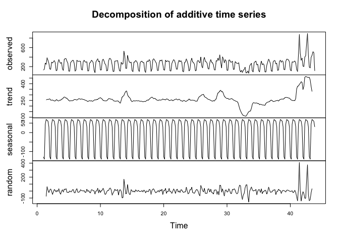
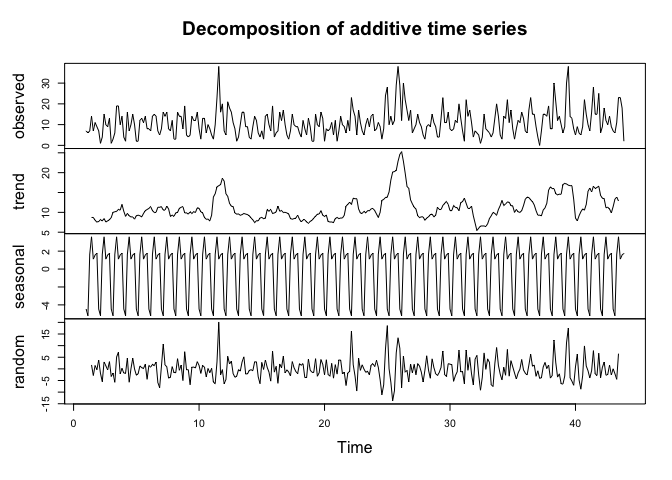

googleAnalyticsModelR
=====================

Creating ready made models to work with `googleAnalyticsR` data

Setup
-----

    install.packages(c("remotes","googleAnalyticsR"))
    remotes::install_github("IronistM/googleAnalyticsModelR")

Useage
------

For end users, they can just load the model then apply it to their data:

    library(googleAnalyticsR)  # assume auto-authentication
    library(googleAnalyticsModelR)

    # fetches data and outputs decomposition
    my_viewid <- 81416156
    decomp_ga <- "inst/models/decomp_ga.gamr"
    ga_model(my_viewid, model = decomp_ga)

    ## NULL

    #repeat with another viewId
    ga_model(123875646, model = decomp_ga)

    ## NULL

Creating models
---------------

It needs:

-   A function to collect the data you will need. The first argument
    should be `viewId`
-   A function to work with the data you have fetched. The first
    argument should be the data.frame that is produced by the data
    fetching function.
-   Specification of which R libraries the functions need

The functions need to not use the same arguments, and both include `...`
as the dots are shared between them.

    library(googleAnalyticsR) # assume auto-authentication
    library(googleAnalyticsModelR)

     get_model_data <- function(viewId, 
                               date_range = c(Sys.Date()- 300, Sys.Date()), 
                               ...){
       google_analytics(viewId, 
                        date_range = date_range, 
                        metrics = "sessions", 
                        dimensions = "date", 
                        max = -1)
     }

     decompose_sessions <- function(df, ...){
       web_data_ts <- ts(df$sessions, frequency = 7)
       d <- decompose(web_data_ts)
       plot(d)
     }
     
     decomp_ga <- ga_model_make(get_model_data,
                                required_columns = c("date", "sessions"),
                                model_f = decompose_sessions,
                                description = "Performs decomposition on session data and creates a plot")
     
     # fetches data and outputs decomposition
     ga_model(81416156, decomp_ga)
     
     # save the model for later
     model_location <- "inst/models/decomp_ga.gamr"
     ga_model_save(decomp_ga, filename = model_location)
     
     # can load model from file
     ga_model(81416156, model_location)
     
     # load model and use again
     model2 <- ga_model_load(model_location)
     
     ga_model(81416156, model2)

More complicated example
------------------------

Using `?ga_anomaly_detection`

    library(googleAnalyticsR)
    library(googleAnalyticsModelR)

    get_anom_data <- function(viewId, 
                              date_range = c(Sys.Date()-600, Sys.Date()),
                              ...){
      google_analytics(viewId, date_range = date_range,
                       metrics = c("sessions","users"),
                       dimensions = "date", 
                       max = -1)
    }

    do_anomaly <- function(df, 
                           value_col = "sessions",
                           max_anoms = 0.1,
                           ...){
      ga_check_anomaly(
        df = df,
        time_col = "date",
        value_col = value_col,
        max_anoms = max_anoms
      )
    }

    req_packs <- c("lubridate", "dplyr", "exploratory", "AnomalyDetection")

    anomaly_model <- ga_model_make(get_anom_data,
                                   required_columns = c("date","sessions","users"),
                                   model_f = do_anomaly,
                                   required_packages = req_packs,
                                   description = "Anomaly detection using Twitter algo on users or sessions")
    # print out model details
    anomaly_model

    ## ==ga_model object==
    ## Description:  Anomaly detection using Twitter algo on users or sessions 
    ## Data args:    viewId date_range 
    ## Input data:   date sessions users 
    ## Model args:   df value_col max_anoms 
    ## Packages:     lubridate dplyr exploratory AnomalyDetection

    # save it to a file for use later
    ga_model_save(anomaly_model, "inst/models/anomaly_model.gamr")

To use, we now have more arguments an end user can specify:

    library(googleAnalyticsR)  # assume auto-authentication
    library(googleAnalyticsModelR)

    # install any needed libraries
    #remotes::install_github("twitter/AnomalyDetection")

    my_viewid <- 81416156
    ga_model(my_viewid, 
             model = "inst/models/anomaly_model.gamr",
             date_range = c(Sys.Date()-601, Sys.Date()-1),
             value_col = "users",
             max_anoms = 0.5)

    ## # A tibble: 601 x 7
    ##    date                users is_positive_ano… positive_anomal…
    ##    <dttm>              <dbl> <lgl>                       <dbl>
    ##  1 2017-06-20 00:00:00   206 FALSE                          NA
    ##  2 2017-06-21 00:00:00   193 FALSE                          NA
    ##  3 2017-06-22 00:00:00   184 FALSE                          NA
    ##  4 2017-06-23 00:00:00   184 FALSE                          NA
    ##  5 2017-06-24 00:00:00    88 FALSE                          NA
    ##  6 2017-06-25 00:00:00    91 FALSE                          NA
    ##  7 2017-06-26 00:00:00   177 FALSE                          NA
    ##  8 2017-06-27 00:00:00   178 FALSE                          NA
    ##  9 2017-06-28 00:00:00   193 FALSE                          NA
    ## 10 2017-06-29 00:00:00   183 FALSE                          NA
    ## # … with 591 more rows, and 3 more variables: is_negative_anomaly <lgl>,
    ## #   negative_anomalies <dbl>, expected_value <dbl>

    #repeat with another viewId
    ga_model(123875646, 
             model = "inst/models/anomaly_model.gamr",
             date_range = c(Sys.Date()-601, Sys.Date()-1),
             value_col = "users",
             max_anoms = 0.5)

    ## # A tibble: 601 x 7
    ##    date                users is_positive_ano… positive_anomal…
    ##    <dttm>              <dbl> <lgl>                       <dbl>
    ##  1 2017-06-20 00:00:00    15 FALSE                          NA
    ##  2 2017-06-21 00:00:00     9 FALSE                          NA
    ##  3 2017-06-22 00:00:00    15 FALSE                          NA
    ##  4 2017-06-23 00:00:00    15 FALSE                          NA
    ##  5 2017-06-24 00:00:00     5 FALSE                          NA
    ##  6 2017-06-25 00:00:00     4 FALSE                          NA
    ##  7 2017-06-26 00:00:00    18 FALSE                          NA
    ##  8 2017-06-27 00:00:00    16 FALSE                          NA
    ##  9 2017-06-28 00:00:00     7 FALSE                          NA
    ## 10 2017-06-29 00:00:00     8 FALSE                          NA
    ## # … with 591 more rows, and 3 more variables: is_negative_anomaly <lgl>,
    ## #   negative_anomalies <dbl>, expected_value <dbl>
